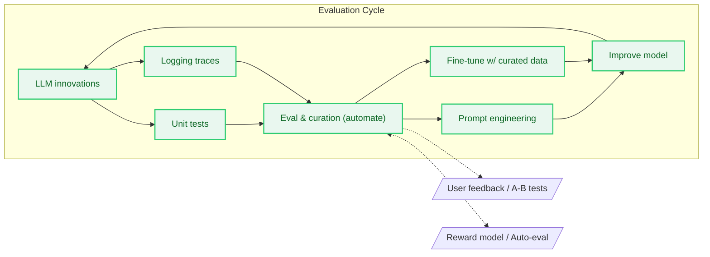

### Evaluation

Evaluation is the process of assessing the performance of a model. It's a **crucial step** in the development of a model, as it allows us to understand how well the model is performing and to identify areas for improvement, starting with the model's data.
It guarantees model reliability through the iterative process of training and evaluation.  
Evaluation consists of different techniques; we can divide them into three categories:

#### Unit Tests 
[Unit tests](https://bigghis.github.io/posts/UNIT-TESTS/) are the first step in an evaluation process. 
They should be used to quickly identify **dumb failure modes**—things that go predictably wrong—and test them programmatically.
They can be used every time the prompt is changed or data is added or modified.

#### LLM as a Judge
LLM as a judge is a type of test performed by an LLM to evaluate the performance of another LLM. The judge LLM receives a prompt and a response and should be able to judge whether the response is correct.
It's a scalable way to evaluate the model's performance and is popular in the industry.  
It's essential to measure the judge LLM's correlation with human judgment.

#### Human Evaluation
It consists of having the model's output directly examined by a person or a team who evaluate its quality.  
The human judge is the most reliable way to evaluate the model's performance, and sometimes it's the only way to examine the model's performance.  
It's expensive, time-consuming, and poorly scalable.
It can be affected by the human judge's bias, and it is not scalable.

#### The Evaluation workflow

Notes:
- Unit tests and traces surface regressions and dumb failures early.
- Eval & curation drive both prompting and fine-tuning.
- Model improvements loop back to kick off the next iteration; feedback and reward models extend automation.