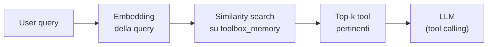
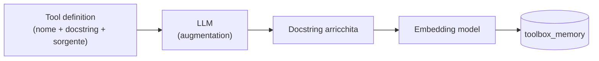

Nella [prima parte]() abbiamo costruito lo strato di memoria di un agente: i memory store su PostgreSQL/pgvector e il **Memory Manager** che orchestra letture e scritture.  
Tra gli store creati c'era anche la **toolbox memory**, implementata come **procedural memory** nella tabella `toolbox_memory`: un vector store PostgreSQL con colonna `vector(768)`, gestito da `PGVectorStore`.

In genere, se i tool sono pochi potremmo anche usare una normale tabella SQL per memorizzarli, ma quando il loro numero aumenta, diventa necessario un approccio più sofisticato utilizzando vettori ed embeddings.  

### Context bloat e tool selection degradation

Quando troppi tool vengono messi a disposizione dell'agente iniettandoli nel contesto, possono causare problemi di **context bloat**, portando a distrazione dell'attenzione del modello e a difficoltà nel selezionare il tool giusto.

Per evitare questi problemi viene definito un pattern di chiamata dei tool, il **tool calling** con cui l'LLM non esegue direttamente il codice contenuto nel tool, ma produce una **richiesta strutturata** che l'ambiente esegue per lui; il risultato torna poi al modello, che lo usa per rispondere all'utente.

Perché questo funzioni, il modello deve *vedere* le definizioni dei tool — nome, descrizione, parametri — dentro la finestra di contesto. Finché i tool sono pochi va tutto bene. Ma più il sistema cresce, più tool accumuliamo: API, query su database, calcolatrici, motori di ricerca. E riversarli tutti nel prompt causa una serie di problemi. Oltre al già citato context bloat e peggioramento della selezione del tool giusto, avremo anche inferenza più lenta e più token processati (quindi più costi).  

Non a caso i model provider raccomandano di esporre all'LLM un numero limitato di tool per avere una selezione affidabile (indicativamente 10–20 al massimo).


### La soluzione: il Toolbox pattern

L'idea è trattare i tool come **memoria procedurale recuperabile**, invece che come contenuto fisso del prompt:

1. **registriamo** tutti i tool (anche centinaia) nel vector store della toolbox, embeddando nome, descrizione e parametri;
2. a inference time, la query dell'utente viene usata per una **ricerca semantica** sulla toolbox;
3. all'LLM passiamo **solo i tool recuperati** (tipicamente 3–5), i più pertinenti per quella specifica richiesta.



Il sistema può così scalare a centinaia di tool, mentre il modello ne vede sempre e solo una manciata: quelli giusti per la query corrente.

La chiave di retrieval è la **docstring**: la ricerca per similarità confronta la query dell'utente con le descrizioni embeddate dei tool. Ed è qui che nasce il secondo problema.

### Memory Unit Augmentation

Le docstring scritte dagli sviluppatori sono spesso striminzite ("Use this function to search the web"). Docstring povere producono embedding poveri: nello spazio vettoriale i tool risultano poco separabili e il retrieval sbaglia.

La **Memory Unit Augmentation** risolve il problema facendo arricchire la definizione del tool da un LLM *prima* di embeddarla: il modello riceve docstring originale e codice sorgente della funzione, e produce una descrizione dettagliata — cosa fa la funzione passo per passo, ogni parametro, il valore di ritorno. È questa versione arricchita che viene embeddata e scritta nella toolbox.



In questo modo la selezione del tool corretto risulta più accurata.

### L'implementazione: la classe Toolbox

Riprendiamo il `MemoryManager` della prima parte e aggiungiamo la classe **`Toolbox`**, che incapsula registrazione e augmentation dei tool. Riceve il Memory Manager (per scrivere nella toolbox memory) e il client OpenAI (per l'augmentation); l'embedding lo fa già il `PGVectorStore` sottostante al momento della scrittura.

```python
import inspect
from openai import OpenAI

client = OpenAI()


class Toolbox:
    """Registers tools as procedural memory, retrievable via semantic search."""

    def __init__(self, memory_manager, llm_client):
        self.memory_manager = memory_manager
        self.client = llm_client
        self._tools_by_name = {}

    def _augment_docstring(self, docstring: str, source: str) -> str:
        """Let the LLM enrich the docstring using the function's source code."""
        response = self.client.chat.completions.create(
            model="gpt-4o-mini",
            messages=[{
                "role": "user",
                "content": (
                    "Rewrite this tool description so that it is maximally useful "
                    "for semantic retrieval. Describe step by step what the function "
                    "does, each parameter and the return value. Be factual.\n\n"
                    f"Original docstring:\n{docstring}\n\n"
                    f"Source code:\n{source}"
                ),
            }],
        )
        return response.choices[0].message.content

    def register_tool(self, augment: bool = False):
        """Decorator: register the function into toolbox memory."""
        def decorator(fn):
            name = fn.__name__
            docstring = inspect.getdoc(fn) or ""
            source = inspect.getsource(fn)
            signature = str(inspect.signature(fn))

            description = (
                self._augment_docstring(docstring, source) if augment else docstring
            )

            # Questo è il testo che verrà embeddato: la chiave di retrieval
            text = f"TOOL: {name}{signature}\n\n{description}"

            self.memory_manager.write_toolbox(
                text,
                metadata={"tool_name": name, "signature": signature,
                          "augmented": augment},
            )
            self._tools_by_name[name] = fn
            return fn
        return decorator


toolbox = Toolbox(memory_manager, client)
```

Il decoratore `@toolbox.register_tool()` fa tutto il lavoro: estrae docstring, firma e sorgente della funzione, eventualmente la arricchisce (`augment=True`), e scrive il risultato nella toolbox memory tramite `write_toolbox()`. Da quel momento il tool è **ricercabile semanticamente**.


#### Il meta-tool: read_toolbox

Il primo tool che registriamo è quello che permette all'agente di **interrogare la toolbox stessa**. 

```python
@toolbox.register_tool(augment=True)
def read_toolbox(query: str, k: int = 3) -> str:
    """
    Search the toolbox for functions that can help solve a problem.

    Use this tool when the currently available tools don't seem sufficient,
    or you need to discover what capabilities are available for a task.

    Args:
        query: Natural language description of what you're trying to accomplish.
        k: Number of relevant tools to return.
    """
    return memory_manager.read_toolbox(query, k=k)
```

> Si noti la ricorsività della cosa: `read_toolbox` è a sua volta un tool registrato nella toolbox. L'agente parte con questo (e pochi altri) nel contesto, e da lì può *scoprire* tutti gli altri on demand.
{: .prompt-tip }

#### Un tool esterno: ricerca web con Tavily

Registriamo ora un tool che chiama un servizio esterno. [Tavily](https://tavily.com/){:target="_blank"} è un'API di ricerca web pensata per applicazioni LLM. Il tool implementa il pattern **search-and-store**: non si limita a restituire i risultati, ma li **persiste nella knowledge base**, così le informazioni scoperte una volta diventano memoria a lungo termine riutilizzabile senza nuove chiamate API.

```python
from datetime import datetime
from tavily import TavilyClient

tavily_client = TavilyClient()

@toolbox.register_tool(augment=True)
def search_tavily(query: str, max_results: int = 5):
    """
    Use this function to search the web and store the results in the knowledge base.
    """
    response = tavily_client.search(query=query, max_results=max_results)
    results = response.get("results", [])

    for result in results:
        text = (f"Title: {result.get('title', '')}\n"
                f"Content: {result.get('content', '')}\n"
                f"URL: {result.get('url', '')}")
        metadata = {
            "title": result.get("title", ""),
            "url": result.get("url", ""),
            "score": result.get("score", 0),
            "source_type": "tavily_search",
            "query": query,
            "timestamp": datetime.now().isoformat(),
        }
        memory_manager.write_knowledge_base(text, metadata)

    return results
```

#### Docstring originale vs augmentata

`search_tavily` ha una docstring di una riga. Vediamo cosa ne fa l'augmentation:

```python
fn = toolbox._tools_by_name["search_tavily"]
original = inspect.getdoc(fn)
augmented = toolbox._augment_docstring(original, inspect.getsource(fn))

print("ORIGINAL:", original)
print("AUGMENTED:", augmented)
```

```text
ORIGINAL:
  "Use this function to search the web and store the results
   in the knowledge base."

AUGMENTED:
  Searches the web via the Tavily API for a given natural-language query.
  Step by step: (1) sends the query to Tavily limiting results to
  `max_results`; (2) for each result builds a text block with title,
  content and URL; (3) attaches metadata (title, url, relevance score,
  source_type, original query, timestamp); (4) persists each block into
  the knowledge base for future semantic retrieval.
  Parameters: query (str) — the search query; max_results (int, default 5).
  Returns: the list of raw search results.
```

La versione arricchita non descrive solo *a cosa serve* la funzione, ma *cosa fa* passo per passo, i parametri e il valore di ritorno. Nello spazio vettoriale questo testo è molto più distinguibile, e query come "salva sul database i risultati di una ricerca web" ora trovano il tool giusto anche se la docstring originale non menzionava affatto il salvataggio.

#### Tool locali e integrazioni: datetime e arXiv

Un tool non deve per forza chiamare un servizio esterno: può essere semplice codice Python locale.

```python
@toolbox.register_tool(augment=True)
def get_current_time(detailed: bool = False) -> str:
    """
    Returns the current time.

    Args:
        detailed: If True, returns detailed format with microseconds
    """
    fmt = "%Y-%m-%d %H:%M:%S.%f" if detailed else "%Y-%m-%d %H:%M:%S"
    return datetime.now().strftime(fmt)
```

Per *ArxivScout* servono però tool più sostanziosi. Il primo è la **discovery**: cerca su arXiv e restituisce una lista JSON di paper candidati (ID e metadati), leggera abbastanza da poter essere ragionata dall'agente prima di decidere cosa approfondire. Usiamo l'`ArxivRetriever` di `langchain-community`, configurato per *non* scaricare i documenti completi.

```python
import json
from urllib.parse import urlparse
from langchain_community.retrievers import ArxivRetriever

arxiv_retriever = ArxivRetriever(
    load_max_docs=8,
    get_full_documents=False,
    doc_content_chars_max=4000,
)

def _arxiv_id_from_entry_id(entry_id: str) -> str:
    """'http://arxiv.org/abs/2310.08560v2' -> '2310.08560v2'"""
    if not entry_id:
        return ""
    return urlparse(entry_id).path.split("/abs/")[-1].strip("/")

@toolbox.register_tool(augment=False)
def arxiv_search_candidates(query: str, k: int = 5) -> str:
    """
    Search arXiv and return a JSON list of candidate papers with IDs + metadata.
    """
    docs = arxiv_retriever.invoke(query)
    candidates = []
    for d in (docs or [])[:k]:
        meta = d.metadata or {}
        entry_id = meta.get("Entry ID", "")
        candidates.append({
            "arxiv_id": _arxiv_id_from_entry_id(entry_id),
            "entry_id": entry_id,
            "title": meta.get("Title", ""),
            "authors": meta.get("Authors", ""),
            "published": str(meta.get("Published", "")),
            "abstract": (d.page_content or "")[:2500],
        })
    return json.dumps(candidates, ensure_ascii=False, indent=2)
```

Il secondo è la **deep ingestion**: dato un arXiv ID, scarica il paper completo (PDF → testo), lo **trasforma in chunk** e li salva nella knowledge base. Il chunking, fatto con `RecursiveCharacterTextSplitter` serve a rispettare i limiti di input del modello di embedding e a mantenere ogni chunk semanticamente coeso.

```python
from datetime import timezone
from langchain_community.document_loaders import ArxivLoader
from langchain_text_splitters import RecursiveCharacterTextSplitter


@toolbox.register_tool(augment=True)
def fetch_and_save_paper_to_kb_db(
    arxiv_id: str,
    chunk_size: int = 1500,
    chunk_overlap: int = 200,
) -> str:
    """
    Fetch full arXiv paper text (PDF -> text) and store it into the
    knowledge base as chunked records (avoids routing full content via the LLM).
    """
    loader = ArxivLoader(query=arxiv_id, load_max_docs=1,
                         doc_content_chars_max=None)
    docs = loader.load()
    if not docs:
        return f"No documents found for arXiv id: {arxiv_id}"

    doc = docs[0]
    title = doc.metadata.get("Title") or f"arXiv {arxiv_id}"
    full_text = doc.page_content or ""

    splitter = RecursiveCharacterTextSplitter(
        chunk_size=chunk_size, chunk_overlap=chunk_overlap
    )
    chunks = splitter.split_text(full_text)

    ts_utc = datetime.now(timezone.utc).isoformat()
    for i, chunk in enumerate(chunks):
        memory_manager.write_knowledge_base(
            chunk,
            metadata={
                "source": "arxiv",
                "arxiv_id": arxiv_id,
                "title": title,
                "chunk_id": i,
                "num_chunks": len(chunks),
                "ingested_ts_utc": ts_utc,
            },
        )

    return f"Saved arXiv {arxiv_id}: {len(chunks)} chunks (title: {title})."
```

> Il punto importante di questo tool è che **non trasferisce contenuti nel contesto**: il testo completo del paper va direttamente dal loader alla knowledge base, senza mai transitare nella finestra di contesto dell'LLM. Il modello riceve solo il messaggio di conferma. È il pattern da usare ogni volta che un tool maneggia payload grandi: il carico pesante lo gestisce l'infrastruttura di memoria, non il contesto.
{: .prompt-tip }

### Verifica del retrieval

La toolbox contiene ora cinque tool. Verifichiamo che il retrieval semantico selezioni quello giusto per una richiesta in linguaggio naturale:

```python
retrieved = memory_manager.read_toolbox("Get more details on a paper on AI", k=1)
print(retrieved)
```

```text
MEMORY TYPE: Toolbox Memory (procedural memory)

DESCRIPTION: Contains the tools available to the agent and what each one is for.

USAGE: Select the tool whose description matches the current step.
Do not invent tools.

RETRIEVED PASSAGES:
[1] TOOL: fetch_and_save_paper_to_kb_db(arxiv_id: str, ...)
    Fetches the full text of an arXiv paper and stores it as chunked
    records in the knowledge base...   ({'tool_name': 'fetch_and_save_paper_to_kb_db', ...})
```

La similarity search sulla tabella `toolbox_memory` restituisce `fetch_and_save_paper_to_kb_db`: esattamente il tool che serve per "avere più dettagli su un paper", benché la query non contenga né "arXiv" né "fetch" né "knowledge base". Alzando `k` si ottengono i migliori *k* tool, da passare all'LLM come toolset ristretto per il turno corrente.

### Conclusioni

Il Toolbox pattern chiude il cerchio aperto nella prima parte: la toolbox memory non è un catalogo statico, ma **memoria procedurale interrogabile**, gestita con la stessa infrastruttura (vector store, embedding, Memory Manager) delle altre memorie.

I concetti chiave sono:

- riversare tutte le definizioni di tool nel contesto causa **context bloat**, **degradazione della selezione**, latenza e costi;
- il **Toolbox pattern** tratta i tool come sorgenti recuperabili: si registrano tutti, se ne passano all'LLM solo i top-k pertinenti alla query;
- la **docstring è la chiave di retrieval**: la qualità della descrizione determina la qualità della selezione;
- la **Memory Unit Augmentation** usa un LLM per arricchire le docstring prima dell'embedding, migliorando separabilità e recall;
- pattern come **search-and-store** e **deep ingestion** fanno sì che i tool alimentino a loro volta la memoria dell'agente, tenendo i payload pesanti fuori dalla finestra di contesto.

L'agente non è più limitato dai tool che riusciamo a fargli stare nel prompt: è limitato solo da quelli che abbiamo registrato nella sua memoria. E come per ogni altra memoria, può scoprirli, selezionarli e usarli da solo.
