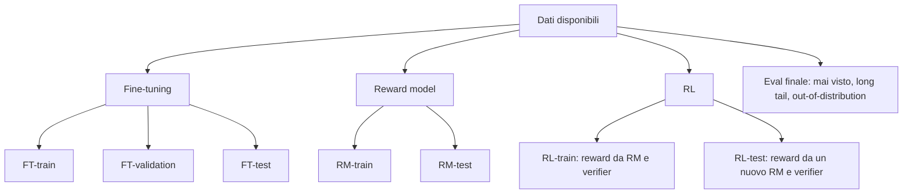
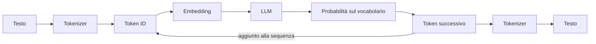

I **dati** con cui addestriamo il modello e i **token** creati a partire da essi sono alla base dei processi di training e RL, e rappresentano la forma con cui le informazioni entrano ed escono dal modello.  
Sono argomenti fondamentali perché identificano il punto in cui si decide gran parte del risultato finale di post-training. Difatti un dataset sporco o diviso male rende inutile qualsiasi algoritmo eseguito successivamente su questi dati, e un tokenizer gestito male può far fallire un fine-tuning in modi poi difficili da diagnosticare.

Fine-tuning e RL hanno bisogno di dati con forme diverse. 

#### Dati per il fine-tuning

Nel fine-tuning servono **coppie** `{input, target output}`: per ogni input, la risposta esatta che vogliamo che il modello impari a produrre.

```text
Input:  Alice ha 3 mele e ne compra altre 2. Quante ne ha ora?
Target: 5
```

Se vogliamo insegnare anche il **reasoning**, il target contiene i passaggi dentro tag dedicati, seguiti dalla risposta finale:

```text
Input:  Alice ha 3 mele e ne compra altre 2. Quante ne ha ora?
Target:
<think>
Parto da 3.
Ne compra 2 ⇒ 3+2=5.
</think>
<answer>5</answer>
```

#### Dati per l'RL

Nell'RL non c'è un target. Si parte da una semplice **lista di input**; è il modello stesso a produrre gli output, che poi vengono valutati dai grader dell'ambiente.

- La coppia `{input, output del modello}` si chiama **rollout**: il modello "srotola" la sua risposta.
- Quando al rollout si aggiunge il punteggio, si ottiene la tupla `{input, output, reward}`, chiamata **trajectory**.

Il reward può arrivare da un verifier (per esempio un checker matematico che controlla se la risposta è 5) oppure da un altro modello, il **reward model**, che assegna un punteggio a quanto è buona la risposta.

#### Dati per il reward model

Se si usa un reward model, serve un terzo tipo di dato, opzionale ma molto diffuso: la tupla `{input, output A, output B, preferenza}`. Per lo stesso input si mostrano due risposte e si indica quale è migliore:

```text
Input:      Alice ha 3 mele e ne compra altre 2. Quante ne ha ora?
Output A:   <think>Parto da 3. Ne compra 2 ⇒ 3+2=5.</think><answer>5</answer>
Output B:   ciao
Preferenza: A
```

La preferenza può essere espressa da una persona o da un altro LLM. Vedremo più avanti come, da questi confronti, si addestra un modello che restituisce un punteggio numerico.

| Uso | Forma del dato |
|:---|:---|
| Fine-tuning | `{input, target output}` (eventualmente con `<think>` + `<answer>`) |
| RL | lista di `{input}` → rollout `{input, output}` → trajectory `{input, output, reward}` |
| Reward model | `{input, output A, output B, preferenza}` |

### Dividere i dati per potersi fidare del modello

Bisogna dividere i dati in **split** separati, altrimenti non sapremo mai se il modello ha davvero imparato a generalizzare o se sta solo ripetendo ciò che ha già visto.

#### Fine-tuning: train, validation, test

Lo schema classico prevede tre insiemi:

- **train**: i dati su cui il modello viene effettivamente addestrato, corrispondente alla parte più grande del dataset;
- **validation**: dati usati durante lo sviluppo per scegliere gli iperparametri; 
- **test** (o eval): dati che servono dopo che il training è terminato, per misurare quanto è buono il modello.

Molti dataset pubblici arrivano già divisi in train e test. GSM8K, per esempio, ha circa 7.500 problemi di train e 1.300 di test. La validation si ricava di solito da una porzione del train:

```python
from datasets import load_dataset

dataset = load_dataset("openai/gsm8k", "main")
test = dataset["test"]

split = dataset["train"].train_test_split(test_size=0.1, seed=42)
train, validation = split["train"], split["test"]
```


#### Reward model: train e test

Per il reward model il discorso è simile: uno split di train e uno di test, entrambi fatti di tuple `{input, output A, output B, preferenza}`. Anche qui si può ricavare una validation dal train.

#### RL: attenzione a chi assegna il reward in fase di test

Anche per l'RL si separano gli input di train da quelli di test. C'è però una sottigliezza importante. In training i reward arrivano dal reward model e dai verifier; in test, se si usa un reward model, bisogna usarne **uno nuovo, addestrato su dati di preferenza diversi**.

Il motivo è che, durante l'RL, il modello impara a ottenere punteggi alti **da quel particolare reward model**, compresi i suoi difetti. Se poi lo valutiamo con lo stesso reward model, misuriamo quanto bene ha imparato a compiacerlo, non quanto è davvero migliorato. È una forma di contaminazione, e porta dritti al reward hacking.

> **Analogia dell'esaminatore.** Uno studente che si prepara sempre con lo stesso professore impara anche le sue manie: le parole che gli piacciono, gli argomenti su cui non approfondisce. Per sapere quanto lo studente è preparato davvero, all'esame finale serve un esaminatore diverso.
{: .prompt-info }

#### La valutazione finale: dati mai visti

Oltre a tutti questi split, conviene preparare un ultimo insieme di valutazione con input **mai visti in nessuna fase**, mescolando casi di **long tail** (situazioni rare, ma possibili) e casi **out-of-distribution** (input diversi da quelli su cui abbiamo lavorato). È il banco di prova più vicino a ciò che accadrà quando il modello incontrerà utenti reali.



L'idea di fondo è tenere gli split ben separati tra loro, il che è più difficile di quanto sembri.

### Leakage: quando gli split non sono davvero separati

Si parla di **leakage** (o contaminazione) quando informazioni del test "trapelano" nel train. Il caso ovvio è lo stesso esempio presente in entrambi gli split. Ma il leakage avviene anche con esempi **simili**: basta che train e test contengano varianti della stessa domanda perché il risultato sul test diventi troppo ottimista.

#### Near-duplicate e MinHash

Consideriamo queste due frasi, una nel test e una nel train:

```text
Test:  Come cambio la password su questa piattaforma?
Train: Come cambio la pw su questa piattaforma?
```

Non sono identiche, quindi un controllo di uguaglianza non le trova. Ma per il modello sono praticamente lo stesso esempio. Per questo i frontier lab dedicano moltissimo lavoro alla **deduplicazione**, cioè a trovare ed eliminare gli esempi duplicati o quasi duplicati, sia dentro ogni split sia tra split diversi.

Una tecnica classica è **MinHash**, spesso abbinata a **LSH** (*Locality-Sensitive Hashing*). L'intuizione è questa:

1. ogni testo viene spezzato in piccoli pezzi sovrapposti (gli *shingle*, per esempio gruppi di 3 parole o di 5 caratteri);
2. due testi sono simili se condividono molti shingle. La misura è la **similarità di Jaccard**: shingle in comune diviso shingle totali;
3. calcolare Jaccard tra tutte le coppie di un dataset enorme sarebbe proibitivo. MinHash riassume ogni testo in una breve "firma" numerica, e la frazione di valori uguali tra due firme approssima la similarità di Jaccard;
4. LSH raggruppa le firme in modo che testi simili finiscano nello stesso "secchio", così si confrontano solo i candidati promettenti.

MinHash trova bene i duplicati *lessicali*: frasi che condividono gran parte delle parole, oppure template come *"Grazie per averci contattato riguardo a [X]"* contro *"Grazie per averci scritto riguardo a [X]"*. Le **parafrasi** sono più insidiose:

```text
Test:  Come cambio la password su questa piattaforma?
Train: Qual è la procedura per aggiornare la mia password qui?
```

Qui le parole in comune sono poche, ma il significato è lo stesso. Per casi del genere si affiancano tecniche consapevoli dei template e delle parafrasi, per esempio la similarità tra embedding semantici.

#### Non dividere a caso

La tentazione più comune è fare uno split casuale: si mescola il dataset e si taglia. È rapido, ma con dati reali porta quasi sempre leakage, perché esempi simili finiscono da entrambe le parti.

Un caso tipico è **lo stesso prompt con target diversi**:

```text
Train: "Scrivi una storia su un cane smarrito" → "Il golden retriever di nome Buddy…"
Test:  "Scrivi una storia su un cane smarrito" → "Max vagava nella foresta…"
```

Il target è diverso, ma il prompt è identico: il modello ha già visto quel compito in training, e il test non misura più la capacità di generalizzare. Prima di dividere conviene quindi raggruppare gli esempi per prompt (o per cluster di prompt simili) e assegnare ogni gruppo interamente a uno split.

#### Dividere per tempo

Una buona pratica, che all'inizio può sembrare strana, è dividere i dati **per data**: train con i dati più vecchi, test con quelli più recenti.

Esempio da un dataset medico:

```text
Train (2019): Febbre, tosse secca, stanchezza, dolori → Influenza stagionale. Riposo, liquidi.
Test  (2020): Tosse secca, dolori, febbre, stanchezza → Sospetto COVID. Isolamento immediato.
```

I sintomi sono quasi identici, la risposta corretta è cambiata. Uno split temporale verifica proprio questo: se il modello sa **generalizzare verso il futuro**, cioè gestire situazioni arrivate dopo i suoi dati di training. Inoltre aiuta a far emergere distorsioni che si sono infilate per caso nel modo in cui il dataset è stato raccolto.

> Con dati e split conviene essere paranoici. Deduplicare dentro e tra gli split, non affidarsi allo split casuale, valutare uno split temporale quando conta generalizzare nel tempo. Un test contaminato dà numeri belli che non reggono in produzione.
{: .prompt-warning }

Non sorprende che, nei frontier lab, la preparazione dei dati sia uno sforzo enorme, con team interi dedicati solo a questo. Secondo un'euristica diffusa, alcuni lab usano solo l'**1% più pulito** dei dati disponibili, perché aggiungere il restante 99% peggiora le prestazioni del modello. La qualità conta più della quantità.

### Dal testo ai numeri: i token

Un modello elabora numeri, bisogna quindi decidere come trasformare il testo in una sequenza di numeri, nel modo più efficiente possibile.

#### Parole, caratteri o token?

Gli LLM lavorano su **token**, pezzi di testo di lunghezza variabile ottenuti con algoritmi come **BPE** (*Byte-Pair Encoding*). BPE parte dai singoli caratteri e fonde via via le coppie più frequenti nel testo di training, finché non ottiene un insieme di pezzi riutilizzabili. Un suffisso come *"ing"* in inglese, o *"zione"* in italiano, diventa un token unico che serve per migliaia di parole.

L'insieme di tutti i token che un modello conosce è il suo **vocabolario**. GPT-3, per esempio, ne ha circa 50.000.

Il guadagno in efficienza è notevole rispetto alla tokenizzazione per caratteri. Il grafico seguente confronta, sui circa 7.500 problemi di train di GSM8K (domanda e soluzione), il numero di token per sequenza con il tokenizer BPE di GPT-2 (in blu) e con la tokenizzazione per caratteri (in verde): con BPE le sequenze sono circa 3,5 volte più corte.


_Lunghezza delle sequenze di GSM8K: mediana di 141 token con BPE contro 485 caratteri._

#### Il problema delle "r" in strawberry

La tokenizzazione ha anche effetti collaterali curiosi. Uno dei più famosi: chiedere a un LLM *quante "r" ci sono in "strawberry"*. Per anni molti modelli hanno risposto 2.

Il motivo è che il modello non vede le lettere. Vede, per esempio, due token: `straw` e `berry`, ciascuno rappresentato da un numero. Non può "guardare dentro" un token per contare i caratteri, a meno di aver imparato in altro modo come è scritto. Il problema si attenua quando il testo viene spezzato in pezzi più piccoli, fino alle singole lettere, ma resta un buon promemoria: il modello ragiona sui token, non sul testo come lo vediamo noi.

### Come i token attraversano il modello

Mettiamo insieme i pezzi del percorso che fa un testo, dall'input al token successivo.



Il token generato viene aggiunto alla sequenza e il ciclo ricomincia, un token alla volta, finché il modello non produce un token di stop.

#### Il tokenizer

Il **tokenizer** fa due lavori opposti: **encode**, cioè trasformare il testo in token ID, e **decode**, cioè riportare gli ID a testo. Sotto il cofano è una tabella di corrispondenza tra pezzi di testo e numeri del vocabolario.

```python
input_ids = tokenizer("What words are indivisible?")["input_ids"]
# [2640, 3073, 418, 3221, 21142, 30]

text = tokenizer.decode(input_ids)
# "What words are indivisible?"
```

#### Gli embedding

I token ID prodotti dal tokenizer sono indici del vocabolario, e di per sé non dicono nulla sul significato del token che rappresentano. Per dare al modello questa informazione, a ogni token si associa un **vettore** di numeri, chiamato **embedding**.

Questi vettori vivono in uno spazio multidimensionale, lo **spazio degli embedding**. Semplificando, lo si può immaginare come un piano cartesiano in cui ogni token è un punto: token con significato simile stanno vicini, token con significato diverso stanno lontani. *Gatto* e *cane* sono più vicini tra loro di quanto lo siano *gatto* e *casa*. La distanza tra i punti esprime la similarità.

L'idea si è affermata nel 2013 con **Word2Vec** ([Mikolov et al.](https://arxiv.org/abs/1301.3781){:target="_blank"}), che parte da un principio semplice: parole simili compaiono in frasi simili. *Forchetta* e *coltello* sono utensili da cucina e si trovano negli stessi contesti. Una rete addestrata a indovinare la parola mancante in milioni di frasi impara così un vettore per ogni parola del vocabolario (300 numeri nel caso di Word2Vec) che ne cattura le relazioni semantiche. Quei vettori non sono altro che i pesi della rete dopo l'addestramento.

Negli LLM gli embedding sono il primo strato del modello: una matrice con una riga per ogni token del vocabolario. Ogni ID serve a trovare la sua riga:

```text
Token ID 2640 → [ 0.038, -0.046,  0.440, … ]
Token ID 3073 → [ 0.002,  0.365,  0.443, … ]
```

La matrice ha quindi dimensione *dimensione del vocabolario × dimensione dell'embedding*, ed è addestrata insieme al resto del modello. DeepSeek Math 7B, per esempio, ha un vocabolario di oltre 100.000 token, ciascuno rappresentato da un vettore di 4.096 numeri: centinaia di milioni di parametri solo nel primo strato.

L'embedding di un token è sempre lo stesso, qualunque sia il contesto. *Riso* ha lo stesso vettore in "mangia il riso" e in "le sfuggì un riso". **Sono gli strati successivi del modello, attraverso l'attention, a trasformare quel vettore in base alle parole vicine**, nel primo caso lo avvicinano al concetto di cereale, nel secondo a quello di risata.

#### Dalle probabilità al token successivo

All'uscita, il modello produce una **distribuzione di probabilità su tutto il vocabolario**: per ogni token possibile, quanto è probabile che sia il prossimo. Resta da decidere *quale* token scegliere. Le strategie principali sono tre.

**Greedy.** Si prende sempre il token con la probabilità più alta. È il comportamento predefinito di `model.generate` in Hugging Face, ed è deterministico: stesso input, stessa risposta.

```python
model.generate(**ids)
```

**Sampling.** Si estrae il token a caso, rispettando le probabilità: un token con probabilità 0,5 uscirà spesso, uno con 0,3 un po' meno, ma può uscire anche lui. Le risposte diventano varie.

```python
model.generate(**ids, do_sample=True)
```

Quanto deve essere "vario" il sampling si regola con la **temperatura** $$T$$. Prima di trasformare i punteggi grezzi del modello (i *logit* $$z$$) in probabilità, li si divide per $$T$$:

$$
p_i = \frac{e^{z_i / T}}{\sum_j e^{z_j / T}}
$$

In parole: con $$T$$ basso le differenze tra i token si amplificano e la distribuzione si concentra sui più probabili; con $$T$$ alto le differenze si appiattiscono e anche i token meno probabili hanno una possibilità. Con $$T \to 0$$ il sampling diventa di fatto uguale al greedy.


_Stessi punteggi, tre temperature: con 0,25 esce quasi sempre "Vaniglia", con 2 la scelta si distribuisce su molti gusti._

```python
model.generate(**ids, do_sample=True, temperature=0.7)
```

Nel RL, e in particolare in GRPO, la **temperatura** serve a generare **più risposte diverse per lo stesso input** da confrontare tra loro.

**Beam search.** Invece di scegliere un token alla volta, si tengono in memoria le **N sequenze candidate più probabili** (i *beam*) e le si fa crescere in parallelo, scartando via via quelle meno promettenti. Con 3 beams e il prompt *"Scrivi una poesia"* il modello potrebbe portare avanti insieme *"Il sole tramonta piano e…"*, *"Il sole sorse sopra le colline…"* e *"Due strade divergevano in un bosco…"*, per poi restituire la migliore.

```python
model.generate(**ids, num_beams=3)
```

#### Batching e padding

Le GPU sono efficienti quando eseguono la stessa operazione su molti dati insieme. Per questo le sequenze vengono raggruppate in **batch** ed elaborate come un'unica matrice. Il problema è che i testi hanno lunghezze diverse, mentre una matrice ha bisogno di righe tutte della stessa lunghezza.

Per questo viene usato il **padding**: si aggiungono alle sequenze più corte dei token speciali "vuoti" (*pad token*) fino a raggiungere la lunghezza della più lunga. Insieme agli ID, il tokenizer restituisce una **attention mask**, che vale 1 sui token veri e 0 su quelli di padding, così il modello sa quali ignorare.

```python
tokenizer(prompt_batch, padding=True, return_tensors="pt")
# input_ids:
# [[   0,    0, 2640, 3073,  418, 3221, 21142],
#  [   0,    0, 3073,  418, 3221, 21142,   30],
#  [   0,    0,    0,    0, 2640, 3073,  418]]
# attention_mask:
# [[0, 0, 1, 1, 1, 1, 1],
#  [0, 0, 1, 1, 1, 1, 1],
#  [0, 0, 0, 0, 1, 1, 1]]
```

In questo esempio il padding è a **sinistra**. Un modello che genera testo continua dall'ultima posizione della sequenza: se il padding fosse a destra, il nuovo token verrebbe attaccato dopo una fila di token vuoti. Per la generazione si usa quindi `tokenizer.padding_side = "left"`. Molti modelli non hanno un pad token dedicato, e si riusa il token di fine sequenza con `tokenizer.pad_token = tokenizer.eos_token`.

### Ogni modello ha il suo tokenizer

Ogni modello è stato addestrato con un tokenizer preciso: il token 3221 di un modello non ha niente a che fare con il token 3221 di un altro. Per questo il tokenizer va sempre caricato insieme al modello, e in Hugging Face lo si fa con `AutoTokenizer`, che a partire dal nome del modello trova il tokenizer giusto:

```python
from transformers import AutoTokenizer

tokenizer = AutoTokenizer.from_pretrained(model_name)
```

Esempio: tokenizer diversi spezzano lo stesso testo in modi diversi. Con la frase `"Using Huggingface is pretty manageable"`:

| Tokenizer | Risultato | Particolarità |
|:---|:---|:---|
| BERT (`bert-base-uncased`) | `using`, `hugging`, `##face`, `is`, `pretty`, `manage`, `##able` | `##` indica il seguito di una parola |
| T5 (`t5-small`) | `▁`, `Using`, `▁Hug`, `ging`, `face`, `▁is`, `▁pretty`, `▁manage`, `able` | `▁` indica uno spazio, anche a inizio sequenza |
| DeepSeek (`deepseek-math-7b-base`) | `Using`, `ĠHug`, `ging`, `face`, `Ġis`, `Ġpretty`, `Ġmanageable` | `Ġ` rappresenta lo spazio |


### Token ed embedding durante il post-training

Tokenizer ed embedding vengono appresi durante il pre-training. Nel post-training si possono lasciare invariati oppure aggiornare, a seconda di quanto cambia il lessico che il modello deve gestire.

- **Stesso lessico.** Se il fine-tuning cambia il comportamento del modello ma non le parole che usa, embedding e tokenizer si **congelano**: le rappresentazioni dei token restano valide. È anche il caso tipico dell'RL, dove il vocabolario non cambia.
- **Nuovo dominio.** Se il modello si sposta su un dominio molto diverso, per esempio il diritto, con il suo gergo e i suoi acronimi, conviene **addestrare anche gli embedding**, così le rappresentazioni dei termini si adattano al nuovo significato.
- **Nuovi token.** Se servono tag come `<think>` o termini che il tokenizer non conosce, bisogna **estendere il tokenizer**: altrimenti `<think>` verrebbe spezzato in più pezzi (`<`, `th`, `ink`, `>`). Il vocabolario cresce, e con lui la matrice degli embedding:

```python
tokenizer.add_special_tokens({"additional_special_tokens": ["<think>", "</think>"]})
model.resize_token_embeddings(len(tokenizer))
```

Le nuove righe della matrice partono senza significato. Per questo di solito si fa prima un breve **warm-up** in cui si addestrano solo i nuovi embedding, e poi si addestra tutto il modello.

### Ispezionare tokenizer, embedding e padding

Prima di un fine-tuning conviene verificare da vicino come il modello vede i dati. Per un prompt come `"The integral of x^2 from 0 to 2 is"` si può stampare ogni token ID con il pezzo di testo corrispondente, e vedere come vengono spezzati numeri, simboli e parole poco comuni:

```python
for token_id in tokenizer.encode(prompt):
    print(token_id, repr(tokenizer.decode([token_id])))

# Con il tokenizer di DeepSeek Math:
# 100000 '<｜begin▁of▁sentence｜>'
# 549 'The'
# 12667 ' integral'
# 280 ' of'
# 1376 ' x'
# 61 '^'
# 17 '2'
# 473 ' from'
# 207 ' '
# 15 '0'
# ...
```

Il tokenizer aggiunge da sé un token speciale di inizio sequenza. Lo spazio prima di una parola fa parte del token (`' integral'`), mentre prima di una cifra diventa un token a parte (`' '` seguito da `'0'`): DeepSeek spezza i numeri in singole cifre.

La forma della matrice degli embedding dà direttamente la dimensione del vocabolario e quella dei vettori:

```python
vocab_size, embedding_dim = model.get_input_embeddings().weight.shape
print(vocab_size, embedding_dim, vocab_size * embedding_dim)

# Con DeepSeek Math 7B:
# 102400 4096 419430400
```

La matrice ha 102.400 righe da 4.096 numeri: circa 420 milioni di parametri. Le righe sono un po' più dei token che il tokenizer conosce davvero (circa 100.000): la matrice viene arrotondata a una dimensione più comoda per la GPU, e le righe in eccesso restano inutilizzate.

Per un batch di prompt di lunghezza diversa, `input_ids` e `attention_mask` devono avere la stessa forma, e la lunghezza deve essere quella del prompt più lungo:

```python
batch = tokenizer(prompts, return_tensors="pt", padding=True)
assert batch["input_ids"].shape == batch["attention_mask"].shape
```

Sono operazioni che le librerie di training svolgono in automatico, ma vederle una volta da vicino aiuta a capire cosa succede quando qualcosa va storto: un modello che genera spazzatura dopo il padding, o un tag speciale spezzato in cinque token.

### Riassunto

Ricapitolando il percorso: fine-tuning, RL e reward model si nutrono di dati con forme diverse, e ciascuno va diviso con cura in train, validation e test. Il caso dell'RL richiede un reward model nuovo in fase di test, e tutto va completato con una valutazione finale su input mai visti. La difficoltà è evitare il leakage, che si nasconde nei duplicati quasi identici, nelle parafrasi e negli split casuali. Deduplicazione e split temporali sono gli strumenti per tenerlo sotto controllo.

Sull'altro versante, i token sono il ponte tra il testo e la matematica del modello. Il tokenizer li produce, gli embedding danno loro un significato, e una strategia di decoding (greedy, sampling con temperatura, beam search) sceglie il prossimo. Durante il post-training, questo ponte di solito resta fermo, ma va allargato quando il modello deve imparare parole o tag nuovi.

Con dati e token in ordine si può affrontare la meccanica del fine-tuning, calcolando la loss sulle risposte e  settando gli iperparametri per stabilizzare il training.