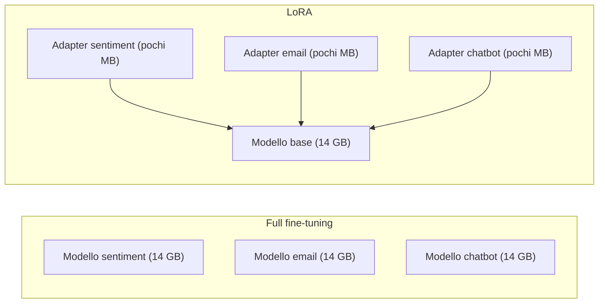

### La loss function

Sappiamo che la **loss function** (funzione di perdita) trasforma l'errore del modello in un singolo numero, e che più la loss è alta, più il modello sbaglia. Addestrarlo significa modificarne i pesi in modo che la loss scenda indicando una riduzione dell'errore.

Nel fine-tuning la l'output del modello è del tipo`{input, target output}`, e la loss si calcola solo sui token del target, non su quelli dell'input.

#### Cross-entropy

Prendiamo la coppia:

```text
Input:  Qual è la capitale della California?
Target: Sacramento è la capitale
```

Per il primo token della risposta, il modello produce una distribuzione di probabilità su tutto il vocabolario. Supponiamo che assegni 0,68 a *SF*, 0,12 a *Sacramento*, 0,02 a *LA* e così via. Con il greedy sceglierebbe *SF*, che è sbagliato.

Il target corrisponde a una distribuzione che mette tutta la probabilità su *Sacramento* e zero sugli altri token (con codifica *one-hot*). La loss misura quanto la distribuzione prevista è lontana da quella del target. Nei modelli linguistici si usa la **cross-entropy**, detta anche *negative log-likelihood*, che per un singolo token si riduce a:

$$
L = -\log p_{\text{corretto}}
$$

cioè meno il logaritmo della probabilità che il modello ha assegnato al token giusto.

| Probabilità su *Sacramento* | Loss |
|:---|:---|
| 0,12 | $$-\log(0{,}12) \approx 2{,}12$$ |
| 0,68 | $$-\log(0{,}68) \approx 0{,}39$$ |

Il logaritmo penalizza molto le probabilità basse, non basta che il token giusto sia il più probabile, il modello deve essere anche **sicuro** della sua scelta. 

#### La loss su tutta la risposta

La risposta ha più token, e la loss si calcola su ciascuno:

| Token da prevedere | Loss |
|:---|:---|
| Sacramento | 0,39 |
| è | 1,51 |
| la | 0,33 |
| capitale | 0,62 |
| `<stop>` | 1,97 |

La loss della sequenza è la somma (o, più spesso, la media) di questi valori. L'ultimo token è il **token di stop**. Insegnare al modello quando fermarsi fa parte del target, altrimenti continuerebbe a generare testo all'infinito.

Qui il logaritmo offre un secondo vantaggio. La probabilità di un'intera sequenza è il **prodotto** delle probabilità dei singoli token, e moltiplicare centinaia di numeri minori di 1 produce valori così piccoli che il computer non riesce più a rappresentarli. Il logaritmo trasforma quel prodotto in una **somma**, numericamente stabile:

$$
L = -\sum_{t} \log p(y_t \mid x, y_{<t})
$$

In parole: per ogni token $$y_t$$ della risposta si prende la probabilità che il modello gli assegna, dato l'input $$x$$ e i token precedenti della risposta $$y_{<t}$$, e si sommano i logaritmi cambiati di segno.

#### Loss mask: imparare dalle risposte, non dalle domande

La loss si calcola solo sui token della risposta. I token della domanda vengono resi irrilevanti con una **loss mask**.

In pratica, a ogni token si associa un'etichetta (*label*). Sui token della risposta l'etichetta è il token stesso; sui token della domanda si mette un valore speciale, in PyTorch `-100`, che la funzione di loss ignora:

```text
Token:  Qual  è   la  capitale della California ? | Sacramento è  la capitale <stop>
Label:  -100 -100 -100  -100    -100     -100   -100 | Sacramento è  la capitale <stop>
```

Lo scopo del fine-tuning è insegnare al modello a **rispondere**, non a scrivere domande. Senza la maschera, il modello verrebbe corretto anche sui token della domanda, e imparerebbe in parte a generare domande simili a quelle del dataset.

C'è anche un problema di proporzioni. Se il prompt contiene 1.000 token, per esempio un documento recuperato con RAG, e la risposta ne contiene 20, senza maschera quasi tutta la loss verrebbe dal prompt. La risposta, cioè l'unica parte che vogliamo insegnare, conterebbe pochissimo. Con la maschera, invece, la loss misura solo la qualità della risposta.


### Gradienti e aggiornamento dei pesi

Ottenuta la loss, bisogna capire come modificare i pesi per ridurla.

Il **gradiente** è l'insieme delle **derivate parziali** della loss rispetto a ciascun peso del modello: per ogni peso indica in che direzione e di quanto cambierebbe la loss se quel peso venisse spostato di poco. La **backpropagation** calcola tutte queste derivate partendo dall'ultimo strato, il più vicino alla loss, e risalendo fino al primo.

> **Analogia della montagna.** La loss è l'altitudine, i pesi sono la posizione sulla mappa, il gradiente è la pendenza del terreno sotto i piedi. Per scendere a valle si fa un passo nella direzione in cui il terreno scende di più.
{: .prompt-info }

Nell'esempio, il gradiente spinge ad aumentare la probabilità di *Sacramento* e a ridurre quella di *SF*, *LA*, *Boston* e di tutti gli altri token.

L'aggiornamento più semplice, lo **SGD** (*Stochastic Gradient Descent*), sottrae a ogni peso il suo gradiente moltiplicato per un fattore $$\eta$$, il **learning rate**:

$$
W \leftarrow W - \eta \, \nabla_W L
$$

Il gradiente calcolato su un solo esempio indica la direzione che migliora la risposta *a quell'esempio*, che non è necessariamente quella giusta per gli altri. Se si aggiornassero i pesi dopo ogni singolo esempio, il modello verrebbe tirato ogni volta in una direzione diversa: imparerebbe l'ultimo esempio visto e dimenticherebbe i precedenti.

Per questo i gradienti si calcolano su un gruppo di esempi (**batch**) e se ne fa la media. La media indica una direzione che va bene per molti esempi insieme, e l'aggiornamento diventa più stabile.

Resta da decidere quanto è lungo il passo. Lo decide l'**optimizer**, l'algoritmo che trasforma i gradienti in aggiornamenti dei pesi. Lo SGD usa lo stesso learning rate per tutti i pesi. **Adam** e la sua variante **AdamW**, oggi molto usati, sono più elaborati:

- tengono memoria dei gradienti dei passi precedenti, così un singolo batch "strano" non devia troppo il percorso;
- adattano il passo a ciascun peso: i pesi che ricevono gradienti grandi e irregolari si muovono con più cautela, quelli che ricevono gradienti piccoli ma costanti avanzano più decisi.

#### In codice

Con Hugging Face TRL tutto il ciclo è racchiuso in `SFTTrainer` (*SFT* sta per *Supervised Fine-Tuning*). Con `completion_only_loss=True` la loss si calcola solo sulla risposta, che in questo contesto si chiama *completion*:

```python
from trl import SFTTrainer, SFTConfig

training_args = SFTConfig(completion_only_loss=True, ...)
trainer = SFTTrainer(
    model=model_name,
    args=training_args,
    train_dataset=train_dataset,
    eval_dataset=eval_dataset,
)
trainer.train()
```

Sotto, in PyTorch, il ciclo è questo:

```python
for epoch in range(num_epochs):            # ogni passata sull'intero dataset
    for batch in train_dataloader:         # ogni batch di coppie {input, target}
        outputs = model(**batch)           # 1. il modello fa le sue previsioni
        loss = outputs.loss                # 2. loss sulle risposte
        loss.backward()                    # 3. backpropagation: calcolo dei gradienti
        optimizer.step()                   # 4. aggiornamento dei pesi
        optimizer.zero_grad()
```

### Gli iperparametri

I pesi del modello si aggiustano da soli durante il training. Gli **iperparametri**, invece, sono le impostazioni che decide chi addestra prima di cominciare, come il learning rate, il numero di epoche e la dimensione del batch.

I valori predefiniti delle librerie sono un buon punto di partenza, ma nel post-training spesso vanno adattati al compito. Da queste scelte dipende se il modello impara bene, o troppo lentamente o non impara affatto.

#### Learning rate

Il **learning rate** (LR) stabilisce quanto si spostano i pesi a ogni aggiornamento. È l'iperparametro più importante.

- **Troppo alto**: ogni aggiornamento corregge troppo, il modello "rimbalza" da un esempio all'altro e dimentica ciò che ha imparato. La loss oscilla, può diventare `NaN` o `inf`, e l'output diventa spazzatura.
- **Giusto**: la loss scende in modo regolare a ogni epoca fino a stabilizzarsi, e il modello produce completamenti coerenti.
- **Troppo basso**: la loss scende lentissima o si blocca. L'output non è spazzatura, ma il modello aggiorna troppo poco i pesi per imparare davvero i pattern dei dati.


_Andamento tipico della training loss con tre learning rate diversi (curve simulate)._

La scelta è molto empirica, ma ci sono buoni punti di partenza. In Hugging Face Transformers l'optimizer predefinito è **AdamW** con LR `5e-5`, un valore ragionevole per molti fine-tuning. AdamW adatta il passo per ogni parametro e applica il **weight decay**, una regolarizzazione che spinge i pesi a restare piccoli, separatamente dal gradiente, per rendere l'apprendimento più stabile e limitare l'overfitting.

In aggiunta, uno **scheduler** può modificare il learning rate nel tempo. I due più diffusi sono:

- **cosine annealing**: il LR parte alto e scende seguendo una curva a coseno;
- **linear decay con warmup**: il LR parte basso, cresce per un breve periodo (**warmup**) e poi scende linearmente.

Il warmup serve a non partire subito a piena velocità: nei primi passi il modello si sta ancora assestando sui nuovi dati e aggiornamenti troppo grandi possono far divergere il training.


_Learning rate massimo 5e-5, 1.000 step, warmup sui primi 100._

#### Un esempio di scelta del learning rate

Facciamo il fine-tuning di DeepSeek Math 7B su 200 problemi di GSM8K, con batch da 20 e 3 epoche, e proviamo tre valori:

| Learning rate | Comportamento della loss |
|:---|:---|
| `9e-7` | scende appena, sia in training sia in validation: troppo basso |
| circa `5e-6` (tra `3e-6` e `1e-5`) | scende in modo regolare: buono |
| `1e-4` | irregolare e instabile: troppo alto |

Si noti che il valore buono è un ordine di grandezza sotto il default `5e-5`. Per un modello grande con pochi dati, un LR più prudente è spesso la scelta giusta. La seconda: per trovarlo sono bastati tre esperimenti e il confronto tra le curve di loss.

#### Numero di epoche

Un'**epoca** è una passata completa sul dataset di training, cioè il modello ha visto ogni esempio una volta.

Nel pre-training i dati sono così tanti che spesso si fa una sola epoca. Nel post-training, invece, i dati sono pochi e di alta qualità, e si fanno di solito **più epoche**, così che il modello li veda più volte e ne affini la comprensione. Anche qui serve equilibrio:

- **poche epoche**: il modello è in *underfitting*, non ha imparato abbastanza e risponde ancora come il checkpoint di partenza;
- **il punto giusto**: il modello ha imparato pattern che generalizzano a input nuovi, senza memorizzare gli esempi;
- **troppe epoche**: il modello è in *overfitting*. Ripete parola per parola gli esempi di training, fallisce su testi nuovi e comincia perfino a dimenticare capacità che aveva prima.

Il numero di epoche si può regolare anche in modo più fine, contando i passi di aggiornamento (*step*) invece delle epoche intere. Tra un'epoca e l'altra conviene mescolare i dati, così il modello non li vede sempre nello stesso ordine.

> **Double descent.** A volte, continuando ad addestrare oltre il punto in cui sembra iniziare l'overfitting, le prestazioni tornano a migliorare. Questo fenomeno è oggetto di ricerca e in discussione.
{: .prompt-info }

#### Batch size

Il **batch size** è il numero di esempi che il modello elabora insieme prima di aggiornare i pesi.

- **Batch piccolo** (per esempio 4 o 16): molti aggiornamenti piccoli e più "rumorosi". Un'epoca richiede più tempo, ma si usa poca memoria della GPU, quindi è la scelta obbligata con hardware limitato.
- **Batch grande** (per esempio 512 o 2048): meno aggiornamenti, ma più stabili, e un'epoca richiede meno tempo. Serve però molta memoria.

Se il batch non entra nella memoria della GPU, il training si interrompe con un errore di **out of memory** (OOM). La soluzione è ridurre il batch finché non entra. Le dimensioni sono di solito potenze di 2, perché sfruttano al meglio l'hardware.

Quando la memoria è poca ma si vuole un batch grande, si usa la **gradient accumulation**: si elaborano più batch piccoli, si sommano i loro gradienti e si aggiornano i pesi solo alla fine. Con un batch da 4 e 8 passi di accumulo, il batch *effettivo* è 32.

La memoria necessaria non dipende solo dal batch: conta anche quanto è grande il modello e quanti pesi vengono aggiornati. Su quest'ultimo punto interviene LoRA.

#### In codice

Gli iperparametri si passano al trainer insieme agli altri argomenti di training:

```python
training_args = SFTConfig(
    learning_rate=5e-6,
    lr_scheduler_type="cosine",
    warmup_ratio=0.05,
    weight_decay=0.01,
    num_train_epochs=3,
    per_device_train_batch_size=4,
    gradient_accumulation_steps=8,
    per_device_eval_batch_size=4,
    completion_only_loss=True,
)
```

### Monitorare il training

Per capire se le scelte funzionano bisogna osservare le **curve di loss**. Le metriche da tracciare sono due:

- **training loss**: l'errore sui dati su cui il modello si sta addestrando;
- **validation loss**: l'errore sullo split di validation, che il modello non vede in training. Serve a capire se il modello generalizza, ed è il riferimento per scegliere gli iperparametri.

Leggere le due curve insieme dice molto:

- **training corretto**: entrambe scendono e si stabilizzano su valori bassi e vicini;
- **overfitting**: la training loss continua a scendere mentre la validation loss risale. Il modello sta memorizzando i dati di training e perde la capacità di generalizzare;
- **underfitting**: entrambe si fermano su un valore alto. Il modello non ha imparato abbastanza, o perché il training è stato troppo breve o perché il learning rate è troppo basso.


_I tre andamenti tipici di training e validation loss (curve simulate)._

Le curve reali sono molto meno lisce di queste: la loro regolarità dipende da quanto spesso si registra la loss e da quanto spesso si valuta il modello sulla validation.

#### Riproducibilità

Il tuning degli iperparametri è fatto di molti esperimenti, e confrontarli ha senso solo se i risultati sono riproducibili. Se due training danno accuratezze dell'86% e del 91%, senza controllare la casualità la differenza potrebbe essere solo fortuna: inizializzazioni diverse, dati mescolati in ordine diverso.

Per questo si fissano i **seed** dei generatori di numeri casuali:

```python
import random
import numpy as np
import torch

random.seed(42)
np.random.seed(42)
torch.manual_seed(42)
torch.use_deterministic_algorithms(True)
```

Anche così, resta una parte di casualità nei kernel che girano sulla GPU, difficile da controllare dal codice Python. **Il determinismo completo del training è un tema di ricerca a sé.**

### LoRA: fine-tuning con una frazione dei parametri

#### Il costo del full fine-tuning

Nel **full fine-tuning** si aggiornano tutti i pesi del modello, e questo costa molta memoria. Oltre ai pesi, la GPU deve contenere:

- un **gradiente** per ogni peso, quindi altrettanto spazio quanto i pesi stessi;
- gli **stati dell'optimizer**. es.: Adam ne tiene due per ogni peso.

A parità di precisione, si arriva a circa quattro volte lo spazio dei soli pesi, a cui si aggiungono le attivazioni del forward pass. Servono anche più calcoli, e quindi più tempo e più costi.

C'è poi un problema di gestione. Se servono più modelli specializzati, per esempio uno per l'analisi del sentiment, uno per riassumere email e uno per un chatbot di prodotto, ognuno è una copia completa del modello, con tutti i suoi gigabyte. Servirli richiede più GPU e spostarli tra server è scomodo.

#### L'aggiornamento dei pesi è ridondante

Il fine-tuning trasforma i pesi originali $$W$$ in pesi aggiornati $$W + \Delta W$$. La matrice degli aggiornamenti $$\Delta W$$ è grande quanto $$W$$, ma contiene molta **ridondanza** e buona parte dell'informazione può essere rappresentata con molti meno numeri.

La ridondanza riguarda gli **aggiornamenti**, non i pesi del modello. Molte delle modifiche che il fine-tuning applica sono poco informative, più rumore che segnale.

Lo si vede applicando a $$\Delta W$$ la **SVD** (*Singular Value Decomposition*), una scomposizione che ordina le "direzioni" di una matrice per quanta informazione portano. I primi valori singolari sono molto grandi, poi crollano; in sostanza poche direzioni contengono quasi tutta l'informazione, e le altre si possono trascurare.


_Valori singolari di una matrice 512 × 512 simulata, costruita come una componente di rango 8 più rumore: i primi otto valori portano quasi tutta l'informazione._

In termini di algebra lineare, $$\Delta W$$ si può approssimare con una matrice a **basso rango**. Detto in modo più intuitivo: gli aggiornamenti del fine-tuning sono pennellate larghe più che ritocchi di precisione.

#### La decomposizione a basso rango

Una matrice a basso rango si può scrivere come il prodotto di due matrici molto più piccole. Una matrice 1000 × 1000 ha 1.000.000 di parametri. Se ha rango 2, si può ottenere moltiplicando una matrice 1000 × 2 per una 2 × 1000, che insieme hanno 4.000 parametri: **250 volte meno**.

Generalizzando, con rango $$r$$:

$$
\underbrace{\Delta W}_{d \times k} \approx \underbrace{B}_{d \times r} \; \underbrace{A}_{r \times k}, \qquad r \ll d, k
$$

Al posto di $$d \times k$$ parametri se ne addestrano $$r \times (d + k)$$. Il rango $$r$$ è un iperparametro, e deve essere molto più piccolo delle dimensioni della matrice: se fosse uguale, si tornerebbe al full fine-tuning.

#### Come funziona LoRA

**LoRA** (*Low-Rank Adaptation*) applica questa idea direttamente al training. I pesi originali $$W$$ vengono **congelati** e non si aggiornano più. Accanto a ciascuna matrice scelta si aggiungono le due piccole matrici $$A$$ e $$B$$, chiamate **adapter**, e si addestrano solo quelle.

Un input $$x$$ attraversa entrambi i percorsi e i risultati si sommano:

$$
h = W x + \frac{\alpha}{r} \, B A x
$$

In parole: l'uscita $$h$$ è quella del modello originale, più una correzione calcolata dall'adapter. Il fattore $$\alpha / r$$ regola quanto pesa la correzione rispetto ai pesi originali.

All'inizio $$B$$ è inizializzata a zero, quindi $$BA = 0$$ e il modello parte esattamente uguale all'originale. Durante la backpropagation i gradienti si calcolano solo per $$A$$ e $$B$$: è da qui che arriva il risparmio.

#### Rango, alpha e learning rate

LoRA introduce nuovi iperparametri, e anche questi si trovano per via empirica.

- **Rango $$r$$**: un buon punto di partenza è un valore piccolo, come 4 o 8. Sorprendentemente, anche $$r = 1$$ può funzionare, soprattutto nel reinforcement learning. In generale, dataset piccoli e cambiamenti contenuti richiedono ranghi piccoli; cambiamenti più ampi richiedono ranghi più grandi. Se il compito si rivela troppo difficile, si può sempre aumentare $$r$$.
- **Alpha $$\alpha$$**: scala l'influenza dell'adapter rispetto ai pesi originali, e va aumentato quando aumenta il rango. Una scelta comune è $$\alpha = 2r$$.
- **Learning rate**: con LoRA si usa di solito un LR circa **10 volte più alto** rispetto al full fine-tuning, perché si addestrano pochi parametri, partendo da zero.

La perdita di accuratezza rispetto al full fine-tuning è in genere piccola. Poiché si arriva a un buon modello attraverso molte iterazioni, avere esperimenti più veloci ed economici spesso porta prima al risultato.

#### Dove si mettono gli adapter

Un LLM è una pila di blocchi decoder, ciascuno con uno strato di **self-attention** e uno **feed-forward**. Il paper originale di LoRA ([Hu et al., 2021](https://arxiv.org/abs/2106.09685){:target="_blank"}) aggiungeva gli adapter alle matrici **query** e **value** dell'attention, lasciando tutto il resto congelato. Lavori più recenti mostrano che applicarli a tutti gli strati lineari, compresi quelli feed-forward, spesso funziona meglio. Anche questa è una scelta da sperimentare.

#### Adapter intercambiabili

Il vantaggio pratico più evidente è la **portabilità**. Invece di tante copie del modello, si tiene un solo modello base e tanti adapter, ciascuno di pochi megabyte invece che di gigabyte.



Più adapter entrano nella stessa GPU accanto allo stesso modello base, e si possono scambiare al volo (**hot-swap**) a seconda della richiesta: un adapter addestrato per generare codice, un altro per scrivere unit test.

Quando un adapter è definitivo, lo si può anche **fondere** nei pesi del modello, calcolando una volta per tutte $$W + \frac{\alpha}{r} BA$$. Il modello risultante ha la stessa velocità di inferenza dell'originale, senza il calcolo aggiuntivo dell'adapter.

#### Quanta memoria si risparmia

Confrontiamo la memoria necessaria nei due casi:

- **i pesi del modello base** devono stare in memoria in ogni caso;
- **i parametri addestrabili**: con LoRA si aggiungono quelli degli adapter, che possono essere appena lo 0,1% del modello;
- **i gradienti**: nel full fine-tuning servono per tutti i pesi, con LoRA solo per gli adapter;
- **gli stati dell'optimizer** sono proporzionali ai gradienti: nessuno con SGD, uno con RMSProp, due con Adam. Con LoRA, anche questi riguardano solo gli adapter;
- **il forward pass** richiede un po' di memoria in più con LoRA, per il calcolo aggiuntivo degli adapter, se non sono stati fusi nel modello.


_Stima semplificata per un modello da 7 miliardi di parametri, tutto in bf16 (2 byte per valore), attivazioni escluse._

Gradienti e stati dell'optimizer, che nel full fine-tuning pesano più dei pesi stessi, con LoRA diventano quasi trascurabili. È questo che permette di fare fine-tuning di modelli grandi su una sola GPU, o perfino in locale.

#### In codice

Con la libreria **PEFT** (*Parameter-Efficient Fine-Tuning*) di Hugging Face, basta descrivere gli adapter in un `LoraConfig` e applicarli al modello:

```python
from transformers import AutoModelForCausalLM
from peft import LoraConfig, get_peft_model

model = AutoModelForCausalLM.from_pretrained(model_name)

config = LoraConfig(
    task_type="CAUSAL_LM",
    r=8,
    lora_alpha=16,
    target_modules=["q_proj", "v_proj"],
)
model = get_peft_model(model, config)
model.print_trainable_parameters()
```

`target_modules` indica le matrici a cui applicare gli adapter, nell'esempio query e value dell'attention, ma si possono aggiungere anche altre. I nomi dipendono dall'architettura del modello.

LoRA è solo una delle tecniche **PEFT**, una famiglia di metodi che rendono più efficiente l'aggiornamento di un LLM, sia durante il training sia dopo. È anche la più usata, nel fine-tuning come nel reinforcement learning.

#### Strumenti

LoRA funziona già con le GPU più diffuse grazie a framework come **PEFT** di Hugging Face, **Unsloth** e **LLaMA-Factory**. Permettono di partire in fretta, a volte anche in locale. 
Abbiamo come limite il fatto che si possono addestrare solo modelli piccoli in locale e che gli iperparametri di LoRA sono più difficili da ottimizzare, perché ci sono meno valori predefiniti affidabili rispetto al full fine-tuning, anche se attualmente la situazione sta migliorando.

Per un esempio completo di fine-tuning con LoRA su un caso reale, vedi [Fine Tuning](https://bigghis.github.io/posts/FINETUNING/) e [LLM "Chat Like Me" - Fine-tuning](https://bigghis.github.io/posts/LLM-CHAT-LIKE-ME-FINETUNING/).

### Dalla loss al reward

La meccanica del fine-tuning è quindi una cross-entropy calcolata solo sui token della risposta, grazie alla loss mask e con i gradienti e optimizer (e eventuali scheduler) che vengono coinvolti nel processo.

La parte delicata sta negli iperparametri. Learning rate, epoche e batch size decretano se il modello impara, se impara troppo lentamente o se finisce per memorizzare i dati, e le curve di training e validation loss sono lo strumento per accorgersene. LoRA, infine, sposta il confine di ciò che si può addestrare con l'hardware disponibile: si congela il modello e si addestrano solo piccole matrici a basso rango, intercambiabili e leggeri.

Nel reinforcement learning manca proprio ciò su cui si basa tutto questo: il target. Non c'è una risposta giusta con cui calcolare la cross-entropy, ma solo un punteggio, il reward, assegnato a risposte che il modello genera da sé.
