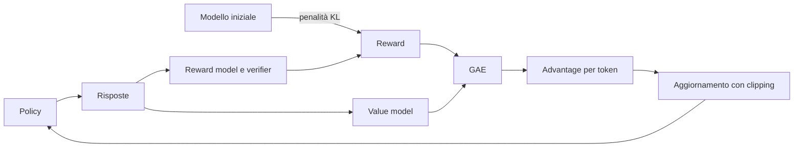
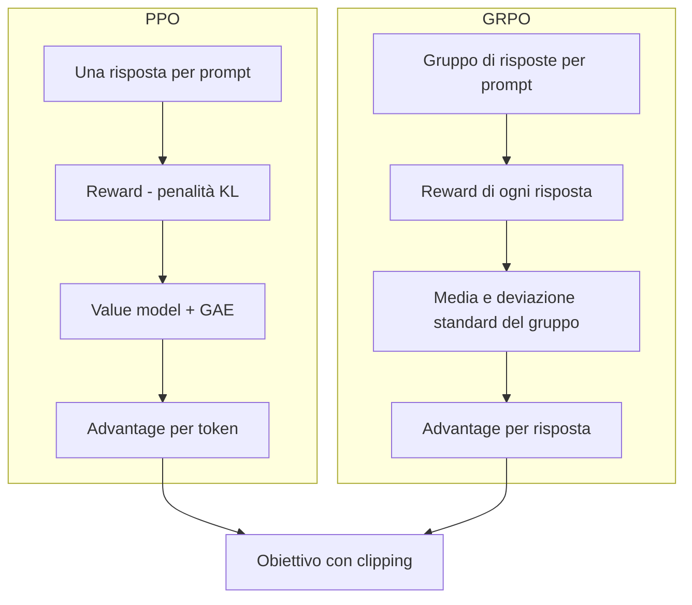

**PPO** (*Proximal Policy Optimization*) e **GRPO** (*Group Relative Policy Optimization*) sono oggi gli algoritmi più usati per addestrare gli LLM con il reinforcement learning. Partono dallo stesso obiettivo di training, che pesa ogni token della risposta con due fattori:

$$
J = \sum_t \rho_t \cdot A_t
$$

Il primo fattore, $$\rho_t$$, è il rapporto tra la probabilità che il modello attuale assegna al token e quella che gli assegnava il modello che ha generato la risposta. Il secondo, $$A_t$$, è l'[**advantage**](https://bigghis.github.io/posts/POST-TRAINING-RL-REWARD-RLHF/#ladvantage-meglio-o-peggio-del-previsto), cioè quanto il token è andato meglio o peggio del previsto.

Bisogna, quindi, **calcolare l'advantage.** Per dire se un token è andato meglio o peggio del previsto serve sapere cosa ci si aspettava, cioè il reward atteso, (**baseline**).

Bisogna anche ricordarsi di **evitare aggiornamenti troppo grandi.** Difatti, se a ogni passo il modello cambia troppo, può perdere capacità che aveva già acquisito in precedenza.

PPO e GRPO calcolano la baseline in modo diverso, mentre limitano gli aggiornamenti quasi allo stesso modo.

### PPO

PPO è l'algoritmo usato nel RLHF originale, quello con cui sono stati addestrati InstructGPT e ChatGPT. Si basa sul **value model**, un secondo modello addestrato a prevedere, token dopo token, quale reward finale ci si può aspettare.

#### Dall'aspettativa all'advantage

Immaginiamo il value model come un commentatore che segue la risposta mentre viene scritta e, dopo ogni token, dice quanto è probabile che finisca bene.

Prendiamo una soluzione di matematica con un errore di calcolo verso la fine. Il reward finale è 0, perché la risposta è sbagliata.

| Dopo il token… | Previsione del value model | Variazione |
|:---|:---|:---|
| "Carly ha 8 mele" | 0,6 | |
| "ne compra 2, quindi 10" | 0,8 | +0,2 |
| "ne vende 5, quindi 10 − 5 = 4" | 0,1 | −0,7 |
| "La risposta è 4" | reward finale 0 | −0,1 |

L'idea di PPO è semplice. L'advantage di un token è **quanto la previsione è cambiata grazie a quel token**. Il passaggio "quindi 10" ha alzato le aspettative e riceve un advantage positivo. Il calcolo sbagliato le ha fatte crollare e riceve un advantage molto negativo. È così che PPO distribuisce il merito tra i token, invece di penalizzare in blocco tutta la risposta.

In formula, la variazione dovuta al token $$t$$ è:

$$
\delta_t = V_{t+1} - V_t
$$

dove $$V_t$$ è la previsione del value model prima del token e $$V_{t+1}$$ quella dopo. All'ultimo token, al posto di $$V_{t+1}$$ si usa il reward finale.

#### GAE: non fidarsi troppo di una sola previsione

C'è un problema. Il value model è anch'esso un modello che sbaglia, soprattutto all'inizio del training, e una singola variazione può essere solo rumore. All'estremo opposto, si potrebbe ignorare il value model e confrontare ogni token direttamente con il reward finale, che è un dato reale ma molto rumoroso, perché dipende anche da tutto ciò che succede dopo quel token.

La **GAE** (*Generalized Advantage Estimation*) trova una via di mezzo. L'advantage di un token è la sua variazione più una parte, via via più piccola, delle variazioni dei token successivi:

$$
A_t = \delta_t + (\gamma\lambda)\,\delta_{t+1} + (\gamma\lambda)^2\,\delta_{t+2} + \dots
$$

In altre parole, ogni token si prende tutta la responsabilità di ciò che cambia subito dopo di lui e una responsabilità decrescente di ciò che cambia più avanti. Il parametro $$\lambda$$, tra 0 e 1, regola questo equilibrio.

- Con $$\lambda = 0$$ conta solo la variazione immediata. Ci si fida completamente del value model.
- Con $$\lambda = 1$$ si sommano tutte le variazioni fino alla fine, e il risultato è semplicemente il reward finale meno la previsione fatta prima di quel token. Ci si fida solo del reward reale.

In pratica si usano valori vicini a 1, come 0,95. Il parametro $$\gamma$$ (*discount factor*) riduce ulteriormente il peso delle variazioni lontane. Negli LLM di solito vale 1.

Il value model, intanto, si addestra insieme alla policy. Per ogni token confronta la sua previsione con il reward che la risposta ha effettivamente ottenuto, e corregge l'errore, come in una normale regressione.

#### Il clipping: passi piccoli e sicuri

Il secondo ingrediente di PPO riguarda il rapporto $$\rho_t$$.

Le risposte di una fase di raccolta vengono riusate per diversi aggiornamenti, perché generarle costa. Dopo qualche aggiornamento, però, il modello potrebbe aver già aumentato parecchio la probabilità di un token buono, per esempio del 50% ($$\rho_t = 1{,}5$$). Se l'obiettivo continuasse a premiarlo in proporzione, il modello continuerebbe a spingere nella stessa direzione sulla base di dati ormai vecchi, e un aggiornamento troppo grande può rovinare capacità che il modello aveva già.

> **Analogia dell'allenatore.** Un allenatore rivede con l'atleta il video della gara della settimana scorsa e gli fa notare un errore. Nel frattempo l'atleta lo ha già corretto in allenamento. Se l'allenatore insiste come se nulla fosse cambiato, l'atleta esagera la correzione e finisce per sbagliare nella direzione opposta.
{: .prompt-info }

PPO risolve il problema con il **clipping**. Il rapporto viene "tagliato" entro un intervallo stretto intorno a 1, tipicamente tra 0,8 e 1,2. Oltre quei limiti l'obiettivo non premia più ulteriori cambiamenti.

$$
J = \sum_t \min\big(\rho_t A_t,\; \text{clip}(\rho_t, 1-\epsilon, 1+\epsilon)\, A_t\big)
$$

Cioè, per ogni token si calcolano due valori, quello normale e quello con il rapporto limitato tra $$1-\epsilon$$ e $$1+\epsilon$$, e si tiene il più piccolo. Con $$\epsilon = 0{,}2$$ i limiti sono 0,8 e 1,2.

Il grafico mostra cosa succede nei due casi.


_La zona verde è l'intervallo in cui il rapporto può muoversi liberamente (ε = 0,2)._

- **Token migliore del previsto** ($$A_t > 0$$). Aumentarne la probabilità conviene, ma solo fino al 20% in più. Oltre $$\rho_t = 1{,}2$$ l'obiettivo diventa piatto, il gradiente si annulla e il modello smette di spingere.
- **Token peggiore del previsto** ($$A_t < 0$$). Ridurne la probabilità conviene, ma solo fino al 20% in meno. Sotto $$\rho_t = 0{,}8$$ l'obiettivo diventa piatto.

C'è un dettaglio importante, dovuto al minimo. Il clipping blocca solo i cambiamenti *nella direzione giusta* che sono già stati fatti. Se invece un aggiornamento ha peggiorato le cose, per esempio rendendo più probabile un token cattivo ($$A_t < 0$$ e $$\rho_t > 1{,}2$$), il valore non viene tagliato e il modello viene corretto con tutta la forza necessaria. Gli errori si correggono sempre, i miglioramenti si fermano a una distanza di sicurezza.

È da qui che viene il nome. *Proximal* significa "vicino". Ogni aggiornamento tiene il modello vicino alla versione che ha generato i dati.

#### Un secondo ancoraggio: la penalità KL

Il modello che ha generato le risposte cambia a ogni fase di raccolta. Nel training con PPO c'è però anche un secondo ancoraggio, fisso per tutto l'addestramento, cioè il **modello iniziale**, quello da cui è partito l'RL (di solito il modello dopo il fine-tuning).

Il motivo è il reward hacking. Ottimizzando il reward a lungo, il modello può allontanarsi molto dal linguaggio naturale e trovare frasi strane che il reward model premia, ma che nessuna persona apprezzerebbe. Per impedirlo si misura quanto le probabilità del modello attuale si sono allontanate da quelle del modello iniziale, con la **divergenza KL** (*Kullback-Leibler*), una misura di quanto due distribuzioni di probabilità sono diverse. La KL vale 0 se le distribuzioni sono identiche e cresce man mano che si allontanano.

La KL viene sottratta al reward, moltiplicata per un coefficiente $$\beta$$:

$$
R' = R - \beta \cdot \text{KL}(\pi_\theta \,\|\, \pi_{\text{iniziale}})
$$

In parole, il modello può migliorare il reward, ma paga un prezzo tanto più alto quanto più si allontana dal modello di partenza. Con $$\beta$$ alto resta molto vicino all'originale, con $$\beta$$ basso è più libero di cambiare.

È questo modello iniziale, congelato, a occupare memoria per tutto il training. Le probabilità del modello che ha generato le risposte, invece, si possono salvare durante la raccolta, insieme alle risposte stesse.

#### PPO nel suo insieme

Per ogni ciclo di training PPO esegue questi passi.

1. La policy genera le risposte, e si salvano le probabilità dei loro token.
2. Reward model e verifier assegnano i reward, a cui si sottrae la penalità KL.
3. Il value model stima le previsioni token per token, e con la GAE si calcolano gli advantage.
4. Si aggiornano la policy, con l'obiettivo con clipping, e il value model, con la regressione sui reward.
5. Si ricomincia con il modello aggiornato.



Il costo è quello visto per il RL classico. Ci sono quattro modelli in memoria, e due di questi, la policy e il value model, si addestrano. Il value model, inoltre, è un modello in più da far convergere, e se le sue previsioni sono sbagliate anche gli advantage lo sono.

### GRPO

GRPO è stato introdotto da DeepSeek nel 2024 con [DeepSeekMath](https://arxiv.org/abs/2402.03300){:target="_blank"} ed è diventato famoso con DeepSeek-R1. Gli autori riassumono l'idea centrale dicendo che **GRPO rinuncia al critic** (il value model) **e stima la baseline dai punteggi di un gruppo, riducendo in modo significativo le risorse di training**.

#### L'idea: misurare la media invece di prevederla

Il value model serve a stimare il reward atteso, che dipende soprattutto dal prompt. Un problema facile ha un reward atteso alto, uno difficile basso.

GRPO si chiede perché addestrare un modello per *prevedere* il reward medio di un prompt, quando lo si può *misurare*. Per ogni prompt genera un **gruppo** di risposte diverse, per esempio 12, le valuta tutte e usa il loro reward medio come baseline. Ogni risposta viene poi giudicata rispetto alle altre dello stesso gruppo.

> **Analogia della verifica in classe.** Un professore corregge una verifica e valuta ogni compito rispetto alla media della classe in quella stessa verifica. Un 6 in una verifica difficilissima, in cui la media è 4, è un ottimo risultato. Lo stesso 6 in una verifica facile, con media 8, è un risultato scarso.
{: .prompt-info }

#### L'advantage di gruppo

Per ogni risposta $$i$$ del gruppo, l'advantage è:

$$
A_i = \frac{r_i - \text{media}(r_1, \dots, r_G)}{\text{deviazione standard}(r_1, \dots, r_G)}
$$

In parole, si sottrae il reward medio del gruppo, così le risposte migliori della media hanno advantage positivo e le peggiori negativo. Poi si divide per la deviazione standard, cioè per quanto i reward del gruppo sono sparpagliati. In questo modo gli advantage hanno sempre una scala simile, sia che i reward vadano da 0 a 1 sia che vadano da 0 a 10, e sia che le risposte di un gruppo siano molto diverse tra loro sia che lo siano poco.

Un esempio con un gruppo di 4 risposte, valutate sommando i punteggi di più grader (test di unità, formattazione e altri):

| Risposta | Reward | Advantage | Effetto |
|:---|:---|:---|:---|
| A | 8,5 | +1,12 | probabilità aumentata |
| B | 6,8 | +0,49 | probabilità aumentata |
| C | 4,2 | −0,49 | probabilità ridotta |
| D | 2,5 | −1,12 | probabilità ridotta |

La media è 5,5 e la deviazione standard circa 2,67. I reward erano tutti positivi, ma dopo la normalizzazione metà delle risposte viene incoraggiata e metà scoraggiata.


_A sinistra i reward grezzi con la loro media, a destra gli advantage normalizzati._

```python
import numpy as np

rewards = np.array([8.5, 6.8, 4.2, 2.5])
advantages = (rewards - rewards.mean()) / (rewards.std(ddof=1) + 1e-4)
# [ 1.12  0.49 -0.49 -1.12]
```

Il piccolo epsilon aggiunto al denominatore evita la divisione per zero quando tutti i reward del gruppo sono uguali.

#### Cosa cambia rispetto a PPO

Il resto dell'obiettivo è lo stesso del PPO, con il rapporto e il clipping. Nella versione di DeepSeekMath la penalità KL rispetto al modello iniziale c'è ancora, ma viene aggiunta direttamente all'obiettivo invece di essere sottratta al reward. Le differenze vere sono tre.

**L'advantage è per risposta, non per token.** Tutti i token di una risposta ricevono lo stesso advantage. Si perde la ripartizione fine del merito di PPO, quella che sapeva individuare il token sbagliato. In cambio, il confronto tra molte risposte allo stesso prompt fa emergere statisticamente quali scelte portano a reward alti, perché le risposte buone tendono a condividere i passaggi giusti e quelle cattive gli errori.

**Non c'è il value model.** È il risparmio principale. Su un modello da 7 miliardi di parametri addestrato per intero, il value model con gradienti e stati dell'optimizer pesa circa 56 GB. Se poi il reward arriva solo da verifier, come per DeepSeek-R1-Zero, non serve nemmeno il reward model, e in memoria restano solo la policy e il modello iniziale. Con LoRA e il modello iniziale ottenuto spegnendo gli adapter, resta in pratica un solo modello.

**Serve più generazione.** Invece di una risposta per prompt se ne generano 8, 12 o anche di più. Generare costa tempo e memoria (la KV cache cresce con il numero di risposte in parallelo), e il costo si sposta dal training alla raccolta dei dati. Per avere risposte diverse tra loro serve anche una temperatura di sampling sufficiente (es.: 0,7).

#### Quando GRPO non impara nulla

C'è un caso in cui GRPO non riceve alcun segnale.
Se tutte le risposte di un gruppo ottengono lo stesso reward, la media coincide con ogni singolo reward e tutti gli advantage valgono zero. Il modello non impara niente da quel prompt. Succede quando il prompt è troppo facile e il modello risponde sempre bene, oppure troppo difficile e sbaglia sempre. Con un reward binario (1 giusto, 0 sbagliato) succede spesso, soprattutto all'inizio del training, quando un modello debole sbaglia quasi tutto.

Per contrastare questa situazione si scelgono prompt di difficoltà adeguata al modello e si progettano reward più graduati, che creino differenze anche tra risposte tutte sbagliate.

#### In codice

Con Hugging Face TRL, GRPO si configura con `GRPOConfig` e si avvia con `GRPOTrainer`. La funzione di reward riceve le risposte generate e restituisce un reward grezzo per ciascuna. Raggruppamento e normalizzazione li fa il trainer.

```python
from trl import GRPOConfig, GRPOTrainer

def correctness_reward(prompts, completions, answer, **kwargs):
    return [reward_signal.compute_reward(c, a) for c, a in zip(completions, answer)]

config = GRPOConfig(
    num_generations=12,      # risposte generate per ogni prompt
    temperature=0.7,         # varietà tra le risposte del gruppo
    learning_rate=1e-6,
    gradient_checkpointing=True,
)

trainer = GRPOTrainer(
    model=model,
    reward_funcs=correctness_reward,
    args=config,
    train_dataset=train_dataset,
    processing_class=tokenizer,
)
trainer.train()
```

Le colonne del dataset diverse dal prompt, come `answer` con la risposta corretta, vengono passate alla funzione di reward come argomenti.

### PPO e GRPO a confronto



| | PPO | GRPO |
|:---|:---|:---|
| Baseline | prevista dal value model | media del gruppo |
| Advantage | per token, con GAE | per risposta, normalizzato |
| Modelli addestrati | policy e value model | solo policy |
| Risposte per prompt | di solito una | un gruppo (8, 12, …) |
| Costo principale | memoria e stabilità del value model | generazione delle risposte |

GRPO si è diffuso soprattutto per i compiti di ragionamento con reward verificabili, come matematica e codice, dove generare molte risposte e controllarle con un verifier è naturale. PPO resta una scelta valida quando serve una ripartizione fine del merito e si hanno le risorse per il value model.

La storia di questi metodi segue una linea abbastanza chiara. Prima il RLHF con PPO, che ha portato a ChatGPT. Poi il RLAIF, con il feedback dato da un modello guidato da una costituzione invece che da annotatori umani. Infine GRPO con reward verificabili, che ha reso il training dei modelli di ragionamento molto più accessibile.

### Progettare una funzione di reward per GRPO

Con GRPO la funzione di reward decide quasi tutto. Vediamo come costruirne una per GSM8K, il dataset di problemi di matematica in cui la soluzione corretta termina con `#### <numero>`.

Il punto di partenza più semplice è un reward binario, 1 se la risposta è corretta e 0 altrimenti. Per quanto visto sopra, però, con un modello che all'inizio sbaglia spesso molti gruppi avranno tutti reward 0 e nessun segnale. Serve un reward più graduato, costruito in quattro parti.

**1. Estrarre la risposta in modo robusto.** Il modello non usa sempre il formato `####`. L'estrazione cerca prima quel formato, poi espressioni come "The answer is 42" o "= 42", e come ultima risorsa prende l'ultimo numero del testo.

```python
import re

def extract_numerical_answer(text):
    if "####" in text:
        try:
            return float(text.split("####")[-1].strip().replace(",", "").replace("$", ""))
        except ValueError:
            pass
    patterns = [
        r"(?:The answer is|Answer:)\s*\$?([+-]?\d+(?:,\d{3})*(?:\.\d+)?)",
        r"(?:equals?|=)\s*\$?([+-]?\d+(?:,\d{3})*(?:\.\d+)?)",
    ]
    for pattern in patterns:
        match = re.search(pattern, text, re.IGNORECASE)
        if match:
            return float(match.group(1).replace(",", ""))
    numbers = re.findall(r"[+-]?\d+(?:\.\d+)?", text.replace(",", ""))
    return float(numbers[-1]) if numbers else None
```

**2. Misurare la qualità del ragionamento.** Alcuni indicatori semplici dicono se la risposta contiene un tentativo serio. Ci sono calcoli (simboli come `+` e `×`, o parole come "multiply" e "add")? Ci sono passaggi in sequenza ("first", "then", "finally")? Quanto è lunga la risposta?

**3. Assegnare il reward in base al caso.**

- **Risposta corretta.** Il reward è 1,0, più un piccolo bonus (fino a 1,3) se la risposta mostra i passaggi e il ragionamento.
- **Risposta sbagliata.** Si dà un credito parziale in base all'errore relativo. Entro l'1% dal valore giusto il reward è 0,9, entro il 10% è più basso, e così via fino a un minimo di 0,1 per chi ha comunque mostrato del lavoro.
- **Nessun numero estraibile.** Si arriva fino a 0,3 se la risposta è lunga e contiene calcoli, perché il modello ci ha almeno provato.

**4. Mettere insieme i pezzi.**

```python
def compute_reward(self, response, correct_answer):
    predicted = self.extract_numerical_answer(response)
    quality = self.analyze_response_quality(response)
    if predicted is None:
        return self.compute_unparseable_reward(response, quality)           # 0,0 – 0,3
    if abs(predicted - correct_answer) < 1e-6:
        return self.compute_correct_reward(response, quality)               # 1,0 – 1,3
    return self.compute_wrong_reward(predicted, correct_answer, quality)    # 0,1 – 0,9
```

In questo modo, anche quando nessuna risposta del gruppo è corretta, quella che si avvicina di più o ragiona meglio riceve un reward più alto delle altre, e GRPO ha un segnale da cui imparare.

> **Attenzione ai bonus.** Ogni bonus è un'occasione di reward hacking. Se la lunghezza o parole come "first" e "then" danno punti, il modello imparerà a scrivere risposte lunghe e piene di quelle parole, indipendentemente dalla correttezza. I bonus devono restare piccoli rispetto al premio per la risposta giusta, e conviene leggere regolarmente le risposte generate per accorgersi di comportamenti strani.
{: .prompt-warning }

Per lo stesso motivo, il progresso del training non si misura con il reward, che il modello impara a massimizzare, ma con l'**accuratezza sul test set**. Nel caso di GSM8K sono i circa 1.300 problemi di test, mai visti durante il training, valutati periodicamente durante l'addestramento.

Qualche accorgimento pratico completa il quadro. Il prompt usa un formato fisso, per esempio *"Question: … Let's solve this step-by-step and find the numerical answer:"*. Il padding è a sinistra, perché il modello deve generare. Gradient checkpointing e caricamento a 8 bit riducono la memoria. Su un modello da 7 miliardi di parametri un training completo richiede decine di ore di GPU, ma con una buona funzione di reward l'accuratezza sul test comincia a salire già nelle prime ore.

### Dall'algoritmo alla valutazione

PPO e GRPO condividono la stessa struttura. Pesano le probabilità dei token con un advantage e limitano ogni aggiornamento con il clipping, così il modello resta vicino alla versione che ha generato i dati. La differenza sta nella baseline. PPO la fa prevedere a un value model e ottiene un advantage per ogni token, al prezzo di un modello in più da addestrare. GRPO la misura su un gruppo di risposte allo stesso prompt, rinuncia alla precisione per token e risparmia un intero modello, spostando il costo sulla generazione.

Con GRPO, in particolare, il cuore del lavoro diventa la funzione di reward. Deve creare differenze tra le risposte di un gruppo, premiare i progressi parziali e resistere ai tentativi del modello di aggirarla.

Proprio perché il modello impara a massimizzare qualunque segnale gli si dia, l'unico modo per sapere se sta davvero migliorando è valutarlo su dati che non ha mai visto, con metriche diverse da quelle che ottimizza. Le valutazioni e gli ambienti di test diventano così la guida di tutto l'addestramento.
