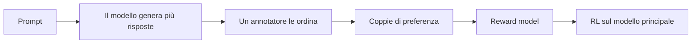
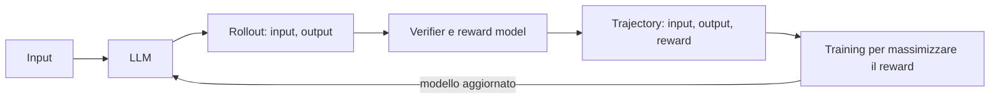

Nel reinforcement learning (RL) il modello non ha una risposta corretta da imitare. Genera da sé le risposte, e per ciascuna riceve un punteggio, il **reward**, che valuta quanto è affidabile assegnandogli un punteggio.  
In questo articolo vediamo chi assegna il reward, come il reward viene usato per aggiornare i pesi del modello e perché questo tipo di addestramento richiede molta più memoria del fine-tuning.

### Cosa cambia rispetto al fine-tuning

Nel fine-tuning si raccolgono tutti i dati `{input, target output}` e poi si addestra il modello per ridurre la distanza tra la sua risposta e il target.

Nell'RL ci sono tre differenze.

- **Non c'è un target.** Servono solo gli input. L'output è quello che genera il modello, e serve a calcolare il reward.
- **Si massimizza il reward.** L'obiettivo non è avvicinarsi a una risposta precisa, ma imparare a produrre risposte che ottengono punteggi alti.
- **Raccolta dei dati e training si alternano.** Il modello genera risposte, le risposte vengono valutate, il modello si aggiorna, e con il modello aggiornato si generano nuove risposte. In loop viene ripetuto più volte.

Il reward è un singolo numero, positivo o negativo. Alla domanda *"Cosa significa GPU?"*, la risposta *"Graphics Processing Unit"* può ricevere +1, mentre *"Una specie di componente del computer, non ne sono sicuro"* può ricevere −1.

### Da dove arriva il reward

#### I verifier

Il modo più semplice per assegnare un reward è un **verifier**, un programma che controlla un criterio oggettivo. Se il modello scrive codice, il verifier controlla che compili e che i test passino. Se risolve un problema di matematica, controlla che il risultato finale sia corretto.

Il fine-tuning sembra fare lo stesso controllo, ma c'è una differenza. Nel fine-tuning il modello deve riprodurre esattamente la stringa del target, compreso il ragionamento dentro `<think>`, e viene penalizzato per ogni token diverso. Con un verifier conta solo la risposta finale, e il ragionamento può prendere qualunque strada, purché arrivi al risultato giusto.

I modelli DeepSeek sono un esempio famoso. **DeepSeek-R1-Zero** è stato addestrato solo con RL, usando due verifier. Il primo controlla che la risposta matematica sia corretta, il secondo che il ragionamento sia scritto dentro i tag `<think>`. Per **DeepSeek-R1** si è aggiunto un terzo verifier che penalizza le risposte che mescolano inglese e cinese, un problema di leggibilità emerso senza questo controllo.

```python
def math_reward(response, correct_answer):
    return 1.0 if extract_final_answer(response) == correct_answer else 0.0

def format_reward(response):
    return 1.0 if "<think>" in response and "</think>" in response else 0.0

def language_consistency_reward(response):
    return 1.0 if consistent_language(response) else -0.5

def combined_reward(response, correct_answer):
    return (math_reward(response, correct_answer)
            + format_reward(response)
            + language_consistency_reward(response))
```

Il reward complessivo è la somma dei singoli controlli. In questo modo si bilanciano più obiettivi insieme, come correttezza, formato e coerenza della lingua.

Un reward binario (1 se giusto, 0 se sbagliato) ha un limite. Una risposta che sbaglia di poco riceve lo stesso punteggio di una completamente sbagliata, e il modello non capisce se si sta avvicinando. Per questo si usa spesso un **credito parziale**, che premia le risposte vicine al risultato corretto:

```python
if predicted == correct_answer:
    reward = 1.0
else:
    relative_error = abs(predicted - correct_answer) / abs(correct_answer)
    if relative_error < 0.01:
        reward = 0.9
    elif relative_error < 0.1:
        reward = 0.7
    elif relative_error < 0.3:
        reward = 0.4
    else:
        reward = 0.0
```

#### Quando un verifier non basta

I verifier funzionano solo dove esiste un criterio verificabile. Si può controllare se un calcolo è giusto, ma non esiste una funzione che stabilisca se una risposta è empatica o utile.

Prendiamo il problema *"Carly ha 8 mele, ne compra 2 e ne vende 5 al fornaio. Come si sente Carly?"*. Un checker matematico non sa cosa farsene. Serve un altro modello che legga la risposta e le assegni un punteggio. Può essere un LLM usato come giudice oppure, più spesso, un **reward model**, un modello addestrato apposta per restituire un reward numerico. Alla risposta *"Carly si sente soddisfatta della giornata"* potrebbe assegnare +1,3.

### Come si addestra un reward model

Il reward model deve imparare a dare punteggi alti alle risposte che le persone preferiscono. Per farlo servono dati che descrivono queste preferenze, raccolti da **annotatori**, cioè persone incaricate di valutare le risposte del modello.

La strada più ovvia sarebbe chiedere a ogni annotatore un voto, per esempio da 1 a 10. In pratica funziona male perché ognuno usa la scala a modo suo, a causa di preferenze soggettive, per cui la stessa risposta può ricevere 8 da un annotatore e 5 da un altro, e anche la stessa persona può dare voti diversi a distanza di qualche ora. I voti diventano rumorosi e difficili da confrontare.

Più affidabile è mostrare più risposte allo stesso prompt e chiedere di **metterle in ordine**, dalla migliore alla peggiore. Confrontare due risposte è un giudizio più immediato e non dipende da come ognuno interpreta una scala di voti.

Anche l'ordinamento resta soggettivo. Nel lavoro su InstructGPT di OpenAI ([Ouyang et al., 2022](https://arxiv.org/abs/2203.02155){:target="_blank"}), gli annotatori erano d'accordo tra loro in circa il 73% dei confronti. Per contenere questo rumore si scrivono linee guida dettagliate, si fanno valutare gli stessi confronti a più persone e si raccolgono moltissime coppie di dati. Il reward model impara così una preferenza media, più stabile dei singoli giudizi.

```text
Prompt: Scrivi un biglietto di ringraziamento per un regalo.

1° "Grazie mille per il bellissimo libro! Non vedo l'ora di leggerlo."
2° "Mah, carino. Grazie, credo."
3° "Thx"
```

Quindi il reward model impara a riconoscere quali risposte le persone preferiscono.

#### Dalle classifiche alle coppie

Una classifica non si può usare direttamente come target. La si scompone allora in **coppie di preferenza**, in cui una risposta A è preferita a una risposta B. La classifica precedente produce tre coppie, cioè 1° > 2°, 1° > 3° e 2° > 3°.

Per ogni coppia, il reward model assegna un punteggio a entrambe le risposte, $$r(A)$$ e $$r(B)$$. L'obiettivo è che la risposta preferita riceva un punteggio più alto, quindi che la differenza $$r(A) - r(B)$$ sia grande e positiva.

La differenza si trasforma in una probabilità con la **sigmoide** $$\sigma$$, una funzione che schiaccia (**squash**)qualunque numero tra 0 e 1. Il valore $$\sigma(r(A) - r(B))$$ si legge come la probabilità che A sia preferita a B. Vale circa 1 se $$r(A)$$ è molto più alto di $$r(B)$$, 0,5 se i due punteggi sono uguali, circa 0 se $$r(A)$$ è molto più basso.

La loss è il logaritmo negativo di questa probabilità, come la cross-entropy del fine-tuning:

$$
L = -\log \sigma\big(r(A) - r(B)\big)
$$

In parole, la loss è piccola quando il reward model dà alla risposta preferita un punteggio molto più alto dell'altra, ed è grande quando sbaglia l'ordine. Con $$r(A) = 2{,}4$$ e $$r(B) = -1{,}3$$ la differenza è 3,7 e la loss vale circa 0,02. 


_A sinistra la probabilità che A sia preferita a B, a destra la loss corrispondente._

Questo processo si chiama **preference learning**, e il modello che ne risulta si chiama anche **preference model**. In pratica si parte da un LLM e si sostituisce l'ultimo strato, quello che produce le probabilità sul vocabolario, con uno che produce un solo numero, il reward. Poi lo si addestra con questa loss come in un normale fine-tuning.

Le classifiche non devono per forza essere create da umani. Anche un LLM può ordinare le risposte o indicare la migliore di una coppia, guidato da un insieme di regole. In questo caso si parla di **RLAIF** (*Reinforcement Learning from AI Feedback*), l'approccio della [Constitutional AI](https://bigghis.github.io/posts/POST-TRAINING-IN-PRATICA/).

#### RLHF: il caso ChatGPT

Chi usa ChatGPT a volte vede due risposte affiancate e una richiesta di scegliere la migliore. È la raccolta di dati per il **RLHF** (*Reinforcement Learning from Human Feedback*), il processo con cui è stato addestrato ChatGPT.

1. Per un prompt come *"Spiega lo sbarco sulla Luna a un bambino di 6 anni"* si generano più risposte, per esempio quattro (A, B, C, D).
2. Un annotatore le ordina dalla migliore alla peggiore, per esempio D > C > A = B.
3. La classifica diventa un insieme di coppie di preferenza.
4. Con le coppie si addestra il reward model.
5. Il reward model assegna i reward alle risposte del modello principale, che viene addestrato con RL, eventualmente insieme ai verifier.



#### Reward model o verifier?

Spesso si usano entrambi, per obiettivi diversi.

Il **reward model** è utile quando l'obiettivo si può descrivere con esempi ma non con una funzione. È la scelta giusta per compiti soggettivi, come allineare il modello ai valori delle persone, migliorare la qualità del dialogo o rendere il modello più piacevole da usare. Il suo punto debole è che impara le preferenze in modo imperfetto, e il modello addestrato può trovare il modo di ottenere punteggi alti senza dare risposte davvero migliori(**reward hacking**).

I **verifier** sono perfetti per i compiti oggettivi, come matematica, codice e correttezza dei fatti. Sono più difficili da ingannare, ma funzionano solo dove esiste un criterio verificabile. Inoltre possono essere costosi. Un verifier deve girare su migliaia di risposte a ogni ciclo, e se controllare una risposta richiede di eseguire una lunga suite di test, il training rallenta di conseguenza.

### Dalle risposte ai dati di training

Mettendo insieme i pezzi, i dati dell'RL si costruiscono così:

1. Il modello genera una risposta per ogni input. La coppia `{input, output}` si chiama **rollout**.
2. Verifier e reward model assegnano un reward a ogni rollout. La tupla `{input, output, reward}` si chiama **trajectory**.
3. Le trajectory servono ad addestrare il modello, che diventa più bravo a ottenere reward alti.
4. Con il modello aggiornato si generano nuovi rollout, e il ciclo ricomincia.



### Dal reward all'aggiornamento dei pesi

Nel fine-tuning la loss dipende direttamente dalle probabilità che il modello assegna ai token, e con la backpropagation si calcola come cambiarla modificando i pesi.

Con il reward questo non si può fare. Il reward viene calcolato su un testo già generato, cioè su token scelti con il sampling, e il sampling è una scelta discreta su cui non si possono calcolare derivate. Se poi il reward arriva da un verifier, cioè da un programma, non c'è nemmeno una rete attraverso cui propagare il gradiente.

#### L'idea: pesare le probabilità con il reward

Si può aggirare il problema: invece di derivare il reward, lo si usa come peso. Si **aumenta la probabilità dei token che hanno portato a un reward alto** e si **diminuisce quella dei token che hanno portato a un reward basso**:

$$
J = \sum_{t} \log \pi_\theta(y_t \mid x, y_{<t}) \cdot R
$$

Qui $$\pi_\theta$$ è il modello che stiamo addestrando (in RL si chiama **policy**), $$y_t$$ sono i token della risposta generata e $$R$$ è il suo reward. In parole, si prende la log-probabilità di ogni token della risposta, la si moltiplica per il reward e si cerca di rendere $$J$$ il più grande possibile.

Il ragionamento è molto simile alla loss del fine-tuning. Se il reward è positivo, l'aggiornamento spinge il modello a ripetere quella risposta, come se fosse un target da imitare. Se è negativo, lo spinge ad allontanarsene. Questa idea è alla base di **REINFORCE**, uno dei primi algoritmi di *policy gradient*.

#### Due fasi e il modello di riferimento

Per addestrare un modello con RL si lavora in due fasi.

- **Fase 1, raccolta.** Il modello genera le risposte a molti input, e le risposte vengono valutate. Si ottiene un dataset di trajectory. È solo inferenza, quindi si può fare in fretta con batch molto grandi.
- **Fase 2, training.** Il modello si addestra su quel dataset, un batch alla volta. I batch sono più piccoli, perché il training richiede molta più memoria.

Durante la fase 2, come in ogni training, dopo ogni batch si calcolano i gradienti e si aggiornano i pesi, quindi il modello cambia continuamente. Le risposte su cui si addestra, invece, le ha scritte la versione precedente, quella della fase 1. Dopo qualche aggiornamento il modello attuale non scriverebbe più quelle risposte allo stesso modo, alcune le produrrebbe più spesso, altre quasi mai. Se non se ne tiene conto, il training si basa su dati che non rappresentano più il modello, e l'addestramento diventa instabile.

Per questo si conserva una copia congelata del modello che ha scritto le risposte, chiamata **modello di riferimento** ($$\pi_{\text{ref}}$$). Per ogni token si confronta la probabilità che gli assegna il modello attuale con quella che gli assegnava il modello di riferimento, calcolando il loro **rapporto**.

$$
\rho_t = \frac{\pi_\theta(y_t \mid x, y_{<t})}{\pi_{\text{ref}}(y_t \mid x, y_{<t})}
$$

In parole, il rapporto dice quanto il modello attuale scriverebbe ancora quel token, rispetto al modello che lo ha scritto davvero. Un rapporto di 1 significa che il token ha la stessa probabilità di allora, un rapporto > 1 significa che ora il token è più probabile, un rapporto < 1 significa che ora è meno probabile.

Nell'obiettivo di training il rapporto prende il posto della probabilità. Le risposte che il modello attuale produrrebbe ancora volentieri pesano di più, quelle che ormai produrrebbe di rado pesano di meno. Il confronto con un punto fisso, il modello di riferimento, rende il training più stabile.

#### L'advantage: meglio o peggio del previsto?

Anche il reward, così com'è, si può migliorare. Usarlo direttamente nell'obiettivo funziona, ma in modo inefficiente, per due motivi.

Il primo è legato al **segno** del reward. Immaginiamo che tre risposte allo stesso prompt ricevano reward 8, 9 e 10. Sono tutti numeri positivi, e il modello li interpreta tutti come un incoraggiamento: aumenta la probabilità di tutte e tre le risposte, solo un po' di più per quella da 10. In questo modo impara molto lentamente a distinguere la risposta migliore da quelle mediocri, perché nessuna viene davvero scoraggiata. Le cose cambiano se a ogni reward si sottrae la media, cioè 9. I valori diventano −1, 0 e +1, e il messaggio per il modello è più chiaro perché la risposta da 10 è migliore del solito e va incoraggiata, quella da 8 è peggiore e va scoraggiata, quella da 9 è nella norma e non cambia nulla.

Il secondo motivo riguarda la **ripartizione del merito**. Il reward giudica la risposta nel suo insieme, ma l'aggiornamento avviene token per token, e ogni token della risposta riceve lo stesso reward. Pensiamo a una soluzione di matematica con un ragionamento corretto e un solo errore di calcolo alla fine. Il reward è basso, e tutti i token vengono penalizzati allo stesso modo, compresi quelli del ragionamento corretto. Da un singolo esempio il modello non può capire quali token abbiano causato l'errore, e il segnale che riceve è rumoroso. Solo confrontando molte risposte emerge quali scelte portano davvero a reward alti.

Per questo si stima una **baseline** $$b$$, il reward che ci si aspetterebbe in media, e la si sottrae al reward. Il risultato si chiama **advantage**:

$$
A = R - b
$$

L'advantage dice quanto una risposta è andata meglio o peggio del previsto. È positivo se la risposta è migliore della media, negativo se è peggiore. Nella letteratura dell'RL la funzione che stima il reward atteso si chiama **value function**.

L'effetto sulla velocità di apprendimento è notevole. Il grafico seguente mostra una simulazione con REINFORCE in cui il modello deve scegliere tra dieci risposte, tutte con reward positivi ma di valore diverso. Con la baseline impara molto più in fretta a scegliere la migliore.


_Simulazione su 10 risposte possibili con reward medi tra 2 e 6 circa, media su 300 esecuzioni._

#### Il modello che stima la baseline

Nella simulazione la baseline è semplicemente la media dei reward ottenuti fino a quel momento. Purtroppo una media unica non è sufficiente. 

Il reward atteso dipende dal **prompt**. Su un problema facile quasi tutte le risposte ottengono un reward alto, su uno difficile quasi tutte un reward basso. Un reward di 0,6 è un ottimo risultato per un problema difficile e un risultato scarso per uno facile. Serve quindi una baseline diversa per ogni prompt.

Il reward atteso cambia anche **durante la risposta**. Finché il ragionamento procede bene, le probabilità di arrivare al risultato giusto restano alte; dopo un passaggio sbagliato crollano.

Per stimare il reward atteso in ogni situazione si addestra un modello apposito, chiamato **value model** o **critic**. Di solito è anch'esso un LLM, a cui, come per il reward model, si sostituisce l'ultimo strato con uno che restituisce un solo numero. Legge il prompt e la risposta fino a un certo token, e prevede quale reward finale ci si può aspettare da quel punto in poi. Si addestra durante il RL, confrontando le sue previsioni con i reward effettivamente ottenuti e correggendo l'errore.

Il value model risolve anche il problema della ripartizione del merito. Torniamo alla soluzione di matematica con un errore di calcolo alla fine. Lungo il ragionamento corretto il value model prevede un reward alto, per esempio 0,8, e subito dopo il token sbagliato la previsione scende a 0,1. L'advantage di ogni token misura proprio queste variazioni, quindi la colpa ricade sul punto in cui l'aspettativa crolla e non sui passaggi corretti.

Il prezzo è un modello in più da addestrare, con il suo carico di memoria.

Con rapporto e advantage, l'obiettivo di training diventa:

$$
J = \sum_t \rho_t \cdot A_t
$$

cioè il rapporto tra modello attuale e modello di riferimento, pesato per quanto ogni token è stato migliore o peggiore del previsto. Esistono molti modi di calcolare la baseline e quindi l'advantage, ed è proprio questo uno degli aspetti che distinguono gli algoritmi di RL moderni.

### Quanta memoria serve

**Il punto debole del RL è la quantità di modelli da tenere in memoria contemporaneamente.** Nella versione classica sono quattro, e non tutti occupano lo stesso spazio.

- **Il modello che si addestra (la policy).** Viene aggiornato a ogni passo, quindi oltre ai pesi servono i gradienti e gli stati dell'optimizer.
- **Il modello di riferimento.** È congelato e serve solo a calcolare probabilità, quindi in memoria ci sono solo i pesi.
- **Il reward model.** Anche lui è congelato durante l'RL, e servono solo i pesi.
- **Il modello che stima la baseline.** Deve imparare a prevedere il reward atteso, quindi si addestra anche lui, con gradienti e stati dell'optimizer.

Facciamo i conti con modelli da 7 miliardi di parametri, tutti in bf16 (2 byte per numero), con una stima semplificata. I pesi di un modello occupano circa 14 GB. Un modello addestrato con AdamW richiede pesi, gradienti e due stati dell'optimizer, cioè circa 56 GB.

| Modello | In memoria | GB |
|:---|:---|:---|
| Policy | pesi + gradienti + stati di Adam | 56 |
| Riferimento | solo pesi | 14 |
| Reward model | solo pesi | 14 |
| Modello baseline | pesi + gradienti + stati di Adam | 56 |
| **Totale** | | **≈ 140** |

Un fine-tuning completo dello stesso modello richiede circa 56 GB, e con LoRA circa 14. L'RL classico ne richiede circa 140, due volte e mezza il fine-tuning completo, prima ancora di contare le attivazioni.

A questo si aggiunge la memoria per generare i rollout. Durante la generazione il modello conserva una cache dei calcoli già fatti sui token precedenti (**KV cache**), che cresce con la lunghezza delle risposte e con il numero di risposte generate in parallelo (batch size).

Per avere un riferimento concreto, una GPU di fascia alta per il training ha 80 GB di memoria. Un fine-tuning completo di un 7B ci sta, a fatica. L'RL classico dello stesso modello richiede almeno due GPU solo per i modelli.


_Stima semplificata per modelli da 7 miliardi di parametri in bf16, senza attivazioni né rollout._

#### Rimedi per ridurre l'ingombro della memoria

Ci sono diverse contromisure, di solito si combinano.

- **LoRA sulla policy.** Come nel fine-tuning, si addestrano solo gli adapter, e gradienti e stati dell'optimizer diventano trascurabili.
- **Il riferimento condiviso.** Se la policy è il modello base più gli adapter LoRA, il modello di riferimento è semplicemente lo stesso modello base con gli adapter spenti. Non serve una seconda copia.
- **Quantizzazione dei modelli congelati.** Il reward model, che serve solo in inferenza, si può caricare a 8 bit invece che a 16, dimezzando la memoria (7 GB invece di 14).
- **LoRA anche sul modello baseline**, se è presente.
- **Gradient checkpointing.** Invece di conservare tutte le attivazioni del forward pass, se ne conservano solo alcune e le altre si ricalcolano durante la backpropagation. Si risparmia memoria in cambio di un training un po' più lento.

Con LoRA su policy e baseline, il riferimento condiviso e il reward model a 8 bit, si scende da circa 140 a circa 35 GB, e tutto torna a stare in una sola GPU.

La contromisura più radicale è eliminare del tutto uno dei modelli. È quello che fa GRPO, che rinuncia al modello baseline e stima il reward atteso in un altro modo.

### Dal reward agli algoritmi

L'RL sostituisce il target con un reward, e il reward può arrivare da verifier, per i compiti oggettivi, o da un reward model addestrato sulle preferenze, per quelli soggettivi. Il reward model impara da coppie di risposte con una loss simile alla cross-entropy, e questa è l'essenza del RLHF.

Poiché il reward non si può derivare, lo si usa come peso sulle probabilità dei token generati. Due accorgimenti rendono il training stabile ed efficiente. Il primo è il rapporto con un modello di riferimento, che tiene conto di quanto il modello è cambiato da quando ha generato i dati. Il secondo è l'advantage, che confronta ogni reward con quello atteso.

Il prezzo è la memoria. Fino a quattro modelli insieme portano l'RL a costare due o tre volte un fine-tuning completo, e tecniche come LoRA, la quantizzazione e il riferimento condiviso servono a riportarlo su una sola GPU.

Resta aperta la questione di come calcolare la baseline. PPO addestra un modello apposito per stimarla, GRPO la ricava confrontando tra loro più risposte allo stesso prompt, e da questa scelta dipendono costi e stabilità del training.
