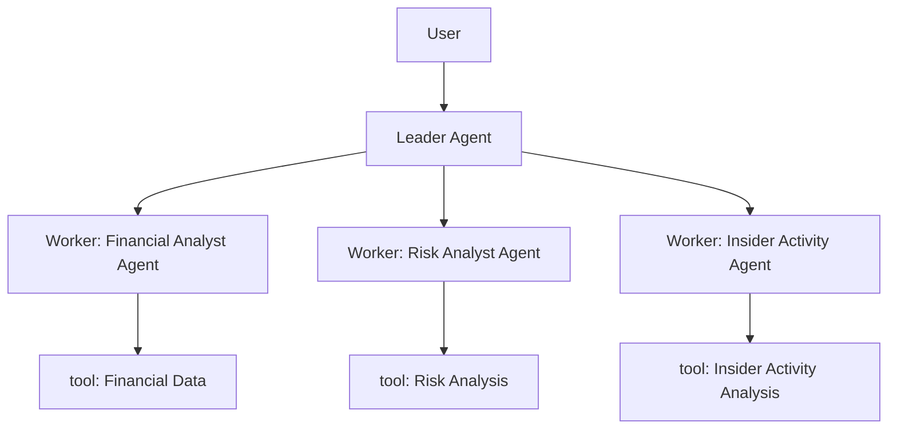

### Agentic Engineering

Agentic engineering represents a shift in how we approach software development and automation. 
Instead of treating artificial intelligence as a simple code generation tool or an isolated assistant, **this paradigm models AI agents as collaborative digital team members**. 
In an agentic engineering system, one or multiple specialized agents work together to execute complex workflows that mirror the operations of real-world engineering teams. 


### Deep Agents Library


[Deep Agents](https://docs.langchain.com/oss/python/deepagents/overview){:target="_blank"} is a framework that enables the complete *harnessing* of agents. 
It simplifies the process of building multi-agent systems by providing a set of tools and capabilities that make it easier to build and manage agents.  

> An agent harness is the software infrastructure that wraps around an AI model, acting as the "body" for the AI's "brain" to turn it into an autonomous agent. It bridges the model's reasoning with real-world actions by providing operational control for multi-step workflows, integrating external tools and environments, managing long-term memory across sessions, and enforcing safety guardrails. 
> To learn more: [The Anatomy of an Agent Harness](https://www.langchain.com/blog/the-anatomy-of-an-agent-harness){:target="_blank"}
{: .prompt-info }

To put Deep Agents to work and test it in the field, we will implement an agentic system specialized in financial reporting that analyzes a company's financials and produces an investment report.  
We will use the SEC EDGAR database to retrieve company financial data through the [edgartools](https://edgartools.readthedocs.io/en/latest/){:target="_blank"} library.  


### The Financial Analyst Agent Demo

We want to create an autonomous agentic system that produces financial reports for publicly traded companies. 

This application assembles a team of AI analysts to evaluate a company's financial health and produce a comprehensive investment report. The software reads real-world data from SEC filings, processes the information, and generates a structured analysis.

This system perfectly illustrates the agentic engineering model. It utilizes a **central leader agent to orchestrate** the entire research workflow. 
When a user requests an analysis of a specific company, **the leader breaks down the request, delegates the quantitative and qualitative research to specialized worker agents**, and finally synthesizes their individual findings into a final report.

### The Architecture

The architecture of the financial analyst system is as follows:



### Tools and Edgar Integration

For the **worker agents** to perform their research, they need access to external data. This is achieved through a set of specialized tools defined in the system. In the context of agentic engineering, these tools act as a shared gateway, providing secure and consistent capabilities across the entire agent swarm. 

Our financial analyst system leverages the `edgartools` library, which provides a set of tools to retrieve company financial data from the SEC EDGAR database. 
These tools are converted into **callable tools** by the deep agent framework.


#### The Leader Prompt

The behavior and workflow of the entire system are governed by the system prompt assigned to the leader agent. In the deep agents architecture, the system prompt is a critical component that teaches the agent its role and operating principles. 

The leader prompt in our financial system instructs the agent to act as a senior investment analyst coordinating a team of specialists. It explicitly outlines a four-step workflow. First, the leader must plan the analysis by breaking it down into logical steps. Second, it must delegate the specific analytical tasks to the appropriate subagents. Third, the leader is instructed to synthesize the findings by reading the intermediate files produced by the team and compiling a final investment summary with specific required sections. Lastly, it must deliver the final report to the user. The prompt also enforces key principles, reminding the leader to always plan before acting, to let the specialists handle the granular details, and to save all work using the virtual filesystem tools.

#### Worker Subagents using tools

The actual analytical work is carried out by specialized worker subagents, demonstrating the power of context isolation. Each subagent focuses entirely on one specific analytical domain, equipped with its own unique system prompt and a restricted set of tools. This prevents massive documents, like a 10-K report, from polluting the reasoning capabilities of the main leader agent.

Example:
For quantitative data, a specialized **financial analyst agent** can invoke a tool to retrieve a company's balance sheet, income statement, or cash flow statement.  

For qualitative analysis, another tool extracts specific sections from 10-K annual reports, such as management discussion or risk factors, and these data are studied by a **risk analyst agent**.

Additionally, an **insider activity analyst agent** is responsible for tracking insider buying and selling patterns.

#### Langsmith: The observability layer

Agentic systems are inherently non-deterministic and involve complex, multi-step workflows where agents interact with each other and external tools. This complexity makes traditional debugging methods insufficient. This is where an observability layer becomes critical.

[LangSmith](https://smith.langchain.com/){:target="_blank"} is a unified developer platform designed specifically for building, testing, and monitoring LLM applications. In our financial analyst system, LangSmith acts as the observability layer, providing end-to-end tracing of every action the agents take.  
This level of visibility is very useful in agentic engineering to debug complex behavior, evaluate agent trajectories, and improve the overall performance and reliability of the system over time.


### The Implementation

Let's dive into the code to see how these concepts are implemented.

#### 1. The Leader Agent

The Leader Agent orchestrates the entire process. Its prompt explicitly defines the workflow (Plan, Delegate, Synthesize, Deliver) and the principles it must follow:

```python
LEADER_PROMPT = """\
You are a senior investment analyst leading a team of specialists.
Your job is to produce a comprehensive investment analysis report for
a given company by coordinating your team.

## Your Workflow

1. **Plan**: Break the analysis into steps using the todo list.
   Typical steps: financial analysis, risk review, insider activity check, synthesis.

2. **Delegate**: Assign each analytical task to the appropriate specialist:
   - financials-analyst: for balance sheets, income statements, ratios
   - risk-analyst: for 10-K risk factors and management discussion
   - insider-activity-analyst: for Form 4 insider transaction patterns

3. **Synthesize**: Read the files produced by your team, then write a final
   investment summary to /investment_report.md with sections:
   - Company Overview
   - Financial Health
   - Key Risks
   - Insider Signals
   - Conclusion & Outlook

4. **Deliver**: Present the final report to the user.

## Principles
- Always plan before acting.
- Let specialists handle the detail; you focus on the big picture.
- Save all intermediate work to the virtual file system (write_file).
- When the user asks to save a report to disk, use the `save_report` tool
  with a filename and the full content. Files are saved to the DATA/ folder.
- Be specific with company tickers when delegating.
"""
```

#### 2. Subagents

Subagents (or Worker Agents) are defined as dictionaries containing their name, description, system prompt, and the specific tools they are allowed to use. This ensures context isolation. The demo defines three specialists—financials, risk, and insider activity—and passes them to the leader as `all_subagents`:

```python
from tools import get_financials, get_10k_section, get_insider_transactions


financials_subagent = {
    "name": "financials-analyst",
    "description": (
        "Analyzes a company's financial statements (balance sheet, income "
        "statement, cash flow) and identifies key trends, strengths, and "
        "red flags. Delegates to this agent for quantitative financial analysis."
    ),
    "system_prompt": (
        "You are a financial analyst specializing in fundamental analysis.\n"
        "When given a company to analyze:\n"
        "1. Retrieve the balance sheet and income statement.\n"
        "2. Calculate or note key metrics: revenue growth, profit margins, "
        "debt-to-equity, current ratio.\n"
        "3. Write your findings to /financials_analysis.md.\n"
        "4. Flag any concerning trends (declining revenue, rising debt, etc.)."
    ),
    "tools": [get_financials],
}

risk_subagent = {
    "name": "risk-analyst",
    "description": (
        "Reads 10-K risk factors and management discussion sections to "
        "identify strategic risks, competitive threats, and forward-looking "
        "concerns disclosed by the company."
    ),
    "system_prompt": (
        "You are a risk analyst who reads SEC 10-K filings.\n"
        "When given a company:\n"
        "1. Read the risk_factors and management_discussion sections.\n"
        "2. Categorize risks: operational, financial, regulatory, competitive.\n"
        "3. Note any new risks vs. prior filings if context allows.\n"
        "4. Write your risk assessment to /risk_assessment.md."
    ),
    "tools": [get_10k_section],
}

insider_subagent = {
    "name": "insider-activity-analyst",
    "description": (
        "Tracks insider buying and selling patterns from Form 4 filings "
        "to assess management confidence and potential signals."
    ),
    "system_prompt": (
        "You are an analyst tracking insider transactions.\n"
        "When given a company:\n"
        "1. Retrieve recent Form 4 filings.\n"
        "2. Summarize who traded, direction (buy/sell), and amounts.\n"
        "3. Note if there's a pattern (cluster of selling, large buys, etc.).\n"
        "4. Write your findings to /insider_activity.md."
    ),
    "tools": [get_insider_transactions],
}

all_subagents = [financials_subagent, risk_subagent, insider_subagent]
```

#### 3. Tools

Tools are standard Python functions that the framework converts into callable actions for the agents. The leader receives every tool (including `list_filings` for orientation and `save_report` for writing deliverables to disk); each subagent is restricted to the subset it needs. The following module uses [edgartools](https://edgartools.readthedocs.io/en/latest/){:target="_blank"} (`from edgar import Company, set_identity`) as the gateway to SEC EDGAR:

```python
import os

from edgar import Company, set_identity

set_identity("your-email@example.com")  # required by the SEC for programmatic access

# --- EDGAR tools ---


def get_financials(ticker: str, statement: str = "balance_sheet") -> str:
    """Retrieve a company's financial statement from SEC EDGAR.

    Args:
        ticker: Stock ticker symbol (e.g. "AAPL", "MSFT").
        statement: One of "balance_sheet", "income_statement", "cash_flow".

    Returns:
        The financial statement as formatted text.
    """
    company = Company(ticker)
    financials = company.get_financials()
    if statement == "income_statement":
        return str(financials.income_statement())
    elif statement == "cash_flow":
        return str(financials.cash_flow_statement())
    else:
        return str(financials.balance_sheet())


def get_10k_section(ticker: str, section: str = "management_discussion", filing_index: int = 0) -> str:
    """Read a specific section from a company's 10-K annual report.

    Args:
        ticker: Stock ticker symbol.
        section: One of "management_discussion", "risk_factors", "business".
        filing_index: Which 10-K to read (0 = most recent).

    Returns:
        The requested section text (truncated to 8000 chars for context management).
    """
    company = Company(ticker)
    filings = company.get_filings(form="10-K")
    report = filings[filing_index].obj()
    text = getattr(report, section, f"Section '{section}' not found.")
    return str(text)[:80000]


def get_insider_transactions(ticker: str, num_filings: int = 5) -> str:
    """Get recent insider transactions (Form 4) for a company.

    Args:
        ticker: Stock ticker symbol.
        num_filings: How many recent Form 4 filings to retrieve.

    Returns:
        Summary of recent insider trades.
    """
    company = Company(ticker)
    filings = company.get_filings(form="4")
    results = []
    for i in range(min(num_filings, len(filings))):
        form4 = filings[i].obj()
        results.append(str(form4))
    return "\n---\n".join(results) if results else "No insider transactions found."


def list_filings(ticker: str, form: str = "10-K", count: int = 10) -> str:
    """List available SEC filings for a company.

    Args:
        ticker: Stock ticker symbol.
        form: Filing type (e.g. "10-K", "10-Q", "8-K", "4").
        count: How many filings to list.

    Returns:
        List of available filings with dates.
    """
    company = Company(ticker)
    filings = company.get_filings(form=form)
    entries = []
    for i in range(min(count, len(filings))):
        entries.append(f"[{i}] {filings[i]}")
    return "\n".join(entries) if entries else f"No {form} filings found for {ticker}."


# --- Disk I/O (leader can persist final reports outside the virtual FS) ---

OUTPUT_DIR = os.path.join(os.path.dirname(os.path.abspath(__file__)), "DATA")


def save_report(filename: str, content: str) -> str:
    """Save a report to the local DATA/ directory on disk.

    Args:
        filename: Name of the file to create (e.g. "MSFT_investment_report.md").
        content: The full text content to write.

    Returns:
        Confirmation message with the absolute path of the saved file.
    """
    os.makedirs(OUTPUT_DIR, exist_ok=True)
    filepath = os.path.join(OUTPUT_DIR, filename)
    with open(filepath, "w", encoding="utf-8") as f:
        f.write(content)
    return f"Report saved to {filepath}"
```

#### 4. LangSmith Integration

To enable global observability, the application checks for LangSmith environment variables (`LANGSMITH_API_KEY` and `LANGSMITH_TRACING`). When these are present, LangChain automatically instruments every LLM call, tool invocation, and sub-agent execution:

```python
import os
from dotenv import load_dotenv

load_dotenv()

# When LANGSMITH_API_KEY is set, LangChain automatically instruments the entire workflow.
_langsmith_configured = bool(os.environ.get("LANGSMITH_API_KEY")) and os.environ.get("LANGSMITH_TRACING", "").lower() == "true"

if _langsmith_configured:
    print(f"[Observability] LangSmith tracing ENABLED — project: {os.environ.get('LANGSMITH_PROJECT', 'default')}")
    print(f"[Observability] View traces at: https://smith.langchain.com\n")
else:
    print("[Observability] LangSmith tracing DISABLED — set LANGSMITH_API_KEY and LANGSMITH_TRACING=true in .env to enable\n")
```

#### 5. Launching the Application

The application is assembled using `create_deep_agent`, which wires together the leader prompt, the tools, and the subagents. To launch the application, you simply define a user query, initialize the virtual filesystem, and invoke the agent.

The user query is the input to the leader agent. It is the request from the user that the leader agent will use to plan the analysis and delegate the tasks to the subagents. 

**main.py**

```python
from deepagents import create_deep_agent
from deepagents.backends.utils import create_file_data

# Assemble the agent
agent = create_deep_agent(
    model="openai:gpt-4o-mini",
    tools=[list_filings, get_financials, get_10k_section, get_insider_transactions, save_report],
    system_prompt=LEADER_PROMPT,
    subagents=all_subagents,
)

if __name__ == "__main__":
    user_query = (
        "Analyze Mueller Industries (MLI) as an investment. "
        "Look at their financials, key risks from the latest 10-K, "
        "and recent insider trading activity. "
        "Give me a concise investment report and save it to DATA/MLI_investment_report.md file"
    )

    # Invoke the agent with the query and an initialized virtual filesystem
    result = agent.invoke(
        {
            "messages": [{"role": "user", "content": user_query}],
            "files": {
                "/financials_analysis.md": create_file_data(""),
                "/risk_assessment.md": create_file_data(""),
                "/insider_activity.md": create_file_data(""),
                "/investment_report.md": create_file_data(""),
            },
        }
    )

    # Print the final report
    print(result["messages"][-1].content)
```

To run the application, simply execute the main script from your terminal:

```bash
python main.py
```

The leader agent will begin planning, spawning subagents to gather data, and will finally produce a comprehensive investment report.

To see how the system works we can use the LangSmith UI to trace the execution of the agent.

For example can see the trace of workflow execution in the following screenshot:


This is a basic example, you can obviously improve the prompts, add more subagents, tools, memory systems, or build user interfaces with streamlit or other frameworks to make the system more versatile and complex.
