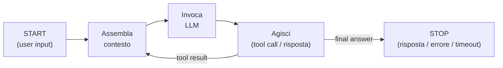
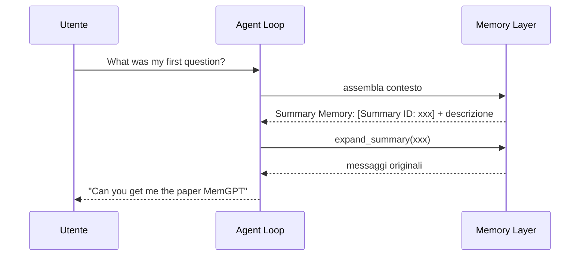

Nelle parti precedenti abbiamo costruito tutti i componenti: i [memory store e il Memory Manager](), il [Toolbox pattern]() e la [pipeline di consolidamento della memoria]().  
È arrivato il momento di assemblarli in un **agente memory-aware completo**: un sistema che carica il contesto pregresso all'avvio, ragiona in un ciclo iterativo con checkpoint di memoria intermedi, e **persiste tra le sessioni** migliorando nel tempo.

### L'agent loop

L'**agent loop** è l'ambiente ciclico e iterativo in cui un LLM viene eseguito per un certo numero di passi. Ogni iterazione fa tre cose:

1. **assembla il contesto** (il context engineering visto finora);
2. **invoca l'LLM**, che ragiona sulle informazioni ricevute;
3. **agisce** sulla risposta: chiamare un tool, rispondere all'utente, o chiedere ulteriore input.

Il loop parte quando l'utente fornisce l'input (**start condition**) e termina quando si verifica una **stop condition**: una risposta finale dell'LLM a obiettivo completato, un errore, oppure un timeout / numero massimo di iterazioni raggiunto.



In pseudocodice:

```python
for step in range(MAX_STEPS):
    response = llm(context)
    if response.is_final_answer:
        break
    context += execute(response.action)
```

### L'agent harness

Le operazioni di memoria non vivono tutte nello stesso posto: alcune sono **esterne** al loop, altre **interne**. L'insieme dello scaffolding che comprende le operazioni di memoria, la loro collocazione e le condizioni che le attivano è ciò che chiamiamo **agent harness**: l'infrastruttura che rende affidabile l'esecuzione dell'agente.

| Collocazione | Operazioni | Chi decide |
|:---|:---|:---|
| **Prima del loop** | lettura di tutte le memorie per assemblare il contesto; check dell'utilizzo della context window; retrieval dei tool pertinenti; scrittura del messaggio utente | deterministico |
| **Dentro il loop** | tool call decisi dall'agente (ricerca, `expand_summary`, `summarize_and_store`); offload dei tool log su database; summarization forzata se il contesto supera la soglia | agent-triggered + deterministico |
| **Dopo il loop** | scrittura di workflow, entità e risposta finale in memoria conversazionale | deterministico |

Ritroviamo qui la distinzione della prima parte: le operazioni **deterministiche** garantiscono che l'agente non "si dimentichi di salvare" e che il contesto venga sempre caricato; quelle **agent-triggered** vengono usate quando è richiesto giudizio.

### Il system prompt memory-aware

Il primo tassello dell'harness è il **system prompt**. È qui che l'agente diventa consapevole della propria memoria: gli diciamo *quali* memorie possiede, *come* la finestra di contesto è partizionata e *quando* usare ciascun segmento.

```python
AGENT_SYSTEM_PROMPT = """
# Role
You are a memory-aware agentic research assistant with access to tools.

# Context Window Structure (Partitioned Segments)
The user input is a partitioned context window. It contains a `# Question`
section followed by memory segments. Treat each segment as a distinct
memory store with a specific purpose:
- `## Conversation Memory`
- `## Knowledge Base Memory`
- `## Workflow Memory`
- `## Entity Memory`
- `## Summary Memory`

# Memory Store Semantics
- Conversation Memory: recent thread-level dialogue. Use it for continuity,
  user preferences, and unresolved requests.
- Knowledge Base Memory: retrieved documents. Use it to ground factual claims.
- Workflow Memory: prior execution patterns. Use it to plan tool usage;
  adapt patterns, do not copy blindly.
- Entity Memory: named people/orgs/systems. Use it to disambiguate references.
- Summary Memory: compressed older context represented by summary IDs.

# Summary Expansion Policy
If critical detail is only present in Summary Memory or appears ambiguous,
call `expand_summary(summary_id)` before relying on it.

# Operating Rules
1. Start with the provided memory segments before using tools.
2. If segments conflict, prioritize: current `# Question` > latest
   Conversation Memory > Knowledge Base evidence > older summaries.
3. Use only the tools provided in this turn, with the minimum necessary calls.
4. If memory is insufficient, state what is missing and use a tool.
5. For conversation compaction, use `summarize_and_store` with `thread_id`.
"""
```

> La segmentazione della context window usa i **titoli markdown** (`##`) come identificatori: gli LLM hanno una capacità latente di comprendere strutture gerarchiche in markdown, perché ne è pieno il loro training set. Ogni segmento porta con sé la descrizione e le istruzioni d'uso — è il blocco `MEMORY TYPE / DESCRIPTION / USAGE` che il `_format()` del Memory Manager produce ad ogni lettura.
{: .prompt-info }

### Esecuzione dei tool e chiamata al modello

Servono due funzioni di supporto. La prima esegue un tool cercandolo nel registro della `Toolbox` (il dizionario `_tools_by_name` popolato dal decoratore `register_tool` della seconda parte):

```python
import json

def execute_tool(tool_name: str, tool_args: dict) -> str:
    """Execute a tool by looking it up in the toolbox registry."""
    if tool_name not in toolbox._tools_by_name:
        return f"Error: Tool '{tool_name}' not found"
    return str(toolbox._tools_by_name[tool_name](**(tool_args or {})) or "Done")


def call_openai_chat(messages: list, tools: list = None, model: str = "gpt-5-mini"):
    """Call OpenAI Chat Completions API with optional tools."""
    kwargs = {"model": model, "messages": messages}
    if tools:
        kwargs["tools"] = tools
        kwargs["tool_choice"] = "auto"
    return client.chat.completions.create(**kwargs)
```

Altra cosa che serve è un ponte tra la toolbox memory e il formato **function calling** di OpenAI: la ricerca semantica ci restituisce i tool pertinenti, ma all'API dobbiamo passare uno **schema JSON**. Lo costruiamo dalla firma della funzione:

```python
import inspect

_PY_TO_JSON = {int: "integer", float: "number", bool: "boolean", str: "string"}

def openai_tool_schema(fn):
    """Build the OpenAI function-calling schema from the function signature."""
    props, required = {}, []
    for pname, p in inspect.signature(fn).parameters.items():
        props[pname] = {"type": _PY_TO_JSON.get(p.annotation, "string")}
        if p.default is inspect.Parameter.empty:
            required.append(pname)
    return {
        "type": "function",
        "function": {
            "name": fn.__name__,
            "description": (inspect.getdoc(fn) or "")[:1024],
            "parameters": {"type": "object", "properties": props,
                           "required": required},
        },
    }


def retrieve_tools_for_query(query: str, k: int = 5) -> list:
    """Semantic search on toolbox memory -> top-k tools in OpenAI format."""
    docs = toolbox_vs.similarity_search(query, k=k)
    tools = []
    for doc in docs:
        fn = toolbox._tools_by_name.get(doc.metadata.get("tool_name"))
        if fn:
            tools.append(openai_tool_schema(fn))
    return tools
```

> Questo è il Toolbox pattern in azione dentro l'harness: l'agente non vede mai il catalogo completo dei tool, ma solo i top-k pertinenti alla query corrente, recuperati via similarity search prima di entrare nel loop.
{: .prompt-info }

### call_agent: il loop completo

Ora possiamo scrivere la funzione di orchestrazione. `call_agent()` riceve la query dell'utente (start condition), un `thread_id` che delimita la sessione e un tetto di iterazioni (stop condition di sicurezza).

```python
def call_agent(query: str, thread_id: str = "1", max_iterations: int = 10) -> str:
    """Memory-aware agent loop with context monitoring and persistence."""
    steps = []

    # ---- FUORI DAL LOOP: assemblaggio del contesto (deterministico) ----
    memory_context = ""
    memory_context += memory_manager.read_conversational_memory(thread_id) + "\n\n"
    memory_context += memory_manager.read_knowledge_base(query) + "\n\n"
    memory_context += memory_manager.read_workflow(query) + "\n\n"
    memory_context += memory_manager.read_entity(query) + "\n\n"
    memory_context += memory_manager.read_summary_context(thread_id) + "\n\n"

    # Check deterministico: oltre l'80% scatta la compaction (terza parte)
    usage = calculate_context_usage(memory_context)
    if usage["percent"] > 80:
        memory_context = offload_to_summary(memory_context, thread_id)

    # La query non viene mai riassunta: si antepone al contesto
    context = f"# Question\n{query}\n\n{memory_context}"

    # Retrieval dei tool pertinenti (Toolbox pattern)
    dynamic_tools = retrieve_tools_for_query(query, k=5)

    # Persistenza del messaggio utente
    memory_manager.write_conversational_memory(thread_id, "user", query)

    # ---- DENTRO IL LOOP ----
    messages = [{"role": "system", "content": AGENT_SYSTEM_PROMPT},
                {"role": "user", "content": context}]
    final_answer = ""

    for iteration in range(max_iterations):
        response = call_openai_chat(messages, tools=dynamic_tools)
        msg = response.choices[0].message

        if not msg.tool_calls:
            final_answer = msg.content or ""   # stop condition: risposta finale
            break

        messages.append({"role": "assistant", "content": msg.content or "",
                         "tool_calls": [
                             {"id": tc.id, "type": "function",
                              "function": {"name": tc.function.name,
                                           "arguments": tc.function.arguments}}
                             for tc in msg.tool_calls]})

        for tc in msg.tool_calls:
            tool_name = tc.function.name
            tool_args = json.loads(tc.function.arguments)
            try:
                result = execute_tool(tool_name, tool_args)
                status, error = "success", None
            except Exception as e:
                result, status, error = f"Error: {e}", "error", str(e)
            steps.append(f"{tool_name}({tool_args}) -> {status}")

            # Context offloading: l'output integrale va nel tool log (database)
            log_id = memory_manager.write_tool_log(
                thread_id=thread_id, tool_name=tool_name,
                tool_input=tool_args, tool_output=result,
                status=status, error_message=error,
                metadata={"iteration": iteration + 1},
            )

            # All'LLM torna solo una versione limitata del risultato
            if len(result) > 3000:
                result = result[:3000] + (
                    f"\n\n[Truncated. Full output saved in tool log as {log_id}]")
            messages.append({"role": "tool", "tool_call_id": tc.id,
                             "content": result})
    else:
        # stop condition: max iterations senza risposta finale
        final_answer = "I was unable to complete the request within the allowed iterations."

    # ---- DOPO IL LOOP: persistenza degli artefatti (deterministico) ----
    if steps:
        workflow_text = (f"QUERY: {query}\nSTEPS:\n"
                         + "\n".join(f"{i}. {s}" for i, s in enumerate(steps, 1))
                         + f"\nOUTCOME: {final_answer[:500]}")
        memory_manager.write_workflow(workflow_text,
                                      metadata={"num_steps": len(steps)})
    memory_manager.write_conversational_memory(thread_id, "assistant", final_answer)
    return final_answer
```

**Il contesto viene costruito sempre, prima di ragionare.** È la scelta deterministica motivata nella prima parte: l'agente non può decidere di cercare ciò di cui ignora l'esistenza. Ogni segmento arriva già formattato con descrizione e istruzioni d'uso, quindi il modello sa *cosa* sta leggendo e *come* usarlo.

**L'output dei tool non ingombra eccessivamente il contesto.** L'output integrale di ogni tool call viene scritto nel **tool log** (database), e all'LLM torna solo una versione troncata con il riferimento al `log_id`. È lo stesso principio della compaction: il tool vero e proprio è nell'infrastruttura di memoria, nel contesto rimane solo un puntatore. Se all'agente servisse l'output completo, può recuperarlo — è **JIT retrieval**, come per `expand_summary`.

**Il workflow viene scritto a fine esecuzione.** Query, passi eseguiti ed esito diventano una workflow memory unit: alla prossima richiesta simile, la procedura arriverà dal retrieval già pronta, senza essere ri-derivata con il reasoning.

> Si noti cosa *non* c'è nel loop: nessuna chiamata esplicita a `summarize_and_store` o `expand_summary`. Sono tool registrati nella toolbox, e l'agente li scopre e li usa a propria discrezione — sono le operazioni agent-triggered che richiedono giudizio.
{: .prompt-tip }

### L'agente alla prova: continuità tra le chiamate

Vediamo il comportamento su una sequenza di richieste nello stesso thread, che simula una sessione di ricerca con *ArxivScout*.

**Prima chiamata** — memoria conversazionale vuota, ma la knowledge base contiene già i paper ingeriti nella prima parte:

```python
call_agent("Can you get me the paper MemGPT", thread_id="50000")
```

Nell'output si vede la context window partizionata per segmenti (`## Conversation Memory` vuota, `## Knowledge Base Memory` con i paper semanticamente vicini alla query). Il paper richiesto non è in memoria, quindi alla prima iterazione l'agente chiama `arxiv_search_candidates("MemGPT")`; alla seconda riceve il risultato del tool e produce la risposta finale con il paper trovato. **Due iterazioni, stop condition raggiunta.**

**Seconda chiamata** — qui si vede la continuità:

```python
call_agent("Can you save the content of the paper", thread_id="50000")
```

Non specifichiamo *quale* paper: la memoria conversazionale contiene lo scambio precedente e l'agente risolve il riferimento da solo. Nel frattempo la **workflow memory** si è popolata con i passi della prima esecuzione (query, tool chiamati, esito). L'agente usa `fetch_and_save_paper_to_kb_db` con l'arXiv ID corretto e conferma il salvataggio — il testo completo del paper va direttamente nella knowledge base senza transitare nel contesto.

**Terza chiamata**:

```python
call_agent("What are the main key takeaways from the paper", thread_id="50000")
```

Risposta in **una sola iterazione, senza tool call**: il contenuto del paper è ormai nella knowledge base e viene recuperato nel contesto già in fase di assemblaggio. La memoria ha sostituito il lavoro.

**Quarta chiamata** — attiviamo la summarization come tool:

```python
call_agent("Summarize the conversation so far using your tool", thread_id="50000")
```

L'agente chiama `summarize_and_store` con il `thread_id`: i messaggi del thread vengono riassunti, archiviati in summary memory e **marcati** con il `summary_id` (il write-back della terza parte).

**Quinta chiamata** — la prova del nove:

```python
call_agent("What was my first question?", thread_id="50000")
```

La memoria conversazionale ora è quasi vuota (i messaggi sono stati consolidati), ma il segmento `## Summary Memory` contiene il riferimento `[Summary ID: ...]` con la descrizione. Per rispondere serve il dettaglio, non la descrizione: l'agente chiama `expand_summary(summary_id)`, recupera i messaggi originali e risponde correttamente — *"Can you get me the paper MemGPT"*.



È il ciclo completo: compaction deterministica o agent-triggered a monte, **espansione JIT** a valle, e in mezzo un agente che sa *dove* sta l'informazione anche quando non è più nel contesto.

### Conclusioni

Con questa quarta parte i componenti costruiti nella serie diventano un sistema unico. Riassumendo i concetti chiave:

- l'**agent loop** è il ciclo assembla-invoca-agisci, delimitato da start e stop condition (risposta finale, errore, max iterations);
- l'**agent harness** è lo scaffolding programmatico attorno al loop: è lì che vivono le operazioni di memoria, deterministiche fuori dal loop, agent-triggered (più alcune deterministiche) dentro;
- il **system prompt** rende l'agente memory-aware: dichiara i tipi di memoria, la partizione della context window e le regole di priorità tra segmenti;
- l'**output dei tool** va offloadato nel tool log e sostituito da un riferimento: **il contesto trasporta puntatori, il database trasporta i payload**;
- gli artefatti dell'esecuzione (workflow, entità, risposta) vanno **persistiti a fine run**: sono ciò che rende la prossima esecuzione più economica della precedente.

Il risultato è un agente che non si limita a rispondere: **impara da ogni interazione**. Le informazioni scoperte, le decisioni prese e le procedure eseguite vengono persistite — e a ogni sessione l'agente riparte non da zero, ma da tutto ciò che ha già fatto.
