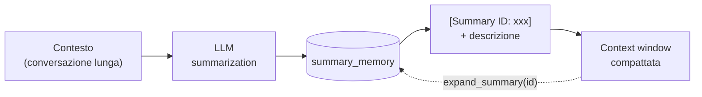
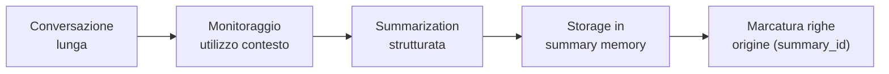

Nella [prima parte]() abbiamo costruito i memory store e il **Memory Manager**; nella [seconda]() abbiamo aggiunto il **Toolbox pattern** per gestire centinaia di tool.  

In questa parte vediamo come affrontare e mitigare il problema delle **conversazioni che crescono all'interno della finestra di contesto fissa**.

Vediamo come trasformare le interazioni in **conoscenza durevole**: monitorare l'utilizzo della context window, consolidare la memoria episodica in memoria semantica tramite riassunti strutturati, e costruire un ciclo di **write-back** con cui l'agente aggiorna e raffina la propria memoria in autonomia.

### La context window è una risorsa finita

Abbiamo visto che il context engineering consiste nel selezionare con giudizio ciò che entra nella finestra di contesto. Ma cosa succede quando l'informazione rilevante è *più grande* della finestra stessa? Una conversazione che dura giorni, con decine di tool call e documenti recuperati, prima o poi satura il budget di token. Senza un meccanismo di gestione, l'agente perde il contesto storico oppure fallisce per superamento dei limiti.

La risposta è la **context window reduction**: il processo di riduzione dell'informazione presente nel contesto. Le due tecniche principali sono la **context summarization** e la **context compaction**.

| Tecnica | Come funziona | Vantaggio | Svantaggio |
|:---|:---|:---|:---|
| **Context Summarization** | l'LLM comprime il contesto in una rappresentazione più corta che preserva l'informazione a più alto segnale | contesto pulito, il modello riparte da una base compatta | è **lossy**: una parte dell'informazione si perde sempre |
| **Context Compaction** | il contesto viene trasferito nel database con un ID e una descrizione; nel prompt resta solo il riferimento | **nessuna perdita**: l'originale è sempre recuperabile | il recupero richiede un accesso al database (latenza) |

#### Context Summarization

Con la summarization prendiamo il contesto, lo facciamo passare attraverso l'LLM e otteniamo un riassunto che mantiene le informazioni più rilevanti, preservando il significato e le relazioni chiave della conversazione.


Il riassunto viene iniettato in una **finestra di contesto pulita**, azzerando la conversazione precedente: il modello riparte ragionando dal riassunto come punto di partenza.

> La summarization è per definizione una tecnica **lossy**: perderemo sempre parte dell'informazione nel processo. La qualità del prompt di summarization determina *quanta* e *quale* informazione si perde.
{: .prompt-warning }

#### Context Compaction

Con la compaction, invece di riassumere, **spostiamo l'informazione nel database** e lo usiamo come estensione esterna della memoria del modello. Il meccanismo è semplice:

il contenuto viene salvato nel database con un **identificatore** e una **breve descrizione** del contenuto compattato.  
Nel contesto rimane solo la coppia *ID + descrizione*: se all'LLM basta un'idea generale, legge la descrizione; se gli servono i dettagli, va nel database e recupera tutto il contenuto.



Le due tecniche non sono alternative: nella pratica si combinano. Il riassunto strutturato finisce nella summary memory (summarization) e nel contesto rimane il riferimento espandibile (compaction).

### Workflow Memory

C'è un terzo modo di risparmiare contesto, meno ovvio: **non far ri-ragionare l'agente su procedure già risolte**. È il compito della **workflow memory**, che avevamo classificato come memoria procedurale nella prima parte.

Prendiamo la richiesta "che tempo fa?". Per rispondere servono più passi: ottenere la posizione dell'utente, chiamare una API meteo passando latitudine e longitudine, estrarre il meteo corrente, restituire la risposta. La workflow memory **preserva questa sequenza di passi** nel database — nome del workflow, descrizione, richiesta originale e passi ordinati, con relativo embedding — così che, dopo averla eseguita una volta, l'agente possa **riutilizzarla** per qualunque richiesta simile senza doverla ricostruire da zero.

Il beneficio è doppio: il modello sa esattamente cosa fare a ogni richiesta e il contesto necessario per elaborarla si riduce, perché la procedura arriva già pronta dal retrieval invece di essere ri-derivata con il reasoning.

### Implementazione

Diamo per assodati database, tabelle, embedding, `StoreManager`, `MemoryManager` e `Toolbox` costruiti nelle parti precedenti, e concentriamoci sulla pipeline di consolidamento:



#### 1. Monitorare l'utilizzo del contesto

Per decidere *quando* riassumere serve una stima di quanto contesto stiamo usando. Fissiamo il budget del modello e stimiamo i token con la regola empirica dei **4 caratteri per token** (varia da tokenizer a tokenizer, ma come stima è sufficiente):

```python
MODEL_TOKEN_LIMITS = {
    "gpt-5-mini": 256000,
}

def calculate_context_usage(context: str, model: str = "gpt-5-mini") -> dict:
    """Calculate context window usage as percentage."""
    estimated_tokens = len(context) // 4  # ~4 chars per token
    max_tokens = MODEL_TOKEN_LIMITS.get(model, 128000)
    percentage = (estimated_tokens / max_tokens) * 100
    return {"tokens": estimated_tokens, "max": max_tokens, "percent": round(percentage, 1)}
```

Costruiamo un monitor che traduce la percentuale in uno stato operativo:

```python
def monitor_context_window(context: str, model: str = "gpt-5-mini") -> dict:
    """Return capacity utilization with an ok/warning/critical status."""
    result = calculate_context_usage(context, model)
    if result["percent"] < 50:
        result["status"] = "ok"
    elif result["percent"] < 80:
        result["status"] = "warning"
    else:
        result["status"] = "critical"
    return result
```

La soglia dell'**80%** è quella oltre cui scatta il consolidamento: non aspettiamo mai di riempire davvero la finestra, perché il degrado dell'attenzione del modello inizia ben prima del limite fisico.

#### 2. La summarization strutturata

Il cuore della pipeline è la funzione che riassume un contenuto e lo scrive nella summary memory. Il punto qualificante è il **prompt**: non chiediamo un riassunto generico, ma un'estrazione strutturata su quattro direttive: informazioni tecniche, contesto emotivo, entità citate, decisioni e azioni da fare.

```python
import uuid

def summarise_context_window(content: str, memory_manager, llm_client,
                             model: str = "gpt-5-mini") -> dict:
    """Summarise content using an LLM and store it in summary memory."""
    cleaned = (content or "").strip()
    if not cleaned:
        return {"status": "nothing_to_summarize"}

    summary_prompt = f"""You are creating durable memory for an AI research assistant.
Summarize this conversation so it can be resumed accurately later.

Output with exactly these headings:
### Technical Information
### Emotional Context
### Entities & References
### Action Items & Decisions

Rules:
- Keep concrete details (names, dates, APIs, errors, decisions).
- Separate confirmed facts from open questions where relevant.
- Do not invent information.
- Keep it concise and useful for continuation.

Conversation:
{cleaned[:6000]}"""

    response = llm_client.chat.completions.create(
        model=model,
        messages=[{"role": "user", "content": summary_prompt}],
        max_completion_tokens=4000,
    )
    summary = (response.choices[0].message.content or "").strip()

    # Fallback: se l'output è vuoto, riprova con un prompt più semplice
    if not summary:
        retry_prompt = f"""Summarize this conversation in <= 180 words using these headings:
### Technical Information
### Emotional Context
### Entities & References
### Action Items & Decisions

Conversation:
{cleaned[:6000]}"""
        retry = llm_client.chat.completions.create(
            model=model,
            messages=[{"role": "user", "content": retry_prompt}],
            max_completion_tokens=4000,
        )
        summary = (retry.choices[0].message.content or "").strip()

    # Etichetta breve: è la descrizione che accompagna l'ID nella compaction
    desc_response = llm_client.chat.completions.create(
        model=model,
        messages=[{"role": "user", "content":
                   f"Create a short 8-12 word label for this summary.\n"
                   f"Return ONLY the label.\n\nSummary:\n{summary}"}],
        max_completion_tokens=2000,
    )
    description = (desc_response.choices[0].message.content or "").strip() \
        or "Conversation summary"

    summary_id = str(uuid.uuid4())
    memory_manager.write_summary(
        summary,
        metadata={"summary_id": summary_id, "description": description},
    )
    return {"id": summary_id, "description": description, "summary": summary}
```

Tre dettagli meritano attenzione. Il **fallback**: se la prima chiamata restituisce output vuoto, riproviamo con un prompt ridotto — non vogliamo mai perdere completamente il contesto per un errore di summarization. La **descrizione breve**, generata con una seconda chiamata: è ciò che resterà nel contesto accanto all'ID quando faremo compaction. E il **`summary_id`**: un UUID che collega il riassunto alle righe di conversazione che lo hanno generato (la colonna `summary_id UUID` della tabella conversazionale, creata nella prima parte, aspettava proprio questo momento).

#### 3. Estendere il Memory Manager

Servono tre modifiche al `MemoryManager` della prima parte. Il primo: `_recent_messages()` deve leggere **solo le righe non ancora riassunte**, aggiungendo `AND summary_id IS NULL` alla query. È questo che rende la memoria *self-updating*: una volta consolidati, i messaggi escono dal working set e non verranno mai riprocessati.

Gli altri due sono i metodi di recupero per la fase di espansione:

```python
    # --- dentro MemoryManager ---

    def read_summary_by_id(self, summary_id):
        """Retrieve a stored summary by its identifier (JSONB metadata lookup)."""
        with self.conn.cursor() as cur:
            cur.execute(
                f"""
                SELECT content
                FROM {SUMMARY_TABLE}
                WHERE langchain_metadata->>'summary_id' = %s
                """,
                (summary_id,),
            )
            row = cur.fetchone()
        return row[0] if row else "(summary not found)"

    def read_conversations_by_summary_id(self, summary_id):
        """All original messages consolidated under a summary, in chronological order."""
        with self.conn.cursor() as cur:
            cur.execute(
                f"""
                SELECT role, content, timestamp
                FROM {self.conversation_table}
                WHERE summary_id = %s
                ORDER BY timestamp ASC
                """,
                (summary_id,),
            )
            rows = cur.fetchall()
        body = "\n".join(
            f"[{ts:%Y-%m-%d %H:%M:%S}] {role}: {content}" for role, content, ts in rows
        ) or "(no result)"
        return self._format("conversational", f"ORIGINAL MESSAGES:\n{body}")
```

Il primo metodo interroga la colonna **JSONB** `langchain_metadata` gestita da `PGVectorStore` — la stessa tabella usata per la ricerca semantica funziona anche per il lookup esatto. Il secondo ricostruisce la conversazione originale dalla tabella SQL usando la marcatura.

#### 4. Consolidare un thread: summarize_conversation

Mettiamo insieme le varie parti implementate. La funzione esegue i seguenti passi della pipeline: legge le righe non riassunte del thread, costruisce il transcript, genera il riassunto, lo archivia e **marca le righe di origine** con il `summary_id`.

```python
def summarize_conversation(thread_id: str) -> dict:
    """Summarize all unsummarized messages in a thread and mark those exact rows."""
    # 1. Leggi le memory unit non ancora riassunte
    with memory_manager.conn.cursor() as cur:
        cur.execute(
            f"""
            SELECT id, role, content, timestamp
            FROM {memory_manager.conversation_table}
            WHERE thread_id = %s AND summary_id IS NULL
            ORDER BY timestamp ASC
            """,
            (thread_id,),
        )
        rows = cur.fetchall()

    if not rows:
        return {"status": "nothing_to_summarize"}

    # 2. Ricostruisci il transcript
    message_ids = [row[0] for row in rows]
    transcript = "\n".join(
        f"[{ts:%Y-%m-%d %H:%M:%S}] [{role.upper()}] {content}"
        for _id, role, content, ts in rows
    )

    # 3-4. Riassumi e archivia in summary memory
    result = summarise_context_window(transcript, memory_manager, client)

    # 5. Marca le righe di origine con il summary_id generato
    with memory_manager.conn.cursor() as cur:
        cur.execute(
            f"""
            UPDATE {memory_manager.conversation_table}
            SET summary_id = %s
            WHERE id = ANY(%s) AND summary_id IS NULL
            """,
            (result["id"], message_ids),
        )
    memory_manager.conn.commit()

    result["num_messages_summarized"] = len(message_ids)
    return result
```

> La marcatura è ciò che chiude il ciclo di **write-back**: la prossima summarization vedrà solo i messaggi nuovi, perché quelli già consolidati hanno un `summary_id` e la query li esclude. L'agente aggiorna la propria memoria senza mai riprocessare due volte la stessa informazione.
{: .prompt-tip }

#### 5. L'operazione inversa: expand_summary

La compaction è utile solo se **reversibile**. Registriamo quindi nella toolbox (con l'augmentation vista nella seconda parte) il tool che, dato un ID, recupera riassunto e messaggi originali:

```python
@toolbox.register_tool(augment=True)
def expand_summary(summary_id: str) -> str:
    """
    Expand a summary reference to retrieve the original conversations.

    Use when you need more details from a [Summary ID: xxx] reference.
    Returns all original messages that were summarized, in chronological order.
    """
    summary_text = memory_manager.read_summary_by_id(summary_id)
    original = memory_manager.read_conversations_by_summary_id(summary_id)
    return f"## Summary Context\n{summary_text}\n\n{original}"
```

#### 6. La compaction del contesto

Ora possiamo compattare: la cronologia della conversazione nel contesto viene sostituita da uno stub con il riferimento al riassunto, mentre gli altri segmenti di memoria restano intatti.

```python
def offload_to_summary(context: str, thread_id: str) -> str:
    """Context compaction: replace conversation history with a summary reference."""
    result = summarize_conversation(thread_id)
    if result.get("status") == "nothing_to_summarize":
        return context

    return (
        "## Conversation Memory\n"
        "Older conversation content was summarized to reduce context size.\n"
        "Use expand_summary(id) for full detail.\n\n"
        "## Summary Memory\n"
        f"[Summary ID: {result['id']}] {result['description']}"
    )
```

(Nella versione completa la funzione ricostruisce il contesto sezione per sezione, sostituendo solo la parte conversazionale e preservando gli altri blocchi di memoria; qui mostriamo il nucleo dell'idea.)

Infine esponiamo la summarization anche come **tool agent-triggered**:

```python
@toolbox.register_tool(augment=True)
def summarize_and_store(text: str, thread_id: str = None) -> str:
    """
    Summarize long text and store it in memory.

    If thread_id is provided, summarize the unsummarized conversation units
    of that thread and mark exactly those units with the generated summary_id.
    """
    if thread_id:
        result = summarize_conversation(thread_id)
        if result.get("status") == "nothing_to_summarize":
            return f"No unsummarized messages found for thread {thread_id}."
        return f"Stored as [Summary ID: {result['id']}] {result['description']}"

    result = summarise_context_window(text, memory_manager, client)
    return f"Stored as [Summary ID: {result['id']}] {result['description']}"
```

Ritroviamo qui la distinzione della prima parte tra operazioni **deterministiche** e **agent-triggered**: il monitoraggio del contesto può essere eseguito ad ogni turno (deterministico), ma la decisione di consolidare (tipicamente quando il monitor segnala l'80% di utilizzo) è lasciata all'agente, che chiama `summarize_and_store` scoprendolo via toolbox come qualsiasi altro tool. Ed è il Toolbox pattern a rendere sostenibile tutto questo: abbiamo ormai decine di tool, e iniettarli tutti nel contesto proprio mentre cerchiamo di *ridurlo* sarebbe un controsenso.

### La pipeline alla prova

Testiamo il ciclo completo su un thread di prova: una conversazione di ricerca di una trentina di messaggi (l'utente che discute con il modello la propria tesi, tra RAG e retrieval) scritta in memoria conversazionale con `write_conversational_memory()`.

```python
current_context = memory_manager.read_conversational_memory(TEST_THREAD_ID, limit=100)
usage = monitor_context_window(current_context)
# {'tokens': 2081, 'max': 256000, 'percent': 0.8, 'status': 'ok'}
```

Il monitor segnala meno dell'1% di utilizzo: non ci sarebbe alcun bisogno di riassumere, ma lo facciamo comunque per verificare la pipeline (nulla vieta di invocarla manualmente prima della soglia).

```python
summary_result = summarize_conversation(TEST_THREAD_ID)
# Summary ID: 3f2a9c1e-..., ~30 messaggi marcati come riassunti
```

Il riassunto arriva strutturato nelle quattro sezioni del prompt, con l'etichetta breve pronta per la compaction. L'operazione inversa recupera tutto:

```python
expanded = expand_summary(summary_result["id"])
# Summary Context + i messaggi originali, in ordine cronologico con timestamp
```

E la verifica finale sul database conferma il write-back:

```python
with memory_manager.conn.cursor() as cur:
    cur.execute(f"""
        SELECT COUNT(*) FILTER (WHERE summary_id IS NULL)     AS unsummarized,
               COUNT(*) FILTER (WHERE summary_id IS NOT NULL) AS summarized
        FROM {memory_manager.conversation_table}
        WHERE thread_id = %s
    """, (TEST_THREAD_ID,))
    print(cur.fetchone())   # (0, 30)
```

Zero righe non riassunte: una nuova chiamata a `summarize_conversation()` risponderebbe `nothing_to_summarize`, e `read_conversational_memory()` restituisce solo i messaggi arrivati *dopo* il consolidamento.

### Conclusioni

Con questa terza parte il sistema di memoria diventa **auto-gestito**: l'agente non si limita a leggere e scrivere, ma monitora, consolida e recupera la propria memoria in autonomia.

I concetti da ricordare:

- la **context window reduction** ha due tecniche: **summarization** (lossy, contesto pulito) e **compaction** (lossless, offload su database con ID + descrizione), che nella pratica si combinano;
- il consolidamento non è una semplice compressione ma **estrazione strutturata**: fatti tecnici, contesto emotivo, entità e decisioni sopravvivono al riassunto;
- la **marcatura con `summary_id`** rende la memoria self-updating: niente viene riprocessato, e il legame tra riassunto e messaggi originali rimane interrogabile;
- ogni compaction deve avere la sua **espansione** (`expand_summary`);
- la **workflow memory** riduce il contesto in un altro modo: le procedure già apprese arrivano dal retrieval invece di essere ri-derivate a ogni richiesta;
- monitoraggio deterministico, consolidamento **agent-triggered**: il sistema misura sempre, l'agente decide quando agire.
