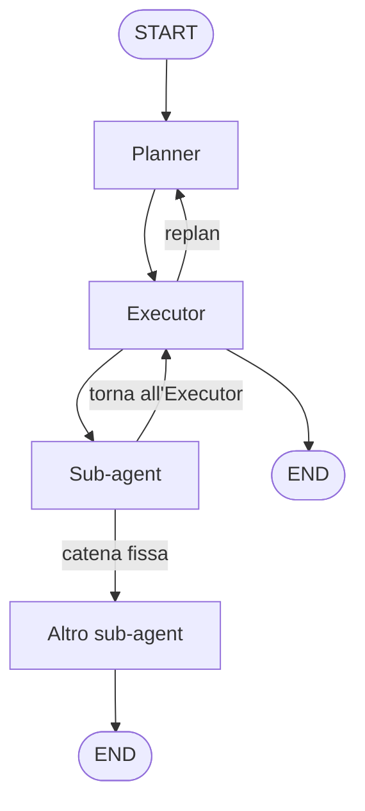

### Sistema multi-agente

Quando vogliamo creare un agente abbiamo due possibili scelte: un **unico agente generalista**, con tutti i tool e un prompt unico, oppure **più agenti specializzati**, ciascuno con prompt e tool dedicati.  

Un agente generalista riceve tutto nel contesto: istruzioni per ogni ruolo, ogni tool, ogni formato di output. Il modello deve decidere da solo cosa fare, con quale strumento e in che ordine. Il contesto si satura, l'attenzione si disperde, e cresce il rischio di **allucinazioni** (fatti inventati, tool sbagliati e passaggi saltati).  

Per compiti complessi, in genere, si preferisce un approccio multi-agente, delegando sotto task ad agenti specialisti con prompt e tool dedicati.

In un **sistema multi-agente** i vari agenti con ruoli distinti collaborano usando uno **stato condiviso**. In genere ci sono agenti che pianificano, agenti che orchestrano e agenti che eseguono i vari sotto task in una struttura gerarchica. Tale sistema apporta il beneficio di **ridurre le allucinazioni e il sovraccarico di contesto** che si verifica con un unico agente generalista.  

Gli agenti specialisti, inoltre, non condividono gli stessi prompt come nel caso di un unico agente generalista, per cui esiste una schematizzazione ben definita per ognuno di essi.

### Esempio d'implementazione con LangGraph

Proviamo ad implementare un sistema multi-agente con [LangGraph](https://docs.langchain.com/oss/python/langgraph/graph-api){:target="_blank"}. Dobbiamo quindi prevedere uno stato come memoria condivisa tra i vari agenti e un agente **Planner** che pianifica il lavoro suddividendolo in step, un **Executor** che si occupa di eseguire il lavoro, scegliendo a chi affidare un sotto task e vari **sub-agent** che materialmente eseguono i sotto-task.   
Esiste anche la possibilità di un **replan** che permette di ripianificare il lavoro in caso di fallimento o in caso di aggiustamenti durante l'esecuzione.

### Nodi in LangGraph (e rapporto con gli agenti)

In LangGraph il workflow è un **grafo**: vertici (nodi) e archi (transizioni). Un **nodo** è un'unità di esecuzione: una funzione Python che riceve lo **stato corrente**, fa un lavoro, e restituisce un **aggiornamento** di quello stato (e, con `Command`, anche il prossimo nodo da visitare).

```python
def planner_node(state: State) -> Command[Literal["executor"]]:
    # legge lo stato → chiama l'LLM → scrive il piano → va all'executor
    ...
```

Un agente è un *ruolo*, come per esempio il Planner o l'Executor e un nodo è il *posto nel grafo* in cui quel ruolo viene eseguito.  
Ogni agente del sistema è **ospitato da un nodo**. Il nodo wrappa l'agente: legge dallo stato ciò che gli serve (`user_query`, `agent_query`, `messages`), esegue il ruolo, scrive il risultato nello stato, e decide il `goto`. Un sub-agent ReAct è a sua volta un mini-grafo; dal punto di vista del grafo padre è comunque **un nodo**.

Non per forza ogni nodo deve essere un agente. Un nodo può essere puramente deterministico (validare un JSON, incrementare un contatore) senza chiamare un LLM.

### Gerarchia: Planner, Executor, sub-agent

Nel dettaglio vediamo i compiti di ogni ruolo:  

| Ruolo | Compito |
|:---|:---|
| **Planner** | Decompone la richiesta in step numerati|
| **Executor** | Sceglie il prossimo agente, scrive la sotto-query e decide se ripianificare |
| **Sub-agent** | Esegue un compito concreto e aggiorna lo stato |



Durante l'esecuzione di un piano è ovviamente possibile che non tutti i sub-agenti disponibili siano utilizzati per completare il lavoro.  
Per estendere il sistema si aggiunge un nuovo nodo e lo si mette nella lista di chi può essere chiamato. Planner ed Executor lo vedranno al giro successivo.

### Stato: la memoria condivisa

In LangGraph i nodi si scambiano messaggi leggendo e scrivendo un **unico stato**. Lo schema tipico per conversazioni è [`MessagesState`](https://reference.langchain.com/python/langgraph/graph/message/MessagesState){:target="_blank"}: una chiave `messages` con reducer [`add_messages`](https://reference.langchain.com/python/langgraph/graph/message/add_messages){:target="_blank"}. I nuovi messaggi si **appendono**; se un messaggio ha lo stesso `id` di uno esistente, lo **sovrascrive**.

Per creare uno stato specifico, si estende `MessagesState` con i campi del ciclo: **piano → azione → replan**:

```python
from typing import Optional, List, Dict, Any
from langgraph.graph import MessagesState

class State(MessagesState):
    enabled_agents: Optional[List[str]]
    plan: Optional[Dict[str, Dict[str, Any]]]
    user_query: Optional[str]
    current_step: int
    replan_flag: Optional[bool]
    last_reason: Optional[str]
    replan_attempts: Optional[Dict[int, int]]
    agent_query: Optional[str]
```

| Campo | Ruolo nel ciclo |
|:---|:---|
| `messages` | Cronologia tra nodi (ereditata da `MessagesState`) |
| `user_query` | Richiesta originale dell'utente |
| `enabled_agents` | Catalogo attivo: vincola i prompt di Planner ed Executor |
| `plan` | Piano corrente: mappa `"1"`, `"2"`, … → `{agent, action}` |
| `current_step` | Step in esecuzione |
| `agent_query` | Istruzione standalone per il sub-agent scelto |
| `last_reason` | Motivazione dell'Executor (utile in replan) |
| `replan_flag` | Handshake: "appena ripianificato, esegui prima di rivalutare" |
| `replan_attempts` | Contatore di ripiani **per step** |

un nodo aggiorna solo la parte dello stato che gli compete.


### Command: aggiornare e instradare

Il routing dinamico di LangGraph prevede che ogni nodo restituisca un [`Command`](https://reference.langchain.com/python/langgraph/types/Command){:target="_blank"} che in sequenza **aggiorna lo stato** (`update`) e **sceglie il prossimo nodo** (`goto`).

```python
from langgraph.types import Command
from typing import Literal

def my_node(state: State) -> Command[Literal["executor"]]:
    return Command(
        update={"current_step": 1},
        goto="executor",
    )
```

La type hint `Command[Literal[...]]` elenca i nodi raggiungibili: serve al rendering del grafo e a LangGraph per sapere dove può andare quel nodo.


### Planner

Il Planner riceve la richiesta dell'utente e produce un piano JSON. Il nodo che mappa il ruolo del Planner invoca un LLM di reasoning forzandolo a rispondere in JSON, valida il contenuto e scrive `plan` nello stato e va all'Executor. In un replan **non** azzera `current_step`: si resta sullo step corrente.

```python
from prompts import plan_prompt
from langchain.schema import HumanMessage
from langchain_openai import ChatOpenAI
import json

reasoning_llm = ChatOpenAI(
    model="o3",
    model_kwargs={"response_format": {"type": "json_object"}},
)

def planner_node(state: State) -> Command[Literal["executor"]]:
    llm_reply = reasoning_llm.invoke([plan_prompt(state)])

    try:
        content_str = (
            llm_reply.content if isinstance(llm_reply.content, str)
            else str(llm_reply.content)
        )
        parsed_plan = json.loads(content_str)
    except json.JSONDecodeError:
        raise ValueError(f"Planner returned invalid JSON:\n{llm_reply.content}")

    replan = state.get("replan_flag", False)

    return Command(
        update={
            "plan": parsed_plan,
            "messages": [HumanMessage(
                content=llm_reply.content,
                name="replan" if replan else "initial_plan")],
            "user_query": state.get(
                "user_query", state["messages"][0].content),
            "current_step": 1 if not replan else state["current_step"],
            "replan_flag": state.get("replan_flag", False),
            "last_reason": "",
            "enabled_agents": state.get("enabled_agents"),
        },
        goto="executor",
    )
```

#### Il prompt del Planner

`plan_prompt(state)` costruisce il messaggio che l'LLM del Planner deve seguire. Non è un prompt fisso: legge dallo stato la richiesta dell'utente, quali agenti possono essere chiamati, e, se si sta ripianificando, il piano precedente e il motivo del blocco (`last_reason`).

Ptoduce un JSON con le chiavi `"1"`, `"2"`, `"3"`, …; ogni valore è uno step con `agent`e `action`.  

```json
{
  "1": { "agent": "web_researcher", "action": "Recupera i dati pubblici richiesti." },
  "2": { "agent": "synthesizer", "action": "Riassumi i risultati in una risposta all'utente." }
}
```

Il Planner produce istruzioni e ogni step è la sotto-query più piccola possibile, rispondibile da **una sola sorgente dati** e da **un solo agente**. Non c'è un tetto sul numero di step, purché il piano resti conciso e ogni passo abbia uno scopo chiaro.

Se `replan_flag` è false, si genera un piano da zero. Se è true, il prompt aggiunge il motivo del blocco e il piano corrente, e chiede di modificare solo gli step che impediscono il successo di progressione del piano.  

```python
def plan_prompt(state: State) -> HumanMessage:
    replan_flag = state.get("replan_flag", False)
    user_query = state.get("user_query", state["messages"][0].content)
    prior_plan = state.get("plan") or {}
    replan_reason = state.get("last_reason", "")

    agent_list = format_agent_list_for_planning(state)
    agent_guidelines = format_agent_guidelines_for_planning(state)

    enabled_list = _get_enabled_agents(state)
    enabled_for_planner = [
        a for a in enabled_list
        if a in ("web_researcher", "cortex_researcher",
                 "chart_generator", "synthesizer")
    ]
    planner_agent_enum = (
        " | ".join(enabled_for_planner)
        or "web_researcher | chart_generator | synthesizer"
    )

    prompt = f"""
        You are the **Planner** in a multi-agent system.  Break the user's request
        into a sequence of numbered steps (1, 2, 3, …).  **There is no hard limit on
        step count** as long as the plan is concise and each step has a clear goal.

        You may decompose the user's query into sub-queries, each of which is a
        separate step.  Break the query into the smallest possible sub-queries
        so that each sub-query is answerable with a single data source.
        For example, if the user's query is "What were the key
        action items in the last quarter, and what was a recent news story for
        each of them?", you may break it into steps:

        1. Fetch the key action items in the last quarter.
        2. Fetch a recent news story for the first action item.
        3. Fetch a recent news story for the second action item.
        4. Fetch a recent news story for the last action item

        Here is a list of available agents you can call upon to execute the tasks
        in your plan. You may call only one agent per step.

        {agent_list}

        Return **ONLY** valid JSON (no markdown, no explanations) in this form:

        {{
        "1": {{
            "agent": "{planner_agent_enum}",
            "action": "string",
        }},
        "2": {{ ... }},
        "3": {{ ... }}
        }}

        Guidelines:
        {agent_guidelines}
        """

    if replan_flag:
        prompt += f"""
        The current plan needs revision because: {replan_reason}

        Current plan:
        {json.dumps(prior_plan, indent=2)}

        When replanning:
        - Focus on UNBLOCKING the workflow rather than perfecting it.
        - Only modify steps that are truly preventing progress.
        - Prefer simpler, more achievable alternatives over complex rewrites.
        """
    else:
        prompt += "\nGenerate a new plan from scratch."

    prompt += f'\nUser query: "{user_query}"'

    return HumanMessage(content=prompt)
```

### Executor

L'Executor legge il piano e decide quattro aspetti:

| Campo JSON | Significato |
|:---|:---|
| `replan` | Serve una revisione del piano? |
| `goto` | Quale agente (o `planner`) eseguire |
| `reason` | Motivazione in una frase |
| `query` | Istruzione standalone per l'agente scelto |

Esempio di risposta in JSON dell'Executor:

```json
{
  "replan": false,
  "goto": "web_researcher",
  "reason": "Lo step 1 chiede dati pubblici e non è ancora stato eseguito.",
  "query": "Qual è la capitalizzazione di mercato attuale delle cinque maggiori banche USA?"
}
```

Il nodo legge questi quattro campi: `goto` diventa il prossimo nodo del grafo, `query` è salvato nell' `agent_query` dello stato, `reason` in `last_reason`. Se invece lo step è bloccato a causa di un replan, l'output punta al Planner:

```json
{
  "replan": true,
  "goto": "planner",
  "reason": "La ricerca non ha restituito dati utilizzabili; serve un piano alternativo.",
  "query": ""
}
```

```python
from prompts import executor_prompt

MAX_REPLANS = 3

def executor_node(
    state: State,
) -> Command[Literal["web_researcher", "chart_generator", "synthesizer", "planner"]]:
    plan: Dict[str, Any] = state.get("plan", {})
    step: int = state.get("current_step", 1)

    # Appena ripianificato: esegui una volta l'agente previsto, poi rivaluta
    if state.get("replan_flag"):
        planned_agent = plan.get(str(step), {}).get("agent")
        return Command(
            update={
                "replan_flag": False,
                "current_step": step + 1,
            },
            goto=planned_agent,
        )

    llm_reply = reasoning_llm.invoke([executor_prompt(state)])
    parsed = json.loads(
        llm_reply.content if isinstance(llm_reply.content, str)
        else str(llm_reply.content)
    )
    replan, goto = parsed["replan"], parsed["goto"]
    reason, query = parsed["reason"], parsed["query"]

    updates = {
        "messages": [HumanMessage(content=llm_reply.content, name="executor")],
        "last_reason": reason,
        "agent_query": query,
    }

    replans = state.get("replan_attempts", {}) or {}
    step_replans = replans.get(step, 0)

    if replan:
        if step_replans < MAX_REPLANS:
            replans[step] = step_replans + 1
            updates.update({
                "replan_attempts": replans,
                "replan_flag": True,
                "current_step": step,
            })
            return Command(update=updates, goto="planner")
        next_agent = plan.get(str(step + 1), {}).get("agent", "synthesizer")
        updates["current_step"] = step + 1
        return Command(update=updates, goto=next_agent)

    planned_agent = plan.get(str(step), {}).get("agent")
    updates["current_step"] = step + 1 if goto == planned_agent else step
    updates["replan_flag"] = False
    return Command(update=updates, goto=goto)
```

#### Il prompt dell'Executor

`executor_prompt(state)` costruisce il messaggio che l'LLM dell'Executor deve seguire. Non è un prompt fisso: si adatta in base allo stato.  
L'executor produce un JSON in cui è specificato se ripianificare (`replan`), chi eseguire (`goto`), perché (`reason`), e la domanda per quell'agente (`query`).

**Come scegliere `goto`.** Tre casi, in quest'ordine, e uno esclude gli altri:

1. `replan` è `true` → si torna al **Planner**. Non si chiama uno specialista in questo turno.
2. Lo step corrente ha già dato un risultato utile → si passa all'agente dello **step successivo** del piano.
3. Lo step non è ancora stato eseguito, o non è concluso → si chiama l'agente che il piano ha assegnato a **questo** step.

>**Come scrivere `query`.** cioè l'istruzione che arriva all'agente indicato in `goto`. Deve essere una domanda completa, comprensibile da sola (senza rileggere il piano o la cronologia), nello stesso linguaggio della richiesta dell'utente, e deve stare nelle capacità di un solo agente. Se `goto` è `planner`, la query può restare vuota: il Planner usa `last_reason` e lo stato, non quella domanda.
{: .prompt-info }


```python
def executor_prompt(state: State) -> HumanMessage:
    step = int(state.get("current_step", 0))
    latest_plan: Dict[str, Any] = state.get("plan") or {}
    plan_block: Dict[str, Any] = latest_plan.get(str(step), {})
    max_replans = MAX_REPLANS
    executor_guidelines = format_agent_guidelines_for_executor(state)
    plan_agent = plan_block.get("agent", "web_researcher")
    messages_tail = (state.get("messages") or [])[-4:]

    executor_prompt = f"""
        You are the **executor** in a multi-agent system with these agents:
        `{ '`, `'.join(sorted(set([a for a in _get_enabled_agents(state) if a in ['web_researcher','cortex_researcher','chart_generator','chart_summarizer','synthesizer']] + ['planner']))) }`.

        **Tasks**
        1. Decide if the current plan needs revision.  → `"replan_flag": true|false`
        2. Decide which agent to run next.             → `"goto": "<agent_name>"`
        3. Give one-sentence justification.            → `"reason": "<text>"`
        4. Write the exact question that the chosen agent should answer
                                                    → "query": "<text>"

        **Guidelines**
        {executor_guidelines}
        - After **{MAX_REPLANS}** failed replans for the same step, move on.
        - If you *just replanned* (replan_flag is true) let the assigned agent try before
        requesting another replan.

        Respond **only** with valid JSON (no additional text):

        {{
        "replan": <true|false>,
        "goto": "<{ '|'.join([a for a in _get_enabled_agents(state) if a in ['web_researcher','cortex_researcher','chart_generator','chart_summarizer','synthesizer']] + ['planner']) }>",
        "reason": "<1 sentence>",
        "query": "<text>"
        }}

        **PRIORITIZE FORWARD PROGRESS:** Only replan if the current step is completely blocked.
        1. If any reasonable data was obtained that addresses the step's core goal, set `"replan": false` and proceed.
        2. Set `"replan": true` **only if** ALL of these conditions are met:
        • The step has produced zero useful information
        • The missing information cannot be approximated or obtained by remaining steps
        • `attempts < {max_replans}`
        3. When `attempts == {max_replans}`, always move forward (`"replan": false`).

        ### Decide `"goto"`
        - If `"replan": true` → `"goto": "planner"`.
        - If current step has made reasonable progress → move to next step's agent.
        - Otherwise execute the current step's assigned agent (`{plan_agent}`).

        ### Build `"query"`
        Write a clear, standalone instruction for the chosen agent. If the chosen agent
        is `web_researcher` or `cortex_researcher`, the query should be a standalone question,
        written in plain english, and answerable by the agent.

        Ensure that the query uses consistent language as the user's query.

        Context you can rely on
        - User query ..............: {state.get("user_query")}
        - Current step index ......: {step}
        - Current plan step .......: {plan_block}
        - Just-replanned flag .....: {state.get("replan_flag")}
        - Previous messages .......: {messages_tail}

        Respond **only** with JSON, no extra text.
        """

    return HumanMessage(content=executor_prompt)
```

### Sub-agent: pattern comune

I sub-agent operativi non sono nodi LLM "nudi". Sono agenti **ReAct** ([Reasoning + Acting](https://arxiv.org/abs/2210.03629){:target="_blank"}) costruiti con [`create_react_agent`](https://docs.langchain.com/oss/python/langgraph/agents){:target="_blank"}: un mini-grafo che alterna chiamata al modello ed esecuzione dei tool.  

Il prompt di squadra è condiviso. `agent_system_prompt(suffix)` antepone regole comuni e aggiunge il ruolo specifico:

```python
def agent_system_prompt(suffix: str) -> str:
    return (
        "You are a helpful AI assistant, collaborating with other assistants."
        " Use the provided tools to progress towards answering the question."
        " If you are unable to fully answer, that's OK, another assistant with "
        "different tools will help where you left off. Execute what you can "
        "to make progress."
        " If you or any of the other assistants have the final answer or "
        "deliverable, prefix your response with FINAL ANSWER so the team "
        "knows to stop."
        f"\n{suffix}"
    )
```

Gli aspetti fondamentali di questo propmp sono la collaborazione, progresso parziale accettabile, un segnale `FINAL ANSWER` quando il lavoro della squadra è completo.

Ogni sub-agent è poi wrappato in un nodo LangGraph che:

1. legge dallo stato (`agent_query` o l'intero `state`);
2. invoca il sub-agent;
3. etichetta l'ultimo messaggio con `name=...` (così il synthesizer può filtrare la cronologia);
4. restituisce `Command(update={"messages": ...}, goto=...)`.

Tre varianti di routing, a seconda del ruolo:

| Pattern | `goto` | Quando |
|:---|:---|:---|
| **Torna all'Executor** | `"executor"` | Dopo un passo di raccolta dati (es. researcher): l'Executor decide il passo successivo |
| **Catena fissa** | collega successivo | Un pezzo del lavoro è sempre seguito da un altro (es. chart → summarizer) |
| **Chiusura** | `END` | Risposta finale (synthesizer) |

Esempio del researcher sub-agent che torna all'Executor:

```python
def web_research_node(state: State) -> Command[Literal["executor"]]:
    agent_query = state.get("agent_query")
    result = web_search_agent.invoke({"messages": agent_query})
    result["messages"][-1] = HumanMessage(
        content=result["messages"][-1].content, name="web_researcher"
    )
    return Command(
        update={"messages": result["messages"]},
        goto="executor",
    )
```

Grazie a `add_messages`, l'`update` **appende** la cronologia del sub-agent a quella del grafo padre. Gli altri nodi vedono il risultato filtrato, non parti del piano che non li riguardano.

### Costruzione del grafo

[`StateGraph`](https://reference.langchain.com/python/langgraph/graph/state/StateGraph){:target="_blank"} è il builder. Si parametrizza con `State`, si registrano i nodi, si fissa l'ingresso, si compila:

```python
from langgraph.graph import START, StateGraph

workflow = StateGraph(State)
workflow.add_node("planner", planner_node)
workflow.add_node("executor", executor_node)
workflow.add_node("web_researcher", web_research_node)
workflow.add_node("chart_generator", chart_node)
workflow.add_node("chart_summarizer", chart_summary_node)
workflow.add_node("synthesizer", synthesizer_node)

workflow.add_edge(START, "planner")
graph = workflow.compile()
```

Il routing tra i nodi viene effettuato tramite i vari `Command.goto`. Per avviare una run basta uno stato iniziale con query, messaggi e catalogo abilitato. Esempio:

```python
query = "Qual è la capitalizzazione di mercato attuale delle cinque maggiori banche USA?"

state = {
    "messages": [HumanMessage(content=query)],
    "user_query": query,
    "enabled_agents": [
        "web_researcher", "chart_generator",
        "chart_summarizer", "synthesizer",
    ],
}
graph.invoke(state)
```
