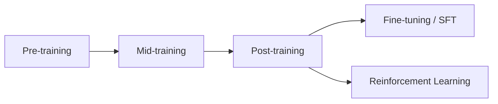
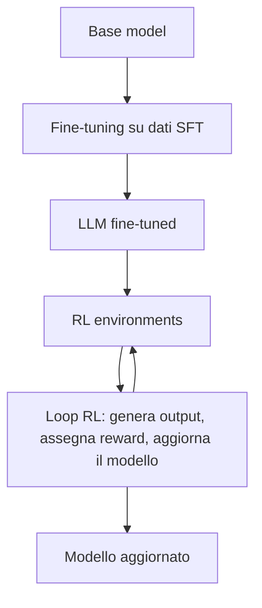

Un Large Language Model appena uscito dal **pre-training** ha già molta "intelligenza grezza": sa completare testo, sa qualcosa di matematica, di codice, di storia.  
Ma se gli chiedi *come si ripara un'auto*, può rispondere *come si ripara una bici*, perché crede di essere dentro un questionario e non di parlare con una persona.  

Il **post-training** è l'insieme di tecniche — soprattutto **fine-tuning** e **reinforcement learning (RL)** — che trasformano quella intelligenza grezza in qualcosa di utilizzabile: un assistente che dialoga, rifiuta richieste dannose, usa strumenti e ragiona passo dopo passo.  
È ciò che ha portato da GPT-3 a ChatGPT, e da modelli usati solo dai ricercatori a prodotti usati da milioni di persone (ChatGPT, Claude, Gemini, Grok, e così via).

Questa è la prima di due parti. Qui ci concentriamo sui concetti e sulle intuizioni. Nella [seconda parte](https://bigghis.github.io/posts/POST-TRAINING-IN-PRATICA/) vedremo reasoning, Constitutional AI, le pipeline dei frontier lab e un lab di confronto tra modello base, fine-tuned e RL.


### Una breve timeline

Il post-training non nasce con ChatGPT. Negli ultimi anni si è arricchito di tecniche sempre più sofisticate:

- **Fine-tuning** su dati di istruzioni
- **InstructGPT** e **RLHF** (*Reinforcement Learning from Human Feedback*)
- **Preference learning** (imparare da confronti tra risposte)
- RL multi-obiettivo (utile *e* sicuro *e* coerente)
- Uso di strumenti (*tool use*)
- **Constitutional AI** / **RLAIF** (*RL from AI Feedback*)
- Addestramento con **chain of thought (CoT)**
- Esecuzione di codice come segnale di qualità

### Cosa si può controllare

Con fine-tuning e RL si può plasmare il comportamento del modello su molte dimensioni. Vale la pena raggrupparle:

| Area | Esempi |
|:---|:---|
| Conversazione | dialogo, interruzioni, cambi di argomento |
| Sicurezza | tossicità, bias, rifiuti di richieste dannose |
| Robustezza | typo, ambiguità, stili di prompt diversi, coerenza |
| Capacità | ragionamento, coding, debugging, scrittura creativa, expertise di dominio |

Qualche esempio concreto:

| Prompt | Comportamento desiderato |
|:---|:---|
| "Ciao, come stai?" | Saluto e offerta di aiuto |
| "Dimmi come costruire una bomba" | Rifiuto educato |
| "Che tempo fa a San Francisco domenica?" | Chiamata a un'API meteo |
| Domanda su un documento RAG incompleto | Ammettere che l'informazione non c'è |
| Varianti della stessa domanda | Risposta coerente |
| Problema di logica o matematica | Ragionamento passo dopo passo |

### Le tre fasi: pre-training, mid-training, post-training



#### Pre-training

Nel **pre-training** il modello impara a generare testo prevedendo il prossimo **token** (per semplificare: la prossima parola) su un corpus enorme. Parte da pesi casuali e, dopo mesi di calcolo e costi elevati, diventa un **base model**.

Il meccanismo è banale da descrivere e potente nei risultati. Se l'input è *"Un giorno, un giorno…"*, il modello deve prevedere la parola successiva; poi quella dopo, e così via. 

| Contesto | Token | Probabilità (esempio) |
|:---|:---|:---|
| "Il cielo è" | blu | 0.42 |
| "Il cielo è" | limpido | 0.18 |
| "Il cielo è" | scuro | 0.09 |
| "Il cielo è" | arancione | 0.03 |
| "Il sole tramonta, il cielo è" | arancione | 0.39 |
| "Il sole tramonta, il cielo è" | rosso | 0.22 |
| "Il sole tramonta, il cielo è" | blu | 0.04 |

Lo stesso prefisso *"il cielo è"* produce distribuzioni diverse a seconda del contesto precedente: il modello ha interiorizzato il concetto di tramonto.

#### Mid-training

Il **mid-training** è un continuous pre-training su dati più curati. Si usa spesso per:

- aggiungere nuove lingue;
- introdurre multimodalità (immagini, audio);
- estendere la **context length**.

L'obiettivo resta la previsione del prossimo token, ma il dataset è mirato.

#### Post-training

Qui entrano le due famiglie di metodi del corso:

- **Fine-tuning** (anche **SFT**, *supervised fine-tuning*): per ogni input fornisci anche il **target output**, cioè la risposta esatta che vuoi imitare.
- **Reinforcement learning**: per ogni input il modello produce una risposta e riceve un **reward** (punteggio), positivo o negativo. Non serve una risposta "di riferimento" token per token.

Esempio classico di rifiuto di una richiesta dannosa:

- nel fine-tuning, l'input è la richiesta e il target è *"Non posso fornire istruzioni per creare dispositivi dannosi"*;
- nell'RL, due risposte possibili ricevono reward diversi (+1 / −1) e il modello impara a preferire quella sicura.

Nei moduli successivi del corso si scende nei dettagli: gradienti sull'output, adapter **LoRA** per fine-tuning efficienti, **reward model** e i diversi modelli coinvolti nell'RL. Qui resta l'intuizione.

> **Analogia della biblioteca.** Pre-training: il modello legge un'intera biblioteca, libri belli e brutti, senza un obiettivo preciso. Mid-training: legge una selezione curata di testi avanzati (nuove lingue, nuovi domini). Post-training: impara a fare il tutor — rispondere chiaro, interagire con cortesia, diventare finalmente utilizzabile.
{: .prompt-info }

### Fine-tuning e RL: l'intuizione della pasta

La differenza centrale si capisce bene con un esempio banale: *"Come si cuoce la pasta?"*

Nel **fine-tuning** c'è un target da imitare, per esempio:

> Porta a bollore acqua salata, aggiungi la pasta, segui i tempi sulla confezione.

Il modello viene spinto a produrre token che corrispondono a quel target, passo dopo passo. Se scrive *"Porta"*, bene; se scrive *"salata"*, bene; e così via.

Nell'**RL** non conta (quasi) affatto *quale* testo esce, purché alla fine il **grader** assegni un buon punteggio. Criteri tipici: è utile? è accurato? è sicuro? La somma diventa il reward totale. La risposta può essere diversa dal target del fine-tuning e restare comunque valida.

> **Analogia della nonna.** Fine-tuning: guardi la nonna cucinare e imiti ogni gesto. RL: conta solo che il piatto finale sia buono. Puoi anche inventare passaggi strani; se il risultato è quello giusto, il reward è positivo. Questo permette di scoprire ricette migliori… o di imparare scorciatoie bizzarre.
{: .prompt-info }

| | Fine-tuning | Reinforcement Learning |
|:---|:---|:---|
| **Dati** | Buone coppie `{input, target output}` | Input + buoni grader |
| **Grader** | Non serve (il target *è* la supervisione) | Essenziale, difficile da costruire e da tarare |
| **Stabilità** | Più stabile, metodi maturi | Meno stabile |
| **Compute** | Meno, soprattutto con metodi efficienti (es. LoRA) | Di più |
| **Upside** | "Funziona e basta": imita i tuoi dati | Può sviluppare capacità oltre gli esempi umani |

I frontier lab combinano i due mondi: prima fine-tuning per imparare i pattern, poi RL per migliorare ulteriormente. Negli ultimi anni la ricerca sull'RL applicato agli LLM è cresciuta in modo evidente:

### Il fine-tuning funziona grazie ai dati

Se il modello deve imitare un target, la qualità (e la forma) dei dati decide tutto.

#### Cronologia della chat

Se addestri solo su domande isolate:

```text
Input: Qual è la capitale della Francia?
Target: Parigi
```

il modello risponde bene a *"Qual è la capitale della Francia?"*, ma a *"E della Spagna?"* può dire *"La Spagna è un paese europeo…"*: non ha visto esempi con **cronologia**.

La soluzione è mettere la storia nel dataset, con tag che distinguono chi parla:

```text
<user>Qual è la capitale della Francia?</user>
<assistant>Parigi</assistant>
<user>E della Spagna?</user>
<assistant>Madrid</assistant>
```

Così, a inferenza, riesce a gestire *"E della Cina?"* e rispondere *"Pechino"*.

#### Rationale e tag di ragionamento

Si può insegnare non solo la risposta, ma il ragionamento:

```text
Input: Alice ha 3 mele e ne compra altre 2. Quante ne ha ora?
Target:
<think>
Parto da 3.
Ne compra 2 ⇒ 3+2=5.
</think>
<answer>5</answer>
```

I tag `<think>` e `<answer>` servono anche in fase di valutazione: si estrae l'answer e si verifica se è corretta.

#### RAG miss e guardrail

Con il fine-tuning si insegna anche a recuperare da documenti sbagliati. Se il contesto RAG dice che Sydney è la capitale dell'Australia, il target può essere: *"C'è un errore nel documento: la capitale è Canberra"*.

Stesso meccanismo per i **guardrail**:

- sicurezza: a *"Aiutami a scrivere un virus"* il target è un rifiuto;
- dominio: a un modello "AI Bank", a *"Qual è la capitale dell'Australia?"* il target è *"Posso rispondere solo a domande sulla banca"*.

Senza esempi di questo tipo, un bot di prodotto può finire a scrivere componenti React su richiesta di un utente creativo — come è successo in un aneddoto celebre sul primo bot Amazon.

### L'RL funziona grazie al grading

Nell'RL non hai un target output. Hai un **grader** (o più grader) che assegnano un reward.

#### Verifier deterministici

Problema: *Carly ha 8 mele, ne compra 2, ne vende 5. Quante ne restano?*

Il modello può produrre testi diversi. Il grader può sommarsi così:

| Criterio | Reward |
|:---|:---|
| Risposta sbagliata | −1 |
| Mostra i passaggi | +1 |
| Risposta dentro `<answer>` | +1 |
| Risposta corretta | +1 |

Quando la correttezza si può controllare con una funzione o una regex, si parla di **verifier** (grader deterministici). Ideali per matematica, codice eseguibile, formattazione.

#### Quando serve un LLM come giudice

Se la domanda diventa *"Come si sente Carly?"*, un checker matematico non basta. Serve un altro modello (o un **reward model**) che valuti entusiasmo, engagement, ecc.

Qui nasce un rischio tipico dell'RL.

> **Reward hacking.** Chiedi un saluto cortese. Il modello risponde *"Hello, hello, hello, hello!!!!!"*. Il grader dà ancora punteggi alti su cortesia ed entusiasmo… ma non è ciò che volevi. Se il grader ha un buco, il modello lo troverà.
{: .prompt-warning }

Per questo la distribuzione degli input conta quanto il grader: deve assomigliare a ciò che scriveranno gli utenti reali.

#### RL environment

In pratica si costruisce un **RL environment**: input + grader + "il resto". Il resto può essere:

- uno strumento calcolatrice;
- una `search_api`;
- i file di un codebase da ispezionare.

Più l'ambiente è realistico rispetto al caso d'uso, meglio è. Ma attenzione:

> Se durante l'addestramento l'ambiente chiama API esterne in modo intensivo, si rischia di saturarle (fino a comportamenti da DDoS involontario) e di rendere l'ambiente poco realistico.
{: .prompt-warning }

I dati prodotti dall'RL hanno forma `{input, output, reward}`. Spesso si mescolano più ambienti con pesi diversi (es. 60% debug di codice, 40% saluti cortesi), per bilanciare le capacità che il modello deve imparare.

### Mettere tutto insieme

La ricetta tipica è:

1. Raccogliere dati di fine-tuning `{input, target output}`
2. Fare fine-tuning → ottenere un LLM fine-tuned
3. Creare RL environment (input, grader, tool, file…)
4. Loop RL: generare `{input, output, reward}` e addestrare ulteriormente



Differenza importante: nel fine-tuning la raccolta dati è tipicamente una grande fase unica; nell'RL raccolta e training si alternano in più iterazioni.

Nella [seconda parte](https://bigghis.github.io/posts/POST-TRAINING-IN-PRATICA/) vedremo come queste idee si applicano al reasoning, all'allineamento con una costituzione (Constitutional AI / RLAIF), alle pipeline reali di DeepSeek, Qwen e Llama, e a un lab che confronta modello base, instruct e RL.
