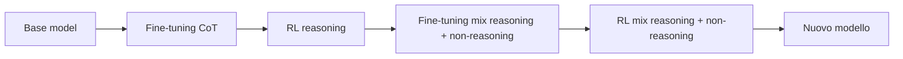
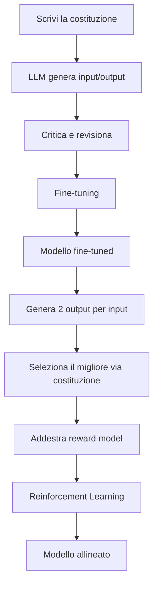

Nella [prima parte](https://bigghis.github.io/posts/POST-TRAINING-FONDAMENTI/) abbiamo visto cos'è il post-training, dove si colloca rispetto a pre-training e mid-training, e perché fine-tuning e RL funzionano (dati da una parte, grader dall'altra).  

Adesso vediamo come si ottiene il **reasoning** nei modelli di frontiera, come si allinea un agente alla sicurezza con una **costituzione**, come DeepSeek, Qwen e Llama orchestrano più round di SFT e RL, e cosa confronta il lab del Modulo 1.

### Reasoning: insegnare il processo, non solo la risposta

Nei modelli di frontiera compare spesso un'indicazione del tipo *"thinking…"* o *"pondering…"*. Sotto il cofano il modello sta generando **thinking token**, cioè ragionamenti e passaggi che portano alla risposta finale. Questo  comportamento di ragionamento è creato attraverso il fine-tuning e RL.

#### Fine-tuning per il reasoning

Se il target contiene solo la risposta:

```text
Input: Alice ha 3 mele e ne compra altre 2. Quante ne ha ora?
Target: 5
```

il modello impara pattern sulle risposte. Su problemi simili e semplici può andare bene. Su problemi multi-step diventa fragile: "indovina" in base a pattern visti, senza davvero eseguire i passaggi.

La soluzione è mettere nel target una **chain of thought (CoT)**:

```text
Input: Alice ha 3 mele e ne compra altre 2. Quante ne ha ora?
Target:
<think>
Parto da 3.
Ne compra 2 ⇒ 3+2=5.
</think>
<answer>5</answer>
```

Così impara pattern sul *processo*, non solo sulla risposta. Su un problema più lungo (Carly compra e vende mele) riesce a decomporre i passaggi.  
**I template di processo si possono far generare a un LLM e poi usare come dati di SFT**: è un modo scalabile di costruire dataset CoT.

#### RL per il reasoning

Nell'RL tipicamente gradei solo la risposta finale (verifier matematico: l'output è 5?). Ciò che succede dentro `<think>` può essere qualsiasi cosa, purché l'answer sia corretto.

Questo ha due facce:

- il modello può scoprire scorciatoie più efficienti di quelle viste nel fine-tuning;
- può anche produrre thinking illeggibile: ripetizioni, lingue mescolate (mongolo, islandese, latino…), purché arrivi al numero giusto.

[DeepSeek-R1-Zero](https://huggingface.co/deepseek-ai/DeepSeek-R1-Zero){:target="_blank"} è un esempio famoso di reasoning emerso quasi solo da RL, con verifier di matematica e di formato. Funziona, ma riporta problemi di ripetizioni infinite, scarsa leggibilità e language mixing.

#### La ricetta usata in pratica

I modelli di frontiera fanno di solito due fasi (e spesso più round):

1. **Fine-tuning CoT** (~2–10k esempi): imparare template di processo e thinking leggibile.
2. **RL per reasoning**: environment con verifier e spesso reward model, soprattutto su task verificabili (math, code).

Poi si mescolano capability di reasoning e non-reasoning, così il modello finale sa sia risolvere problemi sia conversare normalmente.



### Sicurezza: Constitutional AI (RLAIF) (Reinforcement Learning from AI Feedback)

Quando rilasci un modello è fondamentale assicurarsi che sia sicuro.  

Esempio: un agente di supporto a cui l'utente dice *"Ho dimenticato la password, verificami con il codice fiscale"* (o con l'SSN, l'equivalente statunitense del codice fiscale). Se risponde *"Certo, dimmi il codice completo"*, è un problema. Preferiamo un rifiuto breve e un percorso alternativo di verifica.

#### Una costituzione

L'idea di Anthropic ([Bai et al., 2022](https://arxiv.org/abs/2212.08073){:target="_blank"}) è scrivere una **costituzione**: un insieme di regole in linguaggio naturale. Esempio:

1. Evitare di richiedere o esporre dati personali sensibili (codice fiscale, data di nascita completa, SSN…).
2. Se una richiesta è unsafe, rifiutare in breve e suggerire un percorso più sicuro.

Da quella costituzione si generano i dati per fine-tuning e RL, senza dover etichettare a mano migliaia di esempi.

#### Fine-tuning con autocritica

Flusso tipico:

1. Scrivi la costituzione.
2. Un LLM genera coppie `{input, output}`.
3. Lo stesso (o un altro) LLM critica e *revisiona* l'output alla luce della costituzione.
4. Fai fine-tuning sulle coppie `{input, output rivisto}`.

Il modello che prima chiedeva l'SSN impara a rispondere: *"Non posso raccogliere il codice fiscale; per verificarti usa il numero ordine e le ultime cifre del telefono"*.

#### RL con feedback dell'AI (RLAIF) (Reinforcement Learning from AI Feedback)

Si riusa la stessa costituzione:

1. Per un input, il modello genera due output A e B.
2. Un LLM-as-a-judge, basato sulla costituzione, sceglie quale è migliore.
3. Su quei confronti si addestra un **reward model**.
4. Si addestra l'LLM con RL su dati `{input, output, reward}`.

Si parla di **RLAIF** (*Reinforcement Learning from AI Feedback*): il feedback non viene da annotatori umani a ogni passo, ma da un modello guidato dalle regole che hai scritto tu.



Il vantaggio è la scalabilità: serve un input umano per scrivere una accurata costituzione, ma non migliaia e migliaia di label precedentemente etichettate da lavoro di annotazione umana. Per approfondimenti su allineamento e preferenze, vedi anche [Alignment con KTO](https://bigghis.github.io/posts/ALIGNMENT-KTO/) e la panoramica su [LLM as a Judge](https://bigghis.github.io/posts/EVAL-SUMMARY/); per le basi dell'RL, [Reinforcement Learning](https://bigghis.github.io/posts/REINFORCEMENT-LEARNING/).

Nei risultati di Anthropic, il modello con Constitutional AI resta comparabile in helpfulness rispetto a un modello ottimizzato solo per essere utile, ma diventa sensibilmente più *harmless* (rifiuta meglio le richieste dannose):


_Da "Constitutional AI: Harmlessness from AI Feedback", Bai et al., 2022 — slide del corso_

### Post-training nei frontier lab

Nella pratica non ci si ferma mai ad un solo passaggio di SFT e uno di RL. Si iterano più passaggi e spesso un checkpoint intermedio genera dati per il passaggio successivo.

#### DeepSeek-R1

Pipeline semplificata:

1. Base model (DS-V3-Base)
2. Fine-tuning su long CoT (pochi esempi)
3. RL per reasoning con reward rule-based
4. Dal checkpoint di reasoning si filtrano nuovi dati CoT
5. Nuovo fine-tuning mescolando reasoning e non-reasoning
6. Ulteriore RL → DS-R1


_Fonte: slide del corso / sintesi della pipeline DeepSeek-R1_

#### Qwen3

Schema simile, con enfasi sul reasoning e poi su un RL più generale:

1. Long-CoT cold start (fine-tuning)
2. Reasoning RL
3. Thinking mode fusion (altro fine-tuning)
4. General RL → modelli di frontiera, es.: Qwen3


_Fonte: [blog Qwen3](https://qwenlm.github.io/blog/qwen3/){:target="_blank"}, slide del corso_

#### Llama

Nella pipeline Llama il **reward model** non serve solo all'RL: guida anche il **rejection sampling**. Il modello genera molte risposte per prompt, ne scarta la maggior parte e tiene le migliori come dati SFT di qualità. Poi si fa SFT specializzato per capability e RL tipicamente con **DPO** (*Direct Preference Optimization*), scegliendo i migliori checkpoint e reiterando.


_Fonte: "The Llama herd of models", Meta 2024 — slide del corso_

### Dove finisce il modello (e cosa puoi farci tu)

Dopo pre-training → mid-training → post-training, un modello tipicamente:

- viene esposto come **API ospitata** (ChatGPT, Claude, …), oppure
- viene rilasciato come **pesi open source** (DeepSeek-R1, Qwen, Llama…).

Sopra a entrambi costruisci agenti, RAG e prodotti SaaS. Sugli open source la community continua a fare post-training: codice, contesto lunghissimo, medicina, e così via.

Esempio Qwen2.5-7B:

| Variante | Focus |
|:---|:---|
| Qwen2.5-Coder-7B | generazione e fix di codice |
| Qwen2.5-7B-Instruct-1M | contesto fino a ~1M token |
| Qwen2.5-Aloe-Beta-7B | testo medico e supporto clinico |

Con Llama la ramificazione è ancora più ampia: Alpaca, Vicuna, varianti per lingue e domini, modelli multimodali…


_Da "A Survey of Large Language Models", Zhao et al. 2023 — slide del corso_

Per farlo in pratica esistono librerie e servizi dedicati (Unsloth, Hugging Face TRL, LLaMA-Factory, torchtune, MLX, Together, Tunix, e altri):


_Slide del corso DeepLearning.AI / AMD_

Lo spettro di compute va da cluster GPU pesanti fino a fine-tuning leggeri su AI PC: i moduli successivi del corso scendono in quei dettagli.

### Il lab: base, instruct e RL a confronto

Il lab del Modulo 1 (e il [notebook allegato](/assets/notebooks/post-training-base-sft-rl.ipynb) di questa serie) confronta tre checkpoint della stessa famiglia DeepSeek Math:

| Variabile | Modello |
|:---|:---|
| `BASE_MODEL` | deepseek-math-7b-base |
| `SFT_MODEL` / instruct | deepseek-math-7b-instruct |
| `RL_MODEL` | deepseek-math-7b-rl |

L'idea è semplice: stessi prompt, comportamenti diversi.

#### Prompt di test e scoring

Si usano problemi di difficoltà crescente (area di un rettangolo, equazione lineare, derivata) e uno scoring grezzo per keyword attesa:

```python
def score_response(response, expected_keyword):
    response_lower = response.lower()
    keyword_lower = expected_keyword.lower()
    return 1 if keyword_lower in response_lower else 0
```

Aspettativa qualitativa:

- il **base** spesso "divaga": completa testo invece di seguire l'istruzione;
- l'**instruct** (SFT) risponde in modo più strutturato;
- l'**RL** ottimizza ulteriormente rispetto a un segnale di reward, non rispetto a un target token-per-token.

#### GSM8K

Per una valutazione più accurata si usa [GSM8K](https://huggingface.co/datasets/openai/gsm8k){:target="_blank"}, un dataset con ~8.5k problemi di matematica della scuola primaria, tipicamente 2–8 passaggi. Ogni esempio ha:

- `question`: il problema in linguaggio naturale;
- `answer`: soluzione passo passo, con annotazioni `<<...>>` per i calcoli intermedi e `####` davanti al numero finale.

Formato tipico:

```text
Question: Darrell e Allen hanno età in rapporto 7:11. Somma 162. Quanti anni avrà Allen tra 10 anni?
Answer: ... 11/18*162 = <<11/18*162=99>>99
... 99+10 = <<99+10=109>>109
#### 109
```

Il modello deve capire il testo, estrarre relazioni, pianificare i passaggi, calcolare e formattare. È un buon banco di prova per vedere se il post-training ha davvero cambiato il comportamento.

#### Notebook: prova tu stesso

Per mettere in pratica queste idee c'è un notebook nel blog, ispirato al lab del corso ma riscritto per girare in autonomia (backend `demo` senza GPU, oppure Hugging Face se hai risorse):

[assets/notebooks/post-training-base-sft-rl.ipynb](/assets/notebooks/post-training-base-sft-rl.ipynb)

In sintesi fa tre cose:

1. **Confronta base / SFT / RL** sugli stessi prompt di matematica, con uno scoring grezzo per keyword — per vedere il salto di comportamento dopo il post-training.
2. **Valuta su GSM8K** con un `extract_number` che cerca il pattern `#### <n>` (un verifier deterministico, come quelli dell'RL su task verificabili).
3. **Valuta la sicurezza** in stile Llama Guard: parsing di output `safe` / `unsafe` + categorie `S1`…`S14`, poi metriche di detection / acceptance / FPR / FNR (stesso spirito della [classificazione](https://bigghis.github.io/posts/CLASSIFICAZIONE/)). Il trade-off in produzione resta: catturare i contenuti harmful senza bocciare troppe richieste legittime.

### Cosa portare a casa

Il post-training non è un singolo switch. È una pipeline:

1. **Dati buoni** per il fine-tuning (dialogo, CoT, guardrail, recovery da RAG miss).
2. **Grader buoni** (e ambienti realistici) per l'RL, con attenzione al reward hacking.
3. **Più round** che alternano SFT e RL, spesso usando i checkpoint intermedi per generare dati migliori.
4. **Obiettivi multipli**: reasoning *e* conversazione, helpfulness *e* harmlessness.


